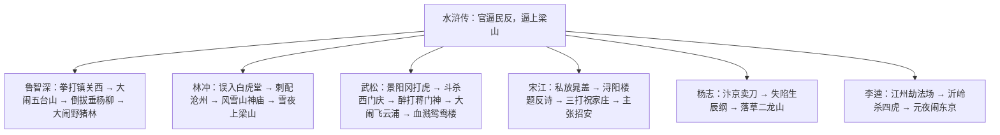

# 名著导读：《水浒传》

标签：#名著 #章回小说 #中考考点

## 一、作品概况

- 作者：施耐庵，元末明初小说家（一说与罗贯中合作）。
- 体裁：我国第一部以农民起义为题材的长篇章回体白话小说，常见版本有一百回本、一百二十回本、七十一回本（金圣叹删评）。
- 内容：北宋末年官逼民反，一百单八将陆续被逼上梁山，聚义后接受招安、征方腊，最终悲剧收场。
- 阅读方法（教材专题）：**古典小说的阅读**——把握链式结构、在情节中理解人物、赏析白话语言。

## 二、主要人物与情节

- **鲁智深**：疾恶如仇、侠肝义胆、粗中有细（绰号花和尚，兵器禅杖）。
- **林冲**：武艺高强、安分隐忍，由委曲求全到奋起反抗，最能体现"逼上梁山"（绰号豹子头）。
- **武松**：勇武刚烈、恩怨分明、快意恩仇（绰号行者）。
- **李逵**：忠诚鲁莽、天真嗜杀（绰号黑旋风，兵器双板斧）。
- **宋江**：仗义疏财、孝义为先，又热衷招安，性格复杂（绰号及时雨）。

## 三、艺术特色

1. **链式（连环列传式）结构**：人物故事相对独立又环环相扣，如鲁智深—林冲—杨志—宋江依次登场；
2. 人物塑造同中见异：同是勇武，鲁智深之"侠"、武松之"烈"、李逵之"莽"各不相同；
3. 情节曲折生动，善设悬念（风雪山神庙的层层伏笔）；
4. 白话语言生动传神，带有说书人风格。

## 四、主题思想

小说深刻揭示"官逼民反"的社会根源，歌颂梁山好汉的反抗精神与忠义品格，同时通过招安后的悲剧结局，寄寓对起义道路与"忠义"局限的深沉思考。

## 五、中考考点

1. 作者、体裁地位、绰号—人名—情节的对应（高频：花和尚、豹子头、智多星吴用、及时雨）；
2. 经典情节复述与人物性格分析（风雪山神庙、景阳冈打虎、智取生辰纲）；
3. 结合选段辨析人物（同类性格比较：鲁智深与李逵之粗的不同）；
4. "逼上梁山"过程的梳理（以林冲为典型）；
5. 与课文[[20 智取生辰纲]]联动的整本书考查。

## 六、练习题

1. 简述"风雪山神庙"的主要情节，说明其在林冲性格转变中的作用。
2. 鲁智深与李逵同为莽汉，性格有何不同？各举一例。
3. 梁山好汉排座次后走向招安，你如何评价宋江的选择？
4. 为"武松"写一则 100 字人物名片（绰号、主要事迹、性格）。

## 七、知识联系

- 课文[[20 智取生辰纲]]选自本书第十六回，精读与整本书阅读互补；
- 与[[名著导读：《儒林外史》]]比较章回体的两种结构（链式与短制连缀）；
- 与[[22* 三顾茅庐]]（《三国演义》）比较英雄传奇与历史演义；
- 人物出场与伏笔技法可借鉴于[[写作：布局谋篇]]。
