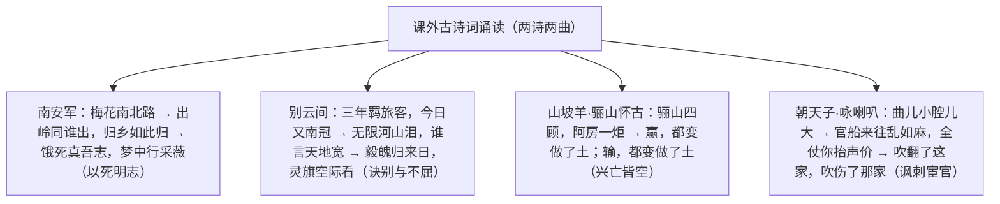

# 课外古诗词诵读

标签：#古诗词 #诗曲 #诵读积累

## 一、篇目与文学常识

- 《南安军》：文天祥，南宋民族英雄、诗人；祥兴二年（1279）兵败被俘，被押解北上经南安军（今江西大余）时作，绝食明志。
- 《别云间》：夏完淳，明末少年抗清英雄，被捕后诀别故乡松江（古称云间）时作，就义时年仅十七岁。
- 《山坡羊·骊山怀古》：张养浩，元代散曲家；途经骊山有感于秦宫遗迹而作，与《山坡羊·潼关怀古》为姊妹篇。
- 《朝天子·咏喇叭》：王磐，明代散曲家；借咏喇叭讽刺宦官（阉宦）作威作福、鱼肉百姓。

## 二、结构脉络

## 三、名句赏析

1. "山河千古在，城郭一时非"：山河永在与城郭易主对照，痛悼故国沦亡，坚信正气长存。
2. "饿死真吾志，梦中行采薇"：用伯夷叔齐不食周粟、采薇首阳的典故，表明绝食殉国、忠贞不贰的志向。
3. "无限河山泪，谁言天地宽"：山河破碎，泪洒无限，天地虽宽而志士无容身之地——悲愤沉痛，力透纸背。
4. "毅魄归来日，灵旗空际看"：化用屈原《九歌》"魂魄毅兮为鬼雄"，誓言死后英魂仍要归来看抗清旗帜，少年英雄气冲霄汉。
5. "赢，都变做了土；输，都变做了土"：对历代王朝更迭的冷峻总结，句式复沓，讥讽统治者奢靡终归尘土。
6. "眼见的吹翻了这家，吹伤了那家，只吹的水尽鹅飞罢"：三个"吹"字层层递进，把宦官依仗权势祸害百姓的罪行揭露得淋漓尽致。

## 四、主题思想

《南安军》《别云间》是亡国之际志士的绝唱，抒写以死殉国的忠贞与壮志未酬的悲愤；两首散曲则借怀古与咏物讽今，一叹兴亡皆苦了百姓，一刺阉宦横行民不聊生——四篇共同指向深沉的家国之思与民生关怀。

## 五、诵读与积累要点

1. 诗与曲的文体区别：散曲有曲牌（山坡羊、朝天子），语言通俗泼辣、可加衬字；
2. 把握两组对照：文天祥与夏完淳（宋末与明末的殉国者）、两首散曲（怀古与咏物的讽刺）；
3. 背诵默写注意"采薇""南冠""毅魄""骊山"等易错字，均属北京中考默写范围。

## 六、练习题

1. 默写："山河千古在"一联、"无限河山泪"一联。
2. 《南安军》尾联用了什么典故？表达了怎样的志向？
3. 《朝天子·咏喇叭》中"曲儿小腔儿大"一语双关，请分析。
4. 比较《山坡羊·骊山怀古》与《山坡羊·潼关怀古》主旨的异同。

## 七、知识联系

- 文天祥、夏完淳的殉国精神与[[2* 梅岭三章]]"取义成仁"一脉相承，也印证[[9 鱼我所欲也]]的舍生取义；
- 与[[12 词四首]]中辛弃疾、秋瑾之作同属家国情怀诗词群，可整合复习；
- 咏物讽刺的笔法可联系[[名著导读：《儒林外史》]]的讽刺艺术；
- 用典赏析方法同[[10* 唐雎不辱使命]]中的举例说理。
