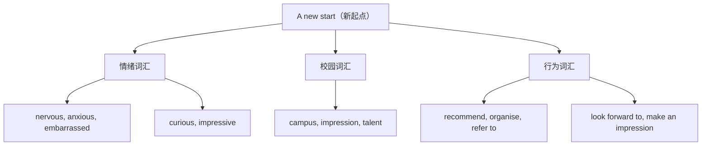

# Unit 1 词汇与课文精读（Understanding ideas）

标签：#Unit1 #ANewStart #高中新生活 #词汇课 ｜ 课文：My First Day at Senior High

## 主题导入

本单元主题是"高中新起点"（A new start）。课文以第一人称记述作者升入高中第一天的所见所感：新校园、新老师、新同学，从紧张（nervous）到充满期待（look forward to）。这一话题与北京高考应用文（欢迎信、建议信）高度契合，词汇多为描述校园生活与个人感受的高频词。

## 核心词汇表

| 词汇 | 词性 | 中文 | 高频搭配 |
| --- | --- | --- | --- |
| campus | n. | 校园 | on campus 在校园里 |
| impression | n. | 印象 | make a good impression on sb. |
| nervous | adj. | 紧张的 | be nervous about... |
| anxious | adj. | 焦虑的 | be anxious about/for... |
| annoyed | adj. | 恼怒的 | be annoyed with sb. at sth. |
| frightened | adj. | 害怕的 | be frightened of... |
| embarrassed | adj. | 尴尬的 | feel embarrassed about... |
| impressive | adj. | 令人印象深刻的 | an impressive speech |
| description | n. | 描述 | give a description of... |
| explanation | n. | 解释 | a clear explanation |
| talent | n. | 天赋；人才 | have a talent for... |
| curious | adj. | 好奇的 | be curious about... |
| refer | v. | 提到；参考 | refer to 指的是 |
| recommend | v. | 推荐；建议 | recommend doing sth. |
| organise | v. | 组织 | organise activities |

## 重点短语与句型

1. **look forward to + n./doing**：期待（to 是介词）— I'm looking forward to starting my new school life.
2. **make an impression on sb.**：给某人留下印象。
3. **can't wait to do sth.**：迫不及待做某事。
4. **What/How + 感叹句**：What an impressive campus (it is)!
5. **be about to do sth.**：即将做某事（不与具体时间状语连用）。

## 课文精读笔记

- 开篇场景：作者站在新校门口，"**My heart was beating fast**"，用动作描写体现紧张情绪——记叙文写作可借鉴。
- 情感线索：nervous → curious → excited → confident，四个形容词串起全文，这种"情感变化线"是北京高考读后续写与完形填空常考逻辑。
- 关键句：The teacher **encouraged us to** introduce ourselves.（encourage sb. to do 高频结构）
- 结尾升华：A new start means new chances. 首尾呼应写法。

## 典型例题

**例1**（语法填空）：I was nervous ______ first, but soon I made a good impression ______ my new classmates.
**解析**：at first 起初；make an impression on sb. 固定搭配。答案：at; on。

**例2**（单句改错）：I look forward to hear from you soon.
**解析**：look forward to 中 to 为介词，后接动名词。hear → hearing。

## 易错点

1. ❌ look forward to **do** → ✅ look forward to **doing**（to 是介词）。
2. -ed 形容词修饰人（I'm frightened），-ing 形容词修饰物（a frightening film），完形高频。
3. anxious 与 nervous：anxious 侧重"担忧结果"，nervous 侧重"心里发慌"。
4. recommend 后接 doing 或 that 从句（should）do，不接 to do。

## 自测题

1. 单选：The film was so ______ that all of us felt ______.（A. moving; moved  B. moved; moving  C. moving; moving  D. moved; moved）
2. 语法填空：She has a talent ______ music and is curious ______ everything new.
3. 完成句子：我迫不及待想见到我的新同学。I ______ ______ ______ meet my new classmates.
4. 改错：What an impressive the campus is!

**答案**：1. A  2. for; about  3. can't wait to  4. 去掉 the 前的 an 保留结构 → What an impressive campus it is!

## 相关知识点

[[语法与语言运用（Using language）]] ｜ [[读写与表达（Developing ideas）]]
