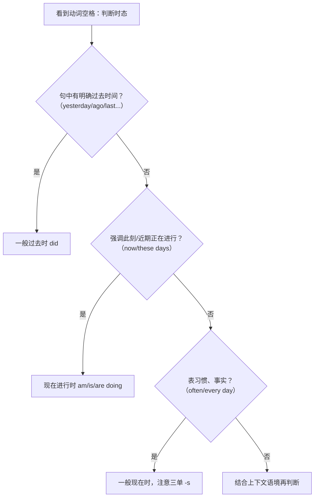

# Unit 1 语法与语言运用（Using language）

标签：#Unit1 #时态复习 #短语动词 #语法课

## 语法目标

1. 复习并区分**一般现在时、现在进行时、一般过去时**三大基础时态。
2. 掌握本单元高频**短语动词**（phrasal verbs）：go over, get on with, fit in, take part in 等。
3. 能在语法填空与写作中根据时间标志词准确选择时态——北京高考语法填空必考点。

## 规则详解（表格对比）

| 时态 | 结构 | 用法 | 标志词 |
| --- | --- | --- | --- |
| 一般现在时 | do/does | 习惯、事实、客观真理 | often, usually, every day |
| 现在进行时 | am/is/are + doing | 此刻正在进行；近期计划 | now, at the moment, these days |
| 一般过去时 | did | 过去某时发生的动作 | yesterday, last..., ago, in 2020 |

常考短语动词：

| 短语 | 含义 | 例句 |
| --- | --- | --- |
| go over | 复习；检查 | Let's go over the notes. |
| get on with | 与…相处；继续 | I get on well with my classmates. |
| fit in | 适应；融入 | It took me a week to fit in. |
| take part in | 参加 | She took part in the speech contest. |
| sign up for | 报名参加 | I signed up for the drama club. |

## 典型例题

**例1**（语法填空）：Last week I ______ (join) the school band, and now I ______ (practise) the guitar every day.
**解析**：last week 明确过去时间 → joined；every day 表习惯 → practise（主语 I，无三单）。

**例2**（单选）：—Where is Tom? —He ______ ready for the coming exam in the library.
A. gets  B. got  C. is getting  D. was getting
**解析**：where is 表明"此刻"，用现在进行时。答案 C。

**例3**（完形语境）：I found it hard to ______ at first, but my classmates helped me a lot.（fit in）
**解析**：语境"起初很难适应"，fit in 不及物，后不接宾语。

## 易错点

1. 一般现在时三单遗漏 -s 是语法填空第一失分点：He **goes** over his notes every night。
2. these days / at present 提示现在进行时，易误用一般现在时。
3. 短语动词代词宾语位置：pick **it** up（✅），pick up it（❌）；但 get on with **it** 不可拆。
4. was/were doing（过去进行）与 did 区分：when 引导的点动作常配过去进行时背景。

## 自测题

1. 语法填空：Listen! Someone ______ (sing) in the next room.
2. 语法填空：Water ______ (boil) at 100°C.（客观真理）
3. 单选：I ______ well with my new deskmate since the term began... 选短语（A. get on  B. go over  C. fit in  D. sign up）
4. 改错：She take part in the club activity every Friday.

**答案**：1. is singing  2. boils  3. A  4. take → takes

## 相关知识点

[[词汇与课文精读（Understanding ideas）]] ｜ [[语法与语言运用（Using language）]]（现在完成时衔接）
