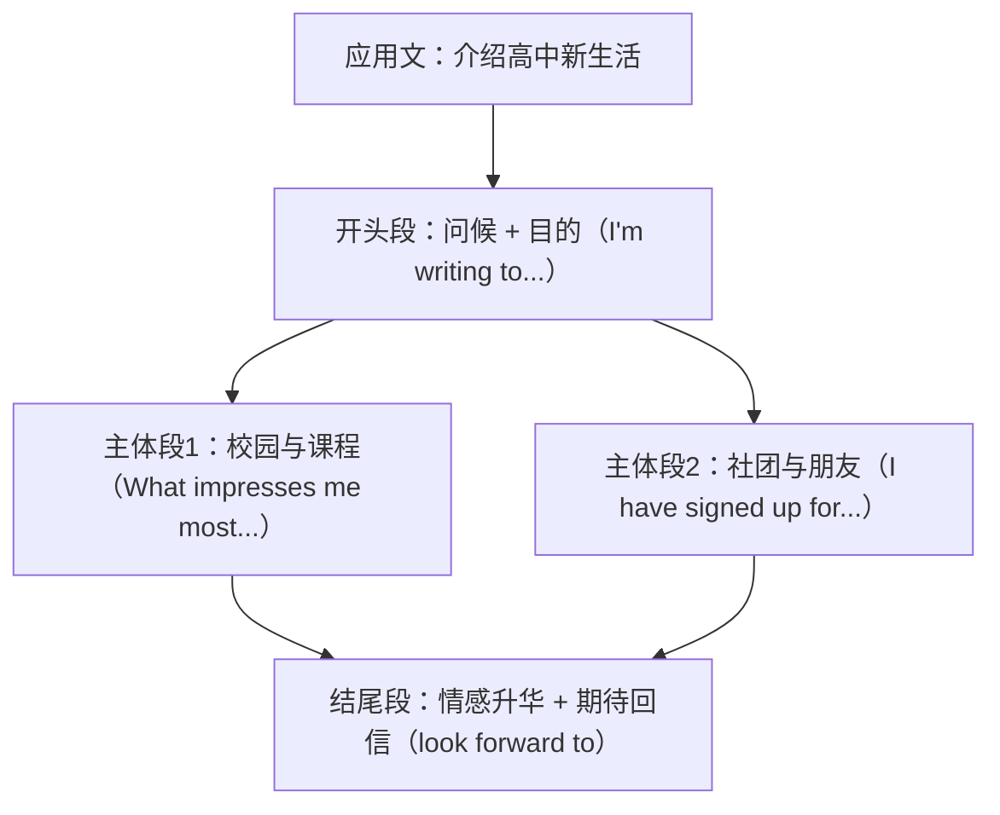

# Unit 1 读写与表达（Developing ideas）

标签：#Unit1 #读写课 #自我介绍与校园生活 #应用文

## 阅读策略

Developing ideas 部分课文 *High School Hints* 是一篇访谈/建议类文本。阅读要点：

1. **抓建议句**：建议类文本的信息核心是祈使句和情态动词句（You should... / Don't be afraid to...）。
2. **辨结构**：问答式访谈按"问题→建议→理由"展开，做题时先读问题定位段落。
3. **推断作者态度**：建议语气（supportive, encouraging）常出现在北京高考阅读态度题中。

## 写作任务拆解

写作任务：给英国笔友 Jim 写一封邮件，介绍你的高中新生活（北京高考应用文经典题型）。

- **第一段**：问候 + 写信目的（升入高中，分享新生活）。
- **第二段**：2-3 个方面展开——新校园、新课程/社团、新朋友，每点"事实 + 感受"。
- **第三段**：表达期待，邀请对方回信分享。
- 时态：现状用一般现在时/现在进行时，开学第一天的事用一般过去时（呼应本单元语法）。

## 实用句式库

1. I'm writing to share with you my new life in senior high school.
2. What impresses me most is the beautiful campus and the friendly teachers.
3. I have signed up for the English club, where I can practise speaking.
4. At first I felt a little nervous, but now I'm getting on well with my classmates.
5. I'm looking forward to hearing from you soon.

## 范文框架

## 典型例题

**例1**（应用文段落写作）：用"事实 + 感受"扩写句子 "I joined the basketball club."
**参考**：I joined the basketball club last week, where I made several new friends. Playing with them after class makes me feel truly at home in my new school.

**例2**（阅读细节题）：According to the passage, what should new students do to fit in quickly?
**解析**：定位建议句 "Don't be afraid to ask for help and try to take part in school activities." 答案：主动求助并参加校园活动。

## 易错点

1. 应用文首段忘写目的句（I'm writing to...），北京高考评分直接扣要点分。
2. 全文时态混乱：介绍现状误用过去时。先定"时态基调"再动笔。
3. look forward to hearing 写成 to hear。
4. 中式表达 "My school life is very happy" → 更自然的 "I'm enjoying my school life a lot."

## 自测题

1. 写出邮件目的句：我写信是想告诉你我的高中新生活。
2. 将两个短句合并：I joined the music club. I can learn the piano there.（用 where）
3. 单选：______ I felt lonely at first, I soon made friends.（A. Because  B. Although  C. If  D. Until）
4. 列出应用文三段式结构中每段必备的一个要素。

**答案**：1. I'm writing to tell you about my new life in senior high school.  2. I joined the music club, where I can learn the piano.  3. B  4. 首段目的句；主体段要点+细节；尾段期待回复/祝愿。

## 相关知识点

[[词汇与课文精读（Understanding ideas）]] ｜ [[读写与表达（Developing ideas）]]
