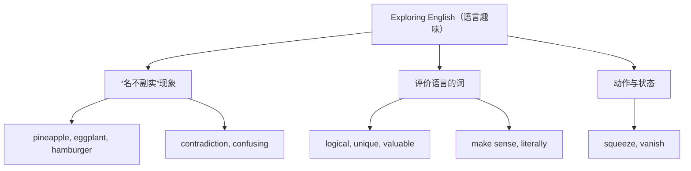

# Unit 2 词汇与课文精读（Understanding ideas）

标签：#Unit2 #ExploringEnglish #英语语言趣味 #词汇课 ｜ 课文：Neither Pine nor Apple in Pineapple

## 主题导入

本单元主题是"探索英语"（Exploring English），课文以幽默笔调揭示英语中"名不副实"的趣味现象：pineapple（菠萝）里既没有 pine（松树）也没有 apple（苹果），hamburger 里没有 ham。文章引导我们思考语言的任意性与文化性。此类"语言与文化"话题是北京高考阅读 C/D 篇的常客。

## 核心词汇表

| 词汇 | 词性 | 中文 | 高频搭配 |
| --- | --- | --- | --- |
| confusing | adj. | 令人困惑的 | a confusing rule |
| contradiction | n. | 矛盾 | a contradiction between A and B |
| literally | adv. | 字面上；确实地 | take sth. literally |
| logical | adj. | 合乎逻辑的 | a logical explanation |
| invisible | adj. | 看不见的 | invisible to the eye |
| unique | adj. | 独特的 | a unique language |
| valuable | adj. | 有价值的 | valuable advice |
| squeeze | v. | 挤压 | squeeze into |
| vanish | v. | 消失 | vanish from sight |
| ordinary | adj. | 普通的 | ordinary people |
| foreigner | n. | 外国人 | a foreigner learning Chinese |
| grammar | n. | 语法 | grammar rules |
| variety | n. | 种类；多样性 | a variety of 各种各样的 |
| means | n. | 方式；手段 | by means of 借助 |
| appearance | n. | 外表；出现 | judge by appearance |

## 重点短语与句型

1. **make sense**：讲得通，有意义 — The word doesn't make sense literally.
2. **a variety of + 复数名词**：各种各样的（谓语用复数）。
3. **There is no + n. + in...**：There is no egg in eggplant.（课文核心句式）
4. **not... nor...**：Neither pine nor apple is found in pineapple.
5. **play a role in**：在…中起作用。

## 课文精读笔记

- 文体：说明+议论的幽默小品文（humorous essay），大量使用**举例论证**：pineapple, eggplant, hamburger。
- 修辞：**paradox（悖论式表达）**制造幽默——"Quicksand works slowly; boxing rings are square."（流沙移动缓慢；拳击"圈"是方的）。
- 结构：现象列举 → 提出疑问（Why is English so confusing?）→ 结论升华（语言反映人类的创造力）。
- 高考链接：说明文常以"现象—解释—评价"组织，判断段落大意时抓每段首句。

## 典型例题

**例1**（语法填空）：English can be ______ (confuse) at times, but that is exactly what makes it ______ (value) to explore.
**解析**：修饰语言本身用 -ing 形容词 confusing；value 变形容词 valuable。

**例2**（阅读主旨题）：What is the author's attitude towards the "illogical" English words?
**解析**：结尾 "That's the beauty of language" 表明作者态度是 appreciative（欣赏的），而非批评。

## 易错点

1. a variety of + 复数名词作主语，谓语用**复数**：A variety of books **are** available.
2. means 单复数同形：a means of / many means of。
3. confusing（令人困惑的）vs confused（感到困惑的），完形高频。
4. literally 不等于 "文学地"（literary 才是"文学的"），形近词辨析。

## 自测题

1. 语法填空：There ______ (be) a variety of interesting expressions in English.
2. 单选：His explanation doesn't ______ at all.（A. make sense  B. make a sense  C. make senses  D. make the sense）
3. 完成句子：不要仅凭外表判断一个词的意思。Don't judge a word's meaning only ______ ______.
4. 改错：I was confusing by the strange English word.

**答案**：1. are  2. A  3. by appearance  4. confusing → confused

## 相关知识点

[[语法与语言运用（Using language）]] ｜ [[读写与表达（Developing ideas）]]
