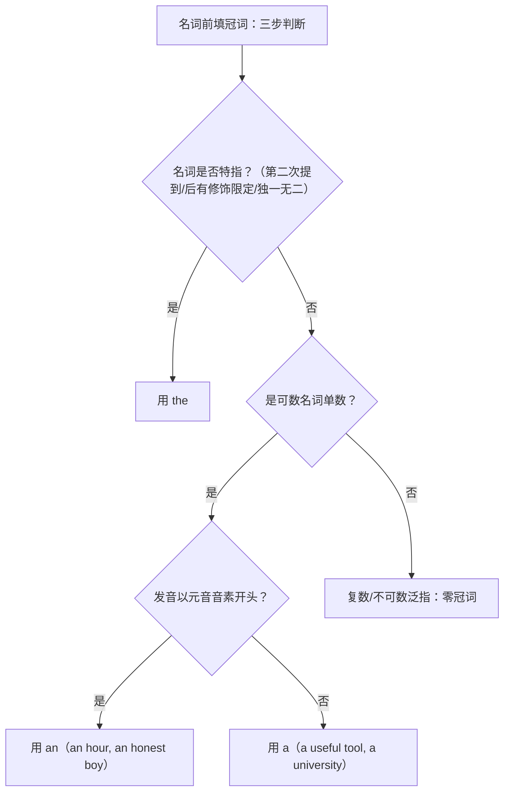

# Unit 2 语法与语言运用（Using language）

标签：#Unit2 #名词短语 #冠词 #构词法 #语法课

## 语法目标

1. 掌握**名词短语**的构成：限定词 + 形容词 + 名词中心词（a confusing English word）。
2. 掌握**冠词** a/an/the 与零冠词的核心用法——北京高考语法填空每年必考。
3. 了解**构词法**：派生（前缀/后缀）、合成、转化，用于完形与阅读猜词。

## 规则详解（表格对比）

冠词用法对比：

| 冠词 | 核心用法 | 例句 |
| --- | --- | --- |
| a/an | 泛指"一个"，首次提到；an 用于元音音素前 | an hour, a useful book |
| the | 特指；双方都知道；序数词/最高级前；独一无二事物 | the sun, the first day |
| 零冠词 | 复数泛指；不可数名词泛指；专有名词；三餐/球类 | play football, have lunch |

构词法一览：

| 方式 | 规则 | 例子 |
| --- | --- | --- |
| 前缀派生 | 改变词义不改词性 | visible → invisible; logical → illogical |
| 后缀派生 | 常改变词性 | confuse → confusing/confusion; value → valuable |
| 合成 | 词 + 词 | class + room → classroom |
| 转化 | 词性直接转换 | water (n.) → water (v.) 浇水 |

## 典型例题

**例1**（语法填空）：He is ______ honest student, and he is also ______ most careful one in our class.
**解析**：honest 元音音素开头 → an；the most careful 最高级前用 the。

**例2**（语法填空）：______ (confuse) caused by these words makes English learning both hard and fun.
**解析**：作主语需名词形式 → Confusion。构词法考点。

**例3**（单选）：useful, university, hour, umbrella 中冠词搭配错误的是 "an useful book"。
**解析**：useful 以 /j/ 开头（辅音音素），应为 a useful book。

## 易错点

1. a/an 看**发音**不看字母：a university（/j/），an hour（h 不发音）。
2. play the piano（乐器加 the）vs play football（球类零冠词）。
3. 语法填空给动词、要求填名词时，注意派生后缀：-tion, -ment, -ness, -ance。
4. 否定前缀选择：il- 接 l 开头（illogical），im- 接 m/p/b 开头（impossible），ir- 接 r 开头（irregular）。

## 自测题

1. 语法填空：She plays ______ violin every morning and plays ______ tennis on weekends.（填冠词或 /）
2. 语法填空：His ______ (explain) was so clear that everyone understood.
3. 单选：It took me ______ hour to finish ______ unusual task.（A. a; an  B. an; an  C. an; a  D. a; a）
4. 写出 possible、regular、visible 的否定派生词。

**答案**：1. the; /  2. explanation  3. B  4. impossible; irregular; invisible

## 相关知识点

[[Unit 2 词汇与课文精读（Understanding ideas）]] ｜ [[Unit 3 语法与语言运用（Using language）]]
