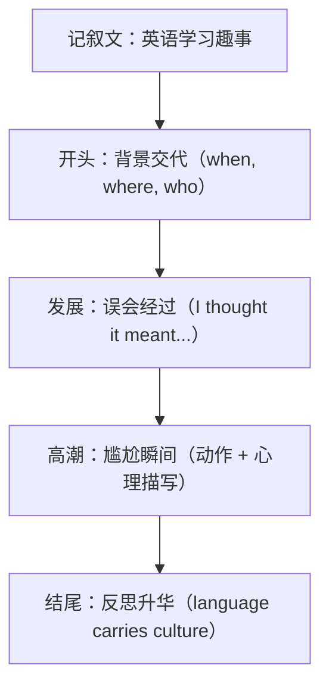

# Unit 2 读写与表达（Developing ideas）

标签：#Unit2 #读写课 #英语学习经历 #说明与叙事

## 阅读策略

Developing ideas 课文 *Misadventures in English* 讲述作者在英语国家因语言差异闹出的笑话（如把 "Give me five" 理解错）。阅读要点：

1. **叙事文抓 5W**：who, when, where, what, why——快速梳理每个小故事。
2. **幽默文体的言外之意**：作者自嘲不等于否定英语学习，推断题勿选过度消极选项。
3. **文化差异信号词**：in Britain / while in America 等对比结构，提示考点。

## 写作任务拆解

写作任务：写一段"我的英语学习趣事/尴尬经历"（记叙短文，亦可迁移为高考读后续写素材）。

- **开头**：一句话点明背景（时间 + 场景 + 人物）。
- **发展**：误会产生的过程——语言点是什么，我如何理解错。
- **高潮**：尴尬/搞笑瞬间，加入动作与心理描写（My face turned red...）。
- **结尾**：反思收获（Language is more than words; it carries culture.）。

## 实用句式库

1. When I first arrived in..., I made an embarrassing mistake.
2. To my surprise, the word didn't mean what I thought at all.
3. My face turned red and everyone burst out laughing.
4. It was not until then that I realised the cultural difference.
5. This experience taught me that language learning is a journey full of surprises.

## 范文框架

## 典型例题

**例1**（读后续写微技能）：为句子 "I was embarrassed." 增加动作与心理细节。
**参考**：My cheeks burning, I lowered my head, wishing the ground would swallow me up.

**例2**（阅读推断题）：Why does the author share these misadventures?
**解析**：结尾反思句表明目的——说明语言与文化紧密相连，鼓励学习者以开放心态面对错误。选 "To show mistakes are part of language learning."

## 易错点

1. 记叙文时态基调是**一般过去时**，反思句可用一般现在时，切忌整篇混用。
2. "burst out laughing"（突然大笑）与 "burst into laughter" 搭配不可交叉：burst out + doing，burst into + n.。
3. It was not until... that... 强调句中 that 不能换成 when。
4. 直接翻译中文幽默常不达意，写作时优先使用课文原句式改写。

## 自测题

1. 完成句子：直到那时我才意识到自己的错误。It was not ______ then ______ I realised my mistake.
2. 单选：Hearing the joke, everyone burst ______ laughter.（A. out  B. into  C. in  D. on）
3. 用一句话为记叙文开头交代背景（英语角第一次发言）。
4. 改错：This experience taught me that make mistakes is natural.

**答案**：1. until; that  2. B  3. 例：Last Friday, at my first English corner, I stood up nervously to give a talk.  4. make → making

## 相关知识点

[[词汇与课文精读（Understanding ideas）]] ｜ [[读写与表达（Developing ideas）]]
