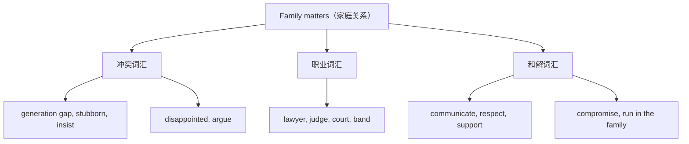

# Unit 3 词汇与课文精读（Understanding ideas）

标签：#Unit3 #FamilyMatters #家庭关系 #词汇课 ｜ 课文：Like Father, Like Son

## 主题导入

本单元主题是"家庭事务/家庭很重要"（Family matters，一语双关）。课文是一个三幕剧本（play）：儿子想学音乐，父亲希望他上大学学法律，爷爷从中调解——三代人围绕"梦想与现实"展开对话。家庭沟通类话题在北京高考完形与七选五中出现频率极高。

## 核心词汇表

| 词汇 | 词性 | 中文 | 高频搭配 |
| --- | --- | --- | --- |
| matter | v./n. | 要紧；事情 | It doesn't matter. |
| band | n. | 乐队 | join a band |
| passion | n. | 热爱；激情 | have a passion for... |
| lawyer | n. | 律师 | become a lawyer |
| judge | n./v. | 法官；判断 | judge by... |
| court | n. | 法庭；球场 | in court |
| disappointed | adj. | 失望的 | be disappointed with sb. |
| stubborn | adj. | 固执的 | as stubborn as a mule |
| generation | n. | 一代人 | the younger generation |
| gap | n. | 代沟；差距 | generation gap |
| insist | v. | 坚持（认为/要求） | insist on doing |
| support | v./n. | 支持 | support one's decision |
| respect | v./n. | 尊重 | respect each other's choices |
| communicate | v. | 沟通 | communicate with sb. |
| compromise | n./v. | 妥协 | reach a compromise |

## 重点短语与句型

1. **run in the family**：世代相传 — Music runs in the family.
2. **Like father, like son.**：有其父必有其子（谚语，标题即出处）。
3. **be meant to do**：注定/应该做 — You are meant to study law.
4. **now that + 从句**：既然 — Now that you've decided, stick to it.
5. **talk sb. into/out of doing**：说服某人做/不做某事。

## 课文精读笔记

- 文体：**剧本**（play script），注意舞台说明（stage directions）常以现在时+括号呈现，暗示人物情绪，如 (angrily), (sighing)。
- 冲突结构：父亲的期望（practical career）vs 儿子的梦想（music passion），爷爷以自身经历打破僵局——"When I was young, my father wanted me to be a doctor."（历史重演的讽刺）。
- 主题句：What matters is that we talk and listen to each other. 沟通是化解代沟的钥匙。
- 高考链接：完形填空常考"矛盾→沟通→和解"情节链，情绪词（disappointed → touched → relieved）是选项高频。

## 典型例题

**例1**（语法填空）：My father insisted ______ my studying law, but I had a passion ______ music.
**解析**：insist on doing 坚持要求；have a passion for 固定搭配。答案：on; for。

**例2**（完形语境）：After the long talk, the father finally ______ his son's choice.（A. refused  B. supported  C. judged  D. doubted）
**解析**：情节链"沟通→和解"，答案 B。

## 易错点

1. insist 表"坚持要求"时从句用 (should) do：He insisted that I **(should) study** law；表"坚持认为"用陈述语气。
2. matter 作动词不用被动：It doesn't matter（❌ be mattered）。
3. respect 是及物动词：respect **him**，不加 to/for。
4. now that 引导原因状语从句，不能与 so 连用。

## 自测题

1. 单选：______ you have grown up, you should make your own decisions.（A. Now that  B. Even if  C. As if  D. In case）
2. 语法填空：He was disappointed ______ his son's decision at first.
3. 完成句子：音乐是我们家世代相传的。Music ______ ______ the family.
4. 改错：Father insisted that I went to law school next year.（表要求）

**答案**：1. A  2. with/at  3. runs in  4. went → (should) go

## 相关知识点

[[语法与语言运用（Using language）]] ｜ [[读写与表达（Developing ideas）]]
