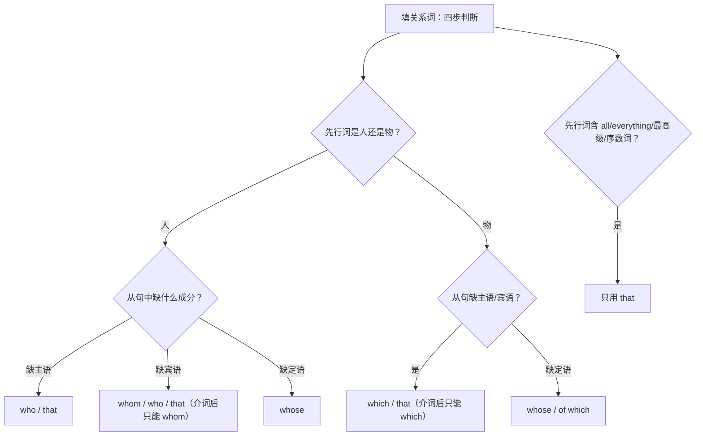

# Unit 3 语法与语言运用（Using language）

标签：#Unit3 #限制性定语从句 #that_which_who #语法课

## 语法目标

1. 理解**限制性定语从句**的功能：修饰名词（先行词），使其更具体。
2. 掌握关系代词 **that / which / who / whom / whose** 的选择规则。
3. 能在语法填空中正确填写关系词——北京高考语法填空最高频考点之一。

## 规则详解（表格对比）

| 关系词 | 先行词 | 在从句中作 | 例句 |
| --- | --- | --- | --- |
| who | 人 | 主语/宾语 | The man who is speaking is my father. |
| whom | 人 | 宾语（介词后只能 whom） | the person with whom I talked |
| which | 物 | 主语/宾语 | a song which touches me |
| that | 人/物 | 主语/宾语 | the band that won the prize |
| whose | 人/物 | 定语（…的） | a boy whose father is a judge |

只用 that 的情形：先行词被最高级、序数词、all/everything/nothing 修饰，或先行词既有人又有物。
只用 which 的情形：介词提前（in which）；非限制性从句（逗号后）。

## 典型例题

**例1**（语法填空）：The guitar ______ my grandfather gave me is the most precious gift ______ I have ever received.
**解析**：第一空先行词 guitar 为物、从句缺宾语 → which/that；第二空先行词被最高级 the most precious 修饰 → 只用 that。

**例2**（单选）：Do you know the girl ______ mother is a famous lawyer?
A. who  B. whom  C. whose  D. which
**解析**：从句缺定语（"她的"母亲）→ whose。答案 C。

**例3**（语法填空）：This is the house in ______ my father grew up.
**解析**：介词 in 提前，先行词为物 → 只能填 which。

## 易错点

1. 关系代词在从句中**作主语时不可省略**，作宾语时可省略：The song (that) I love。
2. 介词 + that（❌）：in that → in which。
3. 先行词是 the way 时，关系词用 that / in which 或省略，不用 which 单独引导（缺状语时）。
4. 从句谓语与**先行词**保持一致：He is one of the students who **were** late.（先行词是 students）。
5. 不要与强调句混淆：It is... that... 去掉框架句子完整则为强调句。

## 自测题

1. 语法填空：I still remember the day ______ we spent together in the countryside.（从句缺宾语）
2. 语法填空：She is the only person ______ understands me in the family.
3. 单选：The film ______ we talked about last night won an award.（A. what  B. who  C. that  D. whose）
4. 改错：All that glitters are not gold.

**答案**：1. which/that  2. who/that  3. C  4. are → is（all 指物为单数概念，谚语：闪光的未必都是金子）

## 相关知识点

[[词汇与课文精读（Understanding ideas）]] ｜ [[语法与语言运用（Using language）]]
