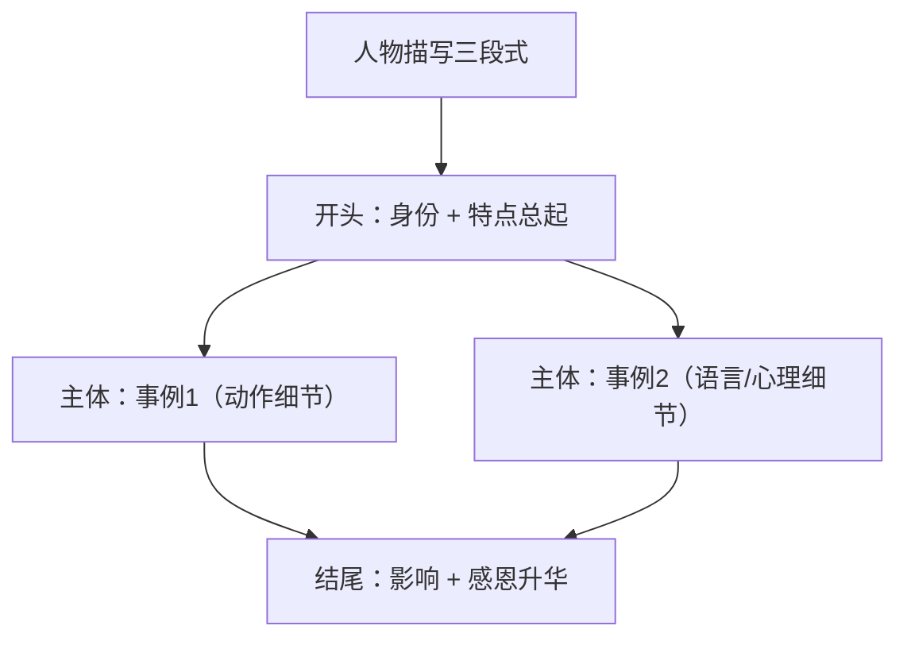

# Unit 3 读写与表达（Developing ideas）

标签：#Unit3 #读写课 #家人描写 #记叙与描写

## 阅读策略

Developing ideas 课文 *Just a Brother* 记述"我"与弟弟从争吵到理解的情感变化。阅读要点：

1. **抓情感变化线**：annoyed → guilty → grateful，情感词是完形与阅读推断题的锚点。
2. **细节描写的作用**：动作细节（He quietly fixed my bike）比直白陈述更能体现人物性格——文学类阅读常考"细节的功能"。
3. **对比结构**：过去的看法 vs 现在的认识（I used to think... but now I realise...）。

## 写作任务拆解

写作任务：写一篇短文介绍你的一位家人（人物描写，可迁移到高考应用文"介绍人物"与读后续写人物刻画）。

- **第一段**：总起——人物身份 + 一句话概括其特点（thesis sentence）。
- **第二段**：用 1-2 个**具体事例**支撑特点（事例比形容词堆砌更有说服力）。
- **第三段**：人物对"我"的影响 + 情感升华。
- 语言：多用定语从句丰富句式（呼应本单元语法），如 "My mother is a person who never gives up."

## 实用句式库

1. The person who influences me most in my family is my grandmother.
2. What impresses me most about her is her patience.
3. I still remember the day when she stayed up all night taking care of me.
4. It is her encouragement that gives me the courage to face difficulties.
5. Whenever I feel down, she is always there for me.

## 范文框架

| 段落 | 内容 | 推荐句式 |
| --- | --- | --- |
| 开头段 | 人物身份 + 核心特点 | The person who... is... |
| 主体段 | 具体事例（时间 + 事件 + 细节） | I still remember the day when... |
| 结尾段 | 影响与情感 | It is... that...; I'm grateful that... |

## 典型例题

**例1**（句式升级）：将 "My father is hard-working. He works every day." 用定语从句合并升级。
**参考**：My father is a hard-working man who never takes a day off, which sets a good example for me.

**例2**（阅读细节题）：How did the writer's attitude towards his brother change?
**解析**：定位 used to / but now 对比结构：从嫌弃（annoyed）到感激（grateful）。

## 易错点

1. 人物描写只堆形容词（kind, nice, great）而无事例，高考作文档次上不去——"特点 + 事例"绑定。
2. 定语从句关系词误用：the day **when** we met（缺状语用 when），the day **that/which** we spent（缺宾语）。
3. 三段式中结尾忘记写"对我的影响"，缺少升华。
4. it is... that... 强调句主谓一致：It is her words that **inspire** me.

## 自测题

1. 用定语从句写一句介绍家人：我的哥哥是一个总能让我发笑的人。
2. 单选：I'll never forget the day ______ my sister was born.（A. which  B. when  C. that  D. what）
3. 为 "My mother is patient." 补写一个具体事例（一句话）。
4. 改错：It was my grandfather's story that have changed my mind.

**答案**：1. My brother is a person who always makes me laugh.  2. B  3. 例：She explained the same maths problem to me five times without any complaint.  4. have → has

## 相关知识点

[[Unit 3 词汇与课文精读（Understanding ideas）]] ｜ [[Unit 3 语法与语言运用（Using language）]]
