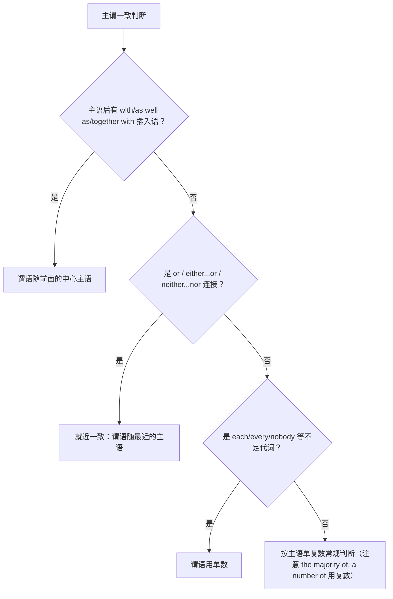

# Unit 4 语法与语言运用（Using language）

标签：#Unit4 #状语从句 #主谓一致 #语法课

## 语法目标

1. 掌握常见**状语从句**：时间（when/while/until）、条件（if/unless）、让步（although/even if）、原因（because/since）。
2. 掌握**主谓一致**三原则：语法一致、意义一致、就近一致。
3. 二者均为北京高考语法填空与短文改错式命题的高频考点。

## 规则详解（表格对比）

状语从句连词速查：

| 类型 | 连词 | 要点 |
| --- | --- | --- |
| 时间 | when, while, as soon as, until | 主将从现：If/When 从句用一般现在时代替将来时 |
| 条件 | if, unless（= if not） | unless 从句不再加 not |
| 让步 | although, though, even if/though | 不与 but 连用 |
| 原因 | because, since, as | because 不与 so 连用 |

主谓一致三原则：

| 原则 | 规则 | 例句 |
| --- | --- | --- |
| 语法一致 | 主语单数谓语单数 | Each of the boys has a bike. |
| 意义一致 | 集合名词按意义 | The class are discussing.（成员） |
| 就近一致 | or, either...or..., neither...nor..., not only...but also... | Neither he nor I am wrong. |

特别注意：A as well as B / A together with B / A along with B 作主语，谓语随 **A**。

## 典型例题

**例1**（语法填空）：If it ______ (rain) tomorrow, we will put off the picnic.
**解析**：条件状语从句"主将从现"→ rains。

**例2**（单选）：Not only the students but also the teacher ______ interested in the film.
A. are  B. is  C. were  D. be
**解析**：not only...but also... 就近一致，随 the teacher → is。答案 B。

**例3**（语法填空）：______ he is only 15, he has made friends all over the world.
**解析**：前后让步关系，填 Although/Though，且后半句不加 but。

## 易错点

1. **主将从现**只适用于时间/条件状语从句，宾语从句照常用将来时：I don't know if he **will come**; if he **comes**, I'll tell you.
2. unless = if...not，从句内不再出现 not。
3. although/though 与 but、because 与 so 不可同现（汉语思维负迁移）。
4. a number of + 复数名词 → 复数谓语；the number of + 复数名词 → 单数谓语。
5. 每逢 each/every/either 单独修饰主语，谓语一律单数。

## 自测题

1. 语法填空：I will keep in touch with you as soon as I ______ (arrive) in London.
2. 单选：______ you trust him, don't tell him the secret.（A. If  B. Unless  C. Because  D. When）
3. 语法填空：The number of my online friends ______ (have) grown to 100.
4. 改错：Either my parents or my brother are coming to the meeting.

**答案**：1. arrive  2. B  3. has  4. are → is（就近一致，随 my brother）

## 相关知识点

[[Unit 4 词汇与课文精读（Understanding ideas）]] ｜ [[Unit 3 语法与语言运用（Using language）]]
