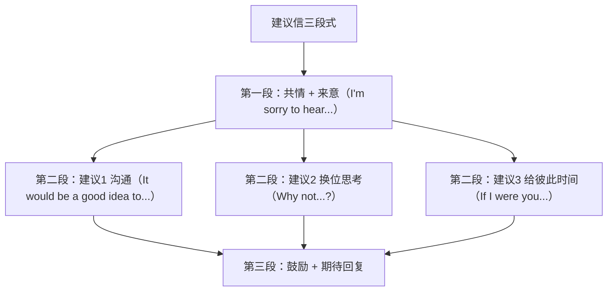

# Unit 4 读写与表达（Developing ideas）

标签：#Unit4 #读写课 #友谊故事 #建议信

## 阅读策略

Developing ideas 课文 *After Twenty Years*（欧·亨利短篇改编）讲述两位老友二十年后赴约，其中一人已成警察、另一人成了通缉犯。阅读要点：

1. **小说三要素**：人物（Bob 与 Jimmy）、情节（赴约→相认→抉择）、主题（友谊与职责的冲突）。
2. **伏笔与反转**（foreshadowing & twist）：欧·亨利式结尾，前文细节（警察看了看 Bob 的脸就离开）皆是伏笔——高考文学类阅读推断题重点。
3. **人物抉择题**：Jimmy 让便衣同事逮捕好友，体现"情与法"的取舍，主旨题勿只答"友谊珍贵"。

## 写作任务拆解

写作任务：给因交友问题苦恼的同学写一封**建议信**（北京高考应用文高频体裁）。

- **第一段**：表明来意 + 共情（I'm sorry to hear that... / I understand how you feel.）。
- **第二段**：给出 2-3 条建议，每条"建议 + 理由/做法"，用 First / Besides / Finally 衔接。
- **第三段**：鼓励 + 期待（I hope my suggestions will be helpful.）。
- 语气：委婉——多用 could / might / It would be a good idea to...，避免生硬祈使句。

## 实用句式库

1. I'm sorry to hear that you are having trouble getting along with your friend.
2. It would be a good idea to have a face-to-face talk with him.
3. Why not put yourself in his shoes before judging?
4. If I were you, I would express my feelings honestly.
5. I believe your friendship will grow stronger if you communicate sincerely.

## 范文框架

## 典型例题

**例1**（应用文写作）：用委婉语气改写 "You must apologize to him."
**参考**：It might be a good idea to say sorry to him first, which shows your sincerity.

**例2**（阅读推断题）：Why did Jimmy walk away instead of arresting Bob himself?
**解析**：他不忍亲手逮捕老友，又不能放弃警察职责，故请便衣同事代劳——细节 "Somehow I couldn't do it myself" 是依据。

## 易错点

1. 建议信通篇祈使句（Do this. Don't do that.）语气生硬，高考评分降档；改用 could/might/Why not。
2. If I were you 虚拟语气中 be 动词用 were，不用 was（正式书面）。
3. 建议缺少"理由/具体做法"，内容单薄——每条建议至少扩展一句。
4. suggest 后接 doing 或 that (should) do，不接 to do。

## 自测题

1. 写出建议信开头共情句：得知你和好朋友闹矛盾，我很难过。
2. 单选：I suggest ______ a sincere letter to your friend.（A. write  B. writing  C. to write  D. wrote）
3. 用 Why not 句式给出一条建议（关于当面沟通）。
4. 改错：If I was you, I would forgive him.

**答案**：1. I'm sorry to hear that you've fallen out with your best friend.  2. B  3. Why not have a face-to-face talk with him after class?  4. was → were

## 相关知识点

[[Unit 4 词汇与课文精读（Understanding ideas）]] ｜ [[Unit 1 读写与表达（Developing ideas）]]
