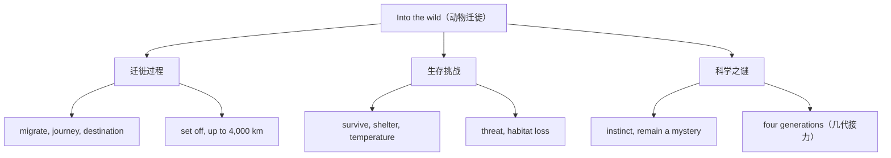

# Unit 5 词汇与课文精读（Understanding ideas）

标签：#Unit5 #IntoTheWild #自然与动物 #词汇课 ｜ 课文：A Journey of a Billion Butterflies（帝王蝶迁徙）

## 主题导入

本单元主题是"走进荒野"（Into the wild），课文介绍**帝王蝶**（monarch butterfly）跨越北美大陆的神奇迁徙：数十亿只蝴蝶飞行数千公里到墨西哥过冬，且完成迁徙需要几代蝴蝶接力。动物迁徙与生态保护是北京高考阅读说明文的经典题材，本课词汇多为科普高频词。

## 核心词汇表

| 词汇 | 词性 | 中文 | 高频搭配 |
| --- | --- | --- | --- |
| journey | n. | 旅程 | make a journey |
| billion | num. | 十亿 | billions of |
| migrate | v. | 迁徙 | migrate south for winter |
| migration | n. | 迁徙 | annual migration |
| species | n. | 物种（单复同形） | an endangered species |
| survive | v. | 幸存；存活 | survive the winter |
| survival | n. | 生存 | the survival of the species |
| extremely | adv. | 极其 | extremely cold |
| temperature | n. | 温度 | low temperatures |
| shelter | n./v. | 庇护所；躲避 | seek shelter |
| generation | n. | 一代 | four generations |
| mystery | n. | 谜 | remain a mystery |
| instinct | n. | 本能 | by instinct |
| destination | n. | 目的地 | reach the destination |
| threat | n. | 威胁 | pose a threat to... |

## 重点短语与句型

1. **set off / set out**：出发 — They set off on their long journey south.
2. **up to + 数字**：多达 — They fly up to 4,000 kilometres.
3. **It takes + 时间/几代 + to do**：It takes several generations to complete the migration.
4. **remain a mystery**：仍是未解之谜（科普文常用）。
5. **pose a threat to**：对…构成威胁（生态话题写作高分表达）。

## 课文精读笔记

- 文体：**科普说明文**，采用"惊叹现象 → 数据支撑 → 科学解释 → 未解之谜 → 保护呼吁"结构。
- 数据阅读：a billion butterflies / up to 4,000 km / four generations——数字细节题必考，注意约数词 up to（多达）、nearly（将近）。
- 拟人化表达：Nature's greatest travellers 增强可读性，标题理解题考点。
- 结尾呼吁：Climate change and habitat loss pose a threat to their survival.——引出保护主题，衔接本单元写作。

## 典型例题

**例1**（语法填空）：Monarch butterflies have amazed scientists with their ______ (migrate), which covers thousands of kilometres.
**解析**：物主代词 their 后接名词 → migration。构词法考点。

**例2**（阅读细节题）：Why is the monarchs' journey called "a relay race"?
**解析**：因为单只蝴蝶无法活着完成全程，需要 four generations 接力完成，定位第三段数字细节。

## 易错点

1. species 单复数同形：a species / many species，谓语按语境定。
2. survive 及物用法直接接宾语：survive the cold winter（❌ survive from）。
3. It takes sb. 时间 to do 中 take 的时态由语境决定，语法填空常考 took/has taken。
4. billion 前有具体数字时不加 s：two billion；泛指用 billions of。

## 自测题

1. 语法填空：These birds fly south every winter ______ (escape) the extreme cold.
2. 单选：Only a few of them managed to ______ the harsh winter.（A. survive  B. survival  C. surviving  D. survived）
3. 完成句子：栖息地丧失对许多物种构成威胁。Habitat loss ______ a ______ to many species.
4. 改错：There are three hundred species of butterfly in this forest, and each species have its own route.

**答案**：1. to escape  2. A  3. poses; threat  4. have → has（each + 单数）

## 相关知识点

[[Unit 5 语法与语言运用（Using language）]] ｜ [[Unit 6 词汇与课文精读（Understanding ideas）]]
