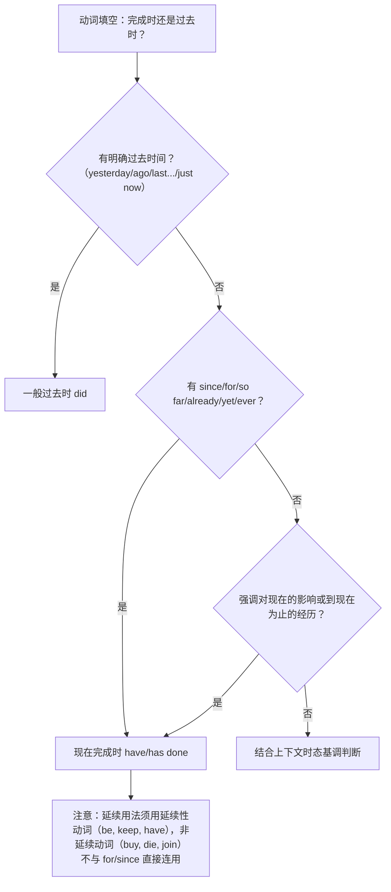

# Unit 5 语法与语言运用（Using language）

标签：#Unit5 #现在完成时 #语法课

## 语法目标

1. 掌握**现在完成时**（have/has + done）的结构与两大核心用法：**影响用法**（过去动作对现在的结果）与**延续用法**（动作/状态从过去延续至今）。
2. 熟练区分现在完成时与一般过去时——北京高考语法填空动词填空高频陷阱。
3. 掌握 have been to / have gone to / have been in 的区别。

## 规则详解（表格对比）

| 对比项 | 现在完成时 | 一般过去时 |
| --- | --- | --- |
| 结构 | have/has + 过去分词 | did |
| 视角 | 立足**现在**看过去 | 立足过去叙述 |
| 时间状语 | already, yet, just, ever, never, so far, since..., for + 时段, in the past few years | yesterday, ago, last..., in 2018, just now |
| 典型句 | The butterflies have arrived in Mexico.（现在它们在墨西哥） | They arrived last week.（陈述过去事件） |

三个易混短语：

| 短语 | 含义 | 例句 |
| --- | --- | --- |
| have been to | 去过（已回来） | I have been to the nature reserve twice. |
| have gone to | 去了（未回来） | He has gone to Yunnan for field study. |
| have been in | 待在某地（多久） | She has been in Beijing for ten years. |

## 典型例题

**例1**（语法填空）：Scientists ______ (study) the migration of monarch butterflies since the 1970s.
**解析**：since + 过去时间点，延续至今 → have studied（have been studying 亦可）。

**例2**（单选）：—Have you ever ______ Xinjiang? —Yes, I ______ there with my parents in 2023.
A. been to; have gone  B. gone to; went  C. been to; went  D. been in; have been
**解析**：经历用 have been to；2023 明确过去时间用 went。答案 C。

**例3**（改错）：My uncle has bought this camera for five years.
**解析**：buy 是非延续动词，不与 for 时段连用 → has had this camera for five years。

## 易错点

1. 非延续动词（die, buy, join, leave, borrow）不能与 for/since 时段直接连用：转换为 be dead / have had / have been in。
2. Have you...? 的肯定回答注意时态呼应，追问细节转过去时（完成时开话题、过去时说细节）。
3. It is/has been + 时段 + since + 过去时：It has been three years since he **joined** the club.
4. in the past/last few years 与完成时连用，是语法填空高频标志。

## 自测题

1. 语法填空：So far, the number of protected species in China ______ (rise) steadily.
2. 单选：—Where is Professor Li? —He ______ the Qinling Mountains to observe wild pandas.（A. has been to  B. has gone to  C. went  D. has been in）
3. 语法填空：Great changes ______ (take) place in my hometown in the past ten years.
4. 改错：He has left Beijing for two months.

**答案**：1. has risen  2. B  3. have taken  4. has left → has been away from（或 He left Beijing two months ago）

## 相关知识点

[[Unit 5 词汇与课文精读（Understanding ideas）]] ｜ [[Unit 1 语法与语言运用（Using language）]]
