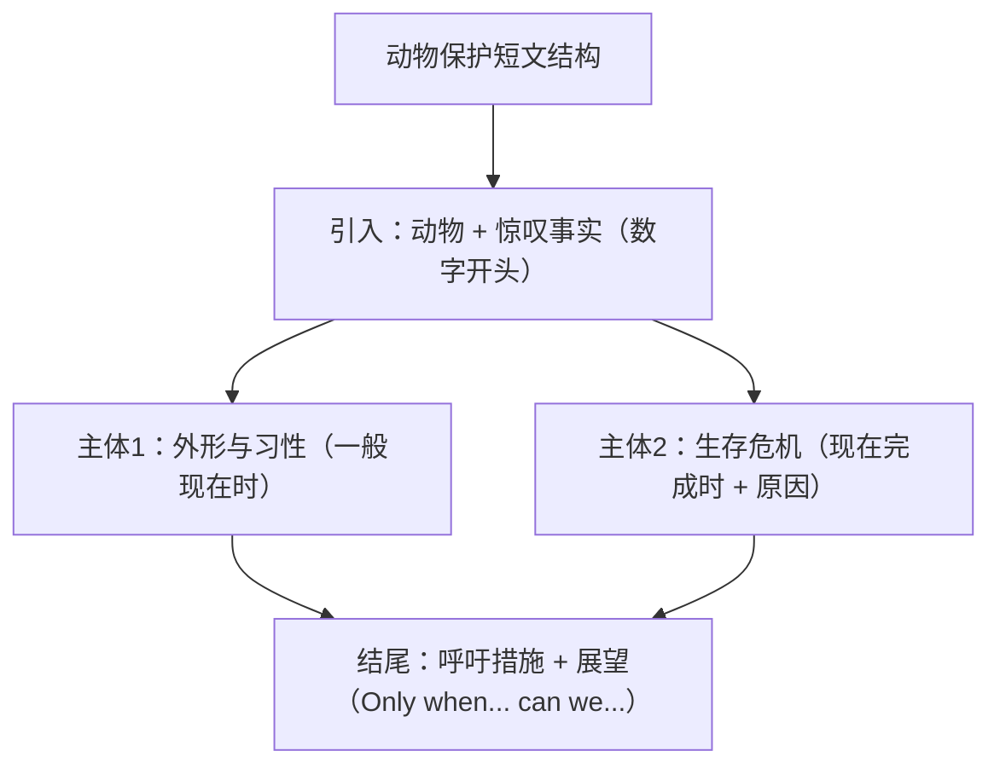

# Unit 5 读写与表达（Developing ideas）

标签：#Unit5 #读写课 #动物保护 #说明性写作

## 阅读策略

Developing ideas 课文 *Grow a Nose for the Wild*（与野生动物相处/追踪自然）呈现人与野生动物的近距离接触经历。阅读要点：

1. **说明文与记叙文杂糅**：亲历叙述（narrative）+ 知识介绍（facts），做题时区分"作者经历"与"客观信息"两个层面。
2. **环境描写的功能**：荒野环境描写（the silent forest, fresh tracks）营造氛围并推动情节——读后续写可借鉴。
3. **保护主题信号**：respect nature, keep a safe distance 等表达提示文章立场。

## 写作任务拆解

写作任务：写一篇介绍某种动物并呼吁保护的短文（说明文，可对接北京高考应用文"倡议/介绍"类）。

- **第一段**：引入动物 + 一句话亮点（数字或惊叹事实抓眼球）。
- **第二段**：基本信息——外形、习性、栖息地（一般现在时）；现状——数量减少及原因（现在完成时呼应本单元语法：Their numbers have dropped sharply）。
- **第三段**：保护呼吁——具体措施 + 展望。
- 语言：科普数据 + 呼吁句式结合，避免空喊口号。

## 实用句式库

1. Known as "the king of the snow mountains", the snow leopard lives in high mountains.
2. Over the past decades, their population has fallen by nearly half.
3. Habitat loss and illegal hunting pose a serious threat to their survival.
4. It is high time that we took action to protect these amazing creatures.
5. Only when we live in harmony with nature can we share a bright future.

## 范文框架

| 段落 | 内容要点 | 时态基调 |
| --- | --- | --- |
| 引入段 | 动物名称 + 惊叹事实 | 一般现在时 |
| 主体段 | 习性栖息地 + 数量变化及原因 | 一般现在时 + 现在完成时 |
| 呼吁段 | 措施 + 展望 | 情态动词 + 倒装升华句 |

## 典型例题

**例1**（句式升级）：升级 "We should protect wild animals."
**参考**：It is high time that we joined hands to protect wild animals, whose survival is closely linked with ours.

**例2**（阅读细节题）：What does the author suggest doing when meeting a wild animal?
**解析**：定位建议句 keep a safe distance and never feed them——尊重自然而非亲近打扰。

## 易错点

1. It is high time that 后接**过去式**（虚拟）：took action，不是 take。
2. Only when... 位于句首，主句须**部分倒装**：Only when we act now **can we** save them.
3. 数量下降表达：the population has fallen/dropped **by** half（降幅用 by）。
4. 呼吁段只有口号无措施，高考作文内容分受损——至少给出一条具体做法（如 set up nature reserves）。

## 自测题

1. 完成句子：是时候采取行动了。It is high time that we ______ (take) action.
2. 倒装改写：We can protect them only when everyone gets involved.（Only when 开头）
3. 语法填空：The number of snow leopards ______ (drop) sharply over the past 20 years.
4. 为熊猫写一个"数字开头"的引入句。

**答案**：1. took  2. Only when everyone gets involved can we protect them.  3. has dropped  4. 例：With fewer than 2,000 left in the wild, the giant panda is a national treasure of China.

## 相关知识点

[[Unit 5 词汇与课文精读（Understanding ideas）]] ｜ [[Unit 6 读写与表达（Developing ideas）]]
