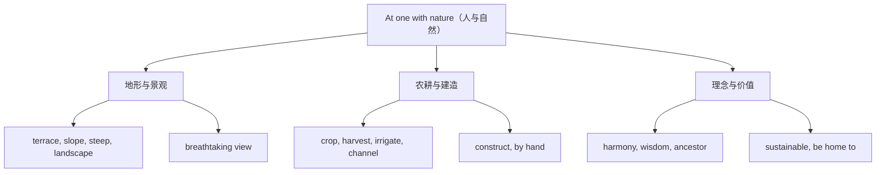

# Unit 6 词汇与课文精读（Understanding ideas）

标签：#Unit6 #AtOneWithNature #人与自然 #词汇课 ｜ 课文：Longji Rice Terraces（龙脊梯田）

## 主题导入

本单元主题是"与自然合一"（At one with nature）。课文介绍广西**龙脊梯田**：先民依山就势开垦梯田，既养活了人，又与山水融为一体，体现"人与自然和谐共生"的中国智慧。中国文化与生态文明是北京高考阅读与书面表达（介绍中国名片）的热门话题。

## 核心词汇表

| 词汇 | 词性 | 中文 | 高频搭配 |
| --- | --- | --- | --- |
| terrace | n. | 梯田；露台 | rice terraces |
| harmony | n. | 和谐 | in harmony with nature |
| slope | n. | 斜坡 | steep slopes |
| steep | adj. | 陡峭的 | a steep mountain |
| flat | adj. | 平坦的 | flat land |
| crop | n. | 庄稼 | grow crops |
| harvest | n./v. | 收获 | a good harvest |
| irrigate | v. | 灌溉 | irrigate the fields |
| channel | n. | 水渠；渠道 | water channels |
| construct | v. | 建造 | construct terraces |
| landscape | n. | 风景；地貌 | a breathtaking landscape |
| breathtaking | adj. | 令人惊叹的 | a breathtaking view |
| ancestor | n. | 祖先 | our ancestors |
| wisdom | n. | 智慧 | the wisdom of the ancients |
| sustainable | adj. | 可持续的 | sustainable development |

## 重点短语与句型

1. **in harmony with**：与…和谐相处 — live in harmony with nature（单元主题句）。
2. **rather than**：而不是 — They worked with nature rather than against it.
3. **date back to / date from**：追溯到 — The terraces date back to the Yuan Dynasty.（无被动、无进行）
4. **be home to**：是…的家园 — The terraces are home to various species.
5. **not only... but also...**：不但…而且…（可倒装开头：Not only do the terraces feed people, but they also...）。

## 课文精读笔记

- 文体：**说明文/文化介绍**，结构为"景观描绘 → 历史由来 → 建造智慧 → 生态价值 → 主题升华"。
- 建造智慧：先民不砍山、不填谷，而是**顺应山势**（follow the shape of the mountains）修建梯田与水渠（channels），体现 work with nature 的核心理念。
- 关键句：The terraces were constructed by hand over hundreds of years.（被动语态，直接衔接本单元语法课）。
- 高考链接：介绍中国文化遗产的说明文常考"How/Why 细节题"与"标题概括题"，抓每段首句即可搭出骨架。

## 典型例题

**例1**（语法填空）：The Longji Rice Terraces, ______ (construct) hundreds of years ago, still feed the local people today.
**解析**：terraces 与 construct 为被动关系，作后置定语 → constructed（过去分词短语）。

**例2**（阅读主旨题）：What is the main idea of the passage?
**解析**：全文围绕"梯田体现人与自然和谐"展开，答案应含 harmony between humans and nature，而非仅"介绍旅游景点"。

## 易错点

1. date back to / date from **无被动语态、无进行时**：The village dates back to...（❌ is dated back to）。
2. be home to 中 home 前不加冠词。
3. in harmony with 不要写成 in harmony to。
4. Not only 置于句首引导句子时，前半句**部分倒装**：Not only **do** they provide food...

## 自测题

1. 语法填空：This ancient town ______ (date) back to the Ming Dynasty.
2. 单选：We should learn to work ______ nature rather than ______ it.（A. with; against  B. for; with  C. at; for  D. in; on）
3. 完成句子：这片湿地是数百种鸟类的家园。The wetland ______ ______ ______ hundreds of bird species.
4. 倒装改写：The terraces not only produce rice but also attract many visitors.（Not only 开头）

**答案**：1. dates  2. A  3. is home to  4. Not only do the terraces produce rice, but they also attract many visitors.

## 相关知识点

[[Unit 6 语法与语言运用（Using language）]] ｜ [[Unit 5 词汇与课文精读（Understanding ideas）]]
