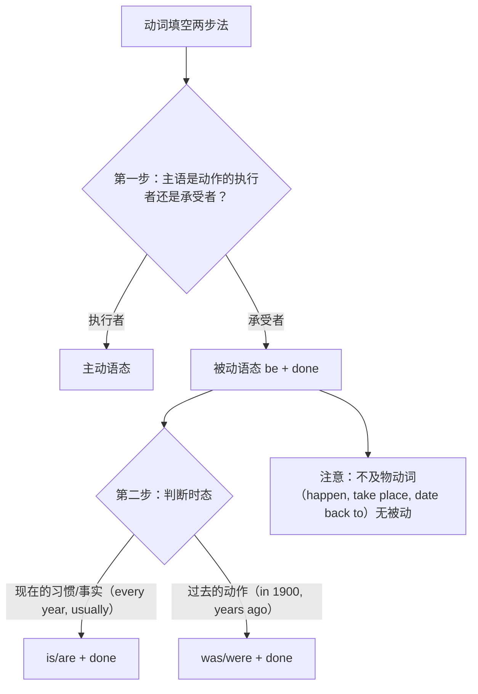

# Unit 6 语法与语言运用（Using language）

标签：#Unit6 #被动语态 #一般现在时被动 #一般过去时被动 #语法课

## 语法目标

1. 掌握**被动语态**的构成：be + 过去分词（by + 动作执行者可省略）。
2. 熟练运用**一般现在时被动**（am/is/are + done）与**一般过去时被动**（was/were + done）。
3. 能判断"何时该用被动"——语法填空给动词时先判主被动再定时态，这是北京高考动词填空的标准两步法。

## 规则详解（表格对比）

| 时态 | 被动结构 | 例句 |
| --- | --- | --- |
| 一般现在时 | am/is/are + done | Rice is grown on the terraces. |
| 一般过去时 | was/were + done | The channels were built by hand. |

主动 vs 被动使用场景：

| 场景 | 选择 | 例句 |
| --- | --- | --- |
| 强调动作承受者 | 被动 | The forest was destroyed in the fire. |
| 执行者未知/不重要 | 被动 | English is spoken here. |
| 说明文/科普客观描述 | 常用被动 | The terraces are visited by thousands each year. |
| 强调谁做的 | 主动 | Our ancestors constructed the terraces. |

## 典型例题

**例1**（语法填空）：Every year, thousands of trees ______ (plant) along the river to protect the soil.
**解析**：trees 是被种的（承受者）+ every year 现在习惯 → are planted。

**例2**（语法填空）：The ancient bridge ______ (build) more than 400 years ago and is still in use today.
**解析**：bridge 是被建的 + ago 过去时间 → was built。

**例3**（单选）：Great changes ______ in my hometown in recent years.
A. have been taken place  B. have taken place  C. were taken place  D. took place
**解析**：take place 不及物，无被动；in recent years 配现在完成时。答案 B。

## 易错点

1. **不及物动词无被动**：happen, take place, appear, date back to, break out——语法填空最爱挖的坑。
2. be 动词与主语一致且承载时态：The photos **were** taken（复数+过去）。
3. 情态动词被动：must be protected，be 不可省。
4. 短语动词的介词/副词不可丢：The problem was **looked into**（被调查）。
5. 主动形式表被动含义：The book sells well. / The pen writes smoothly.（sell, write, wash 等）。

## 自测题

1. 语法填空：Paper ______ (invent) in China about 2,000 years ago.
2. 语法填空：Nowadays, more attention ______ (pay) to environmental protection.
3. 单选：The accident ______ at the crossing yesterday evening.（A. was happened  B. happened  C. is happened  D. has happened）
4. 改错：The mountain village can be see clearly from the top of the tower.

**答案**：1. was invented  2. is paid  3. B  4. see → seen（情态动词被动 can be done）

## 相关知识点

[[Unit 6 词汇与课文精读（Understanding ideas）]] ｜ [[Unit 1 语法与语言运用（Using language）]]
