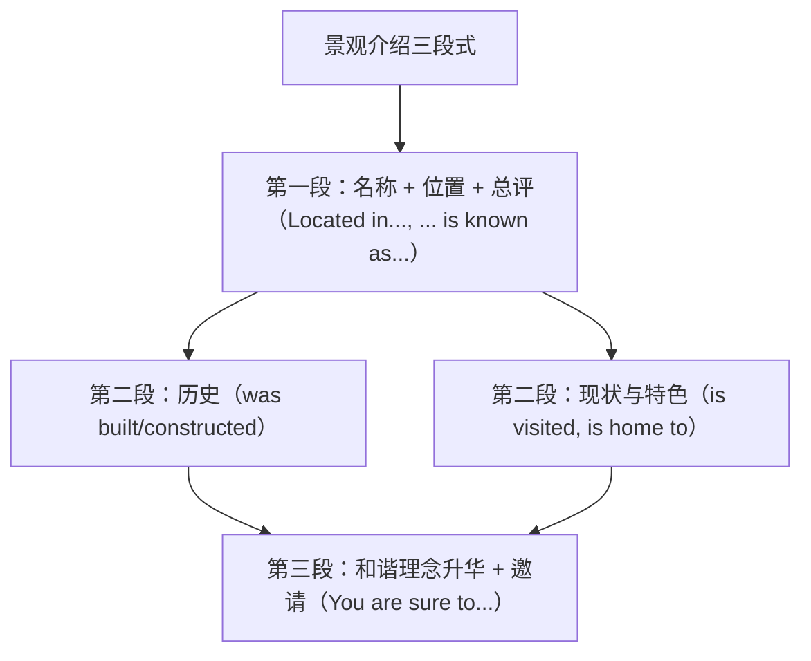

# Unit 6 读写与表达（Developing ideas）

标签：#Unit6 #读写课 #人与自然 #介绍类应用文

## 阅读策略

Developing ideas 课文 *Understanding Nature's Clues*（观察自然的启示，如借助自然征兆预测天气/海啸的故事）。阅读要点：

1. **例证结构**：观点（nature gives us clues）+ 多个事例（动物异常行为预示灾害），细节题按事例定位。
2. **因果链**：animals sensed danger → moved to higher ground → survived the tsunami，理清因果是推断题关键。
3. **主旨升华句**常在末段：Those who listen to nature will be rewarded.——与单元主题 at one with nature 呼应。

## 写作任务拆解

写作任务：写一篇介绍中国某处自然/文化景观并倡导人与自然和谐的短文（北京高考"介绍中国名片"类应用文变体）。

- **第一段**：景观名称 + 位置 + 一句话总评（breathtaking / a perfect example of harmony）。
- **第二段**：特色描述——历史（一般过去时被动：was built/constructed，呼应本单元语法）+ 现状（一般现在时被动：is visited/is known as）。
- **第三段**：意义升华——体现的智慧 + 邀请/呼吁。
- 检查清单：被动语态至少 2 处、一个非谓语或定语从句、字数约 100 词。

## 实用句式库

1. Located in Guangxi, the Longji Rice Terraces are known as one of the most breathtaking landscapes in China.
2. The terraces were constructed by hand and have been farmed for hundreds of years.
3. What makes it special is the perfect harmony between humans and nature.
4. It is regarded as a living example of the Chinese wisdom "greenwaters and green mountains are gold and silver mountains".
5. If you come, you will be deeply impressed by its beauty.

## 范文框架

## 典型例题

**例1**（句式升级）：升级 "The West Lake is beautiful. Many people visit it."
**参考**：Known for its poetic beauty, the West Lake is visited by millions of tourists from home and abroad every year.

**例2**（阅读推断题）：What can we learn from the animals' behaviour before the disaster?
**解析**：动物凭本能感知危险并转移——人类应尊重并学习自然的信号（learn to read nature's clues），不选"动物比人聪明"这类过度推断。

## 易错点

1. Located in... 分词作状语，逻辑主语必须是句子主语（景观本身），不能悬垂。
2. be known as（作为…而闻名）vs be known for（因…而闻名）：is known as a wonder / is known for its beauty。
3. 介绍类作文时态分层：历史用过去被动，现状用现在被动，混用则逻辑混乱。
4. 邀请句避免生硬的 "Welcome to visit"，用 "You are welcome to visit..." 或 "I sincerely invite you to..."。

## 自测题

1. 语法填空：______ (locate) at the foot of the mountain, the village enjoys fresh air all year round.
2. 单选：Hangzhou is known ______ the "Paradise on Earth".（A. for  B. as  C. by  D. to）
3. 用被动语态写一句某景观的历史（长城，明朝）。
4. 改错：What make this place special is its harmony with nature.

**答案**：1. Located  2. B  3. 例：The Great Wall was largely rebuilt during the Ming Dynasty.  4. make → makes（主语从句作主语，谓语单数）

## 相关知识点

[[Unit 6 词汇与课文精读（Understanding ideas）]] ｜ [[Unit 5 读写与表达（Developing ideas）]]
