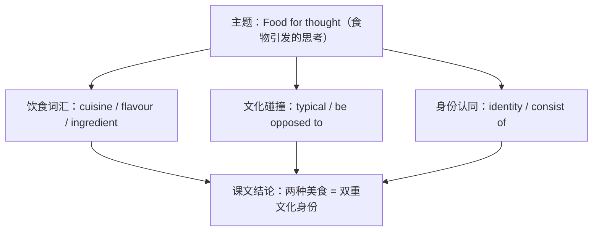

# 词汇与课文精读（Understanding ideas）

**Unit 1 Food for thought**（外研版必修第二册）｜标签：#Unit1 #饮食文化 #词汇 #课文精读

## 单元导览

本单元主题为"食物与文化"，课文 *A Child of Two Cuisines* 讲述一个中英混血家庭中两种饮食文化的碰撞与融合。学习目标：掌握饮食主题词汇约 15 个；理解课文"文化认同"主旨；剖析含非谓语与定语从句的长难句。

## 核心内容

### 主题词汇表

| 词汇 | 词性/含义 | 常考搭配 | 例句 |
| --- | --- | --- | --- |
| cuisine | n. 菜肴；烹饪风格 | Chinese/French cuisine | I grew up with two cuisines. 我在两种饮食文化中长大。 |
| dessert | n. 甜点 | for dessert | We had ice cream for dessert. 我们的甜点是冰淇淋。 |
| dare | v. 敢于 | dare (to) do | I didn't dare (to) try the snails. 我不敢尝蜗牛。 |
| typical | adj. 典型的 | be typical of | Hotpot is typical of Sichuan. 火锅是四川的典型菜。 |
| consist | v. 组成 | consist of（无被动） | The dish consists of rice and fish. 这道菜由米饭和鱼组成。 |
| opposed | adj. 反对的 | be opposed to doing | He is opposed to wasting food. 他反对浪费食物。 |
| slice | n./v. 薄片；切片 | a slice of | a slice of bread 一片面包 |
| stir | v. 搅拌 | stir-fry 翻炒 | Stir the soup gently. 轻轻搅汤。 |
| chilli | n. 辣椒 | chilli sauce | The chilli sauce is too hot. 辣椒酱太辣了。 |
| flavour | n. 风味 | local flavour | The dish has a strong local flavour. 这道菜地方风味浓郁。 |
| ingredient | n. 原料；成分 | fresh ingredients | Choose fresh ingredients. 选用新鲜食材。 |
| digest | v. 消化 | easy to digest | Porridge is easy to digest. 粥容易消化。 |
| balanced | adj. 均衡的 | a balanced diet | Keep a balanced diet. 保持均衡饮食。 |
| identity | n. 身份认同 | cultural identity | Food shapes our cultural identity. 食物塑造文化认同。 |
| explore | v. 探索 | explore new tastes | I love exploring new tastes. 我喜欢探索新口味。 |

### 课文主旨与结构

作者（父亲英国人、母亲中国人）从"餐桌上的两种文化"切入：先写中西饮食差异带来的趣事，再写自己对两种美食的热爱，最后升华——"两种菜系"正是他双重文化身份的象征。

### 长难句剖析

**原句**：Being a child of two cuisines has made me the person I am today.
**剖析**：动名词短语 *Being a child of two cuisines* 作主语（衔接本单元语法 -ing 作主语）；*I am today* 为省略 that 的定语从句修饰 person。译：作为两种饮食文化的孩子，造就了今天的我。

## 典型例题

**例1**（单选）：The dinner ______ three courses, including a famous local dish.
A. consists of  B. is consisted of  C. makes up  D. is made from
**解析**：consist of 无被动语态，排除 B；make up 主语应为"组成部分"。答案 A。

**例2**（语法填空）：My mother is strongly opposed ______ (add) too much chilli to the soup.
**解析**：be opposed to 中 to 为介词，后接动名词。答案 to adding。

## 易错点

1. consist of 不能用于被动语态：*is consisted of* ❌。
2. be opposed to / be used to 中的 to 是介词，接 doing 而非 do。
3. dare 既可作实义动词（dare to do）也可作情态动词（否定句 daren't do）。
4. dessert（甜点）与 desert（沙漠/抛弃）拼写混淆。

## 背记要点

- 高考视角：饮食文化是北京卷阅读与书面表达高频话题，cuisine、ingredient、a balanced diet 为写作加分表达。
- 必背搭配：be typical of / consist of / be opposed to doing / a slice of。
- 主旨句型：Food is more than something to eat; it is part of who we are. 食物不仅是吃的，更是我们身份的一部分。

## 自测题

1. 语法填空：A healthy breakfast ______ (consist) of eggs, milk and bread.
2. 单选：I didn't dare ______ my teacher the truth. A. tell  B. to telling  C. told  D. telling
3. 翻译：这道菜有着典型的北京风味。（be typical of）
4. 写出 identity、ingredient 的中文含义并各造一句。

**答案**：1. consists  2. A（dare 后接 (to) do）  3. This dish is typical of Beijing flavour.  4. 身份认同；原料（造句合理即可）

## 相关知识点

[[语法与语言运用（Using language）]] ｜ [[读写与表达（Developing ideas）]]
