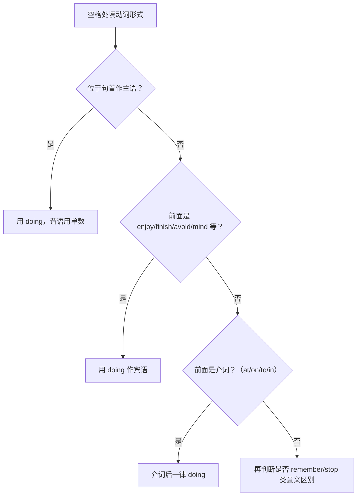

# 语法与语言运用（Using language）

**Unit 1 Food for thought**（外研版必修第二册）｜标签：#Unit1 #非谓语动词 #动词ing #语法专项

## 单元导览

本单元语法核心：**动词-ing 形式作主语和宾语**。这是高中非谓语动词体系的起点，也是北京高考语法填空、写作中最常用的结构之一。目标：能识别 -ing 作主语/宾语的位置，掌握"只接 doing 的动词"清单。

## 核心内容

### -ing 作主语

| 用法 | 结构 | 例句 |
| --- | --- | --- |
| 直接作主语 | Doing ... + 单数谓语 | Eating vegetables is good for health. 吃蔬菜有益健康。 |
| it 形式主语 | It is no use/no good doing | It is no use crying over spilt milk. 覆水难收，哭也没用。 |
| there be 结构 | There is no point (in) doing | There is no point arguing. 争论没有意义。 |

### -ing 作宾语

| 类型 | 常考动词/短语 | 例句 |
| --- | --- | --- |
| 只接 doing 的动词 | enjoy, finish, avoid, mind, suggest, practise, keep, consider, admit, imagine | I enjoy cooking with my mum. 我喜欢和妈妈一起做饭。 |
| 介词后接 doing | be good at, insist on, look forward to, be used to | She insists on eating breakfast. 她坚持吃早餐。 |
| 意义有别 | remember/forget/stop/try doing vs. to do | I stopped eating snacks.（停止吃）/ I stopped to eat.（停下来去吃） |

记忆口诀（只接 doing）：**建议(suggest)完成(finish)练习(practise)享受(enjoy)，避免(avoid)介意(mind)考虑(consider)继续(keep)**。

## 典型例题

**例1**（语法填空）：______ (share) meals with family is an important tradition in China.
**解析**：句首作主语，用动名词 Sharing；谓语 is 单数与之呼应。答案 Sharing。

**例2**（单选）：We are looking forward to ______ the food festival next month.
A. visit  B. visiting  C. be visiting  D. have visited
**解析**：look forward to 中 to 是介词，后接 doing。答案 B。

## 易错点

1. -ing 短语作主语时谓语用**单数**：Eating too many sweets **is** bad ❌ are。
2. look forward to / be used to / devote ... to 中 to 是介词，误接动词原形是第一失分点。
3. stop doing（停止做）≠ stop to do（停下来去做另一件事）。
4. suggest/consider 后接 doing，不接 to do：He suggested **going** out for dinner。

## 背记要点

- 高考视角：语法填空给动词提示词、空格在句首或介词后 → 优先考虑 doing；北京卷几乎每年考查。
- 必背：It is no use doing / There is no point (in) doing / feel like doing。
- 写作升格：用动名词主语替代 "We should..."，如 Keeping a balanced diet makes a difference. 保持均衡饮食大有裨益。

## 自测题

1. 语法填空：He avoided ______ (answer) my question about the recipe.
2. 语法填空：______ (cook) at home is healthier than eating out.
3. 单选：Do you feel like ______ out, or would you rather ______ at home? A. going; stay  B. to go; staying  C. going; to stay  D. to go; stay
4. 改错：Remember turning off the gas after cooking tonight.（提醒"记得要做"）

**答案**：1. answering  2. Cooking  3. A  4. turning → to turn（remember to do 记得要做）

## 相关知识点

[[Unit 1 · 词汇与课文精读]] ｜ [[Unit 1 · 读写与表达]] ｜ 衔接 [[Unit 2 · 语法与语言运用]]（-ing 作定语/状语/表语）
