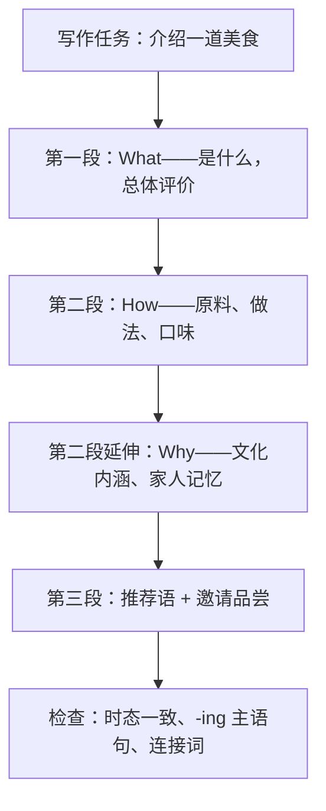

# 读写与表达（Developing ideas）

**Unit 1 Food for thought**（外研版必修第二册）｜标签：#Unit1 #阅读策略 #应用文 #美食介绍

## 单元导览

本板块围绕课文 *The Beauty of Chinese Cuisine* 展开：学习"抓住段落主题句"的阅读策略，并完成本单元写作任务——**介绍一道中国美食/家乡饮食文化**的短文，兼顾北京高考应用文（推荐信/介绍信）体裁。

## 核心内容

### 阅读策略：主题句定位法

1. 主题句（topic sentence）多在段首，其余句子为例证或细节。
2. 遇到 however / but / in fact 等转折词时，主题句可能后移。
3. 做主旨题先读各段首句，再验证标题选项是否覆盖全文。

### 写作模板：介绍一道美食（三段式）

| 段落 | 功能 | 参考句型 |
| --- | --- | --- |
| 开头 | 点出美食+总评价 | Among all the traditional dishes, ... is my favourite. 在所有传统菜肴中，……是我的最爱。 |
| 主体 | 原料+做法+口味/文化 | It is made from... / What makes it special is that... 它由……制成／它的特别之处在于…… |
| 结尾 | 推荐+邀请品尝 | I'm sure you will fall in love with it at first bite. 我相信你尝一口就会爱上它。 |

### 高分句型

1. Tasting Beijing roast duck is like taking a bite of history. 品尝北京烤鸭就像咬了一口历史。（-ing 作主语，呼应本单元语法）
2. Not only does it taste delicious, but it also carries the wisdom of generations. 它不仅美味，还承载着世代智慧。（倒装）
3. It is the dish that brings the whole family together during festivals. 正是这道菜让全家人在节日团聚。（强调句）

## 典型例题

**例1**（主旨题）：若某段首句为 "However, Chinese cuisine is far more than just taste."，该段主旨最可能是？
**解析**：however 提示转折后为核心观点——中国菜不止于味道（还有文化内涵）。选含 "beyond taste / culture" 的选项。

**例2**（写作点评）：学生句 "Dumplings is my favourite food, make by my grandma."
**升格**：Dumplings **are** my favourite food, **made** by my grandma.（主谓一致；过去分词作定语）。再升格：Eating dumplings made by Grandma is the warmest memory of my childhood.

## 易错点

1. 介绍做法时全文误用过去时；客观工序应用**一般现在时**（First, the meat is chopped...）。
2. 菜名首字母与专有名词大写：Beijing roast duck。
3. be made from（看不出原料）/ be made of（看得出）/ be made into（制成）混用。
4. 应用文缺少读者意识：给外国朋友介绍时应加解释，如 jiaozi, a kind of dumpling。

## 背记要点

- 高考视角：北京卷应用文常考"向外国朋友介绍中国文化"，美食是最稳妥素材；50 词内讲清 what–how–why。
- 必背衔接词：to begin with / what's more / more importantly / in a word。
- 万能结尾：Food connects people and cultures. 美食连接人与文化。

## 自测题

1. 写出主题句常见的两个位置及判断依据。
2. 单选：Tofu is made ______ soybeans. A. of  B. from  C. into  D. up
3. 用 -ing 作主语翻译：和家人一起包饺子让我感到幸福。
4. 列出应用文"推荐美食"三段各自的功能关键词。

**答案**：1. 段首为主；转折词后（however/but）。 2. B（看不出原材料）。 3. Making dumplings with my family makes me feel happy. 4. What / How+Why / 推荐邀请。

## 相关知识点

[[词汇与课文精读（Understanding ideas）]] ｜ [[语法与语言运用（Using language）]]
