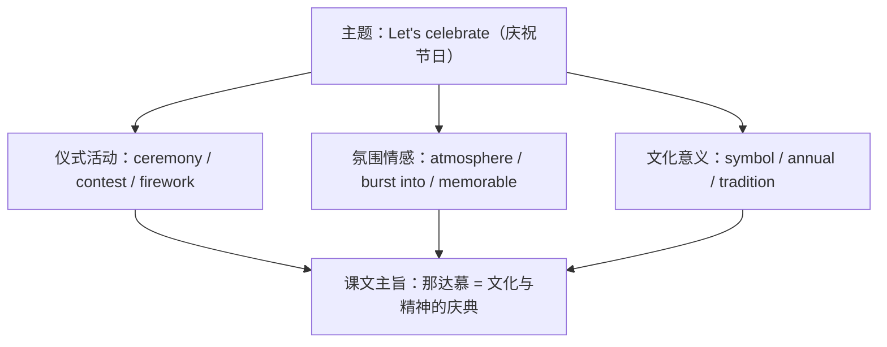

# 词汇与课文精读（Understanding ideas）

**Unit 2 Let's celebrate**（外研版必修第二册）｜标签：#Unit2 #节日庆典 #词汇 #课文精读

## 单元导览

本单元主题为"节日与庆典"，课文 *My Amazing Naadam Experience* 以博客形式记录作者在内蒙古那达慕大会的见闻。目标：掌握节日主题词汇约 15 个；理解游记类文本的时间线结构；剖析含 -ing 形式的长难句。

## 核心内容

### 主题词汇表

| 词汇 | 词性/含义 | 常考搭配 | 例句 |
| --- | --- | --- | --- |
| celebrate | v. 庆祝 | celebrate a festival | We celebrate the Spring Festival with fireworks. 我们放烟花庆祝春节。 |
| occasion | n. 场合；时刻 | on this occasion | It is a special occasion for families. 这是家人团聚的特殊时刻。 |
| ceremony | n. 仪式 | opening ceremony | The opening ceremony was amazing. 开幕式很精彩。 |
| firework | n. 烟花 | set off fireworks | Children love watching fireworks. 孩子们爱看烟花。 |
| costume | n. 服装 | traditional costume | Dancers wore traditional costumes. 舞者身穿传统服装。 |
| contest | n. 比赛 | a wrestling contest | He won the wrestling contest. 他赢了摔跤比赛。 |
| bend | v. 弯曲 | bend down | The rider bent down to pick it up. 骑手俯身去捡。 |
| burst | v./n. 爆发 | burst into cheers | The crowd burst into cheers. 人群爆发出欢呼。 |
| annual | adj. 一年一度的 | an annual event | Naadam is an annual event. 那达慕是一年一度的盛会。 |
| gather | v. 聚集 | gather together | People gathered to watch the race. 人们聚集观看比赛。 |
| atmosphere | n. 气氛 | a festive atmosphere | The festive atmosphere excited us. 节日气氛让我们兴奋。 |
| admire | v. 欣赏；钦佩 | admire the view | I admired the riders' skills. 我钦佩骑手的技艺。 |
| host | v./n. 举办；主人 | host a festival | The city hosts the event yearly. 该市每年举办这一盛会。 |
| symbol | n. 象征 | a symbol of | The dragon is a symbol of power. 龙是力量的象征。 |
| memorable | adj. 难忘的 | a memorable experience | It was a truly memorable day. 那是难忘的一天。 |

### 课文主旨与结构

博客按"到达草原 → 观看摔跤/赛马/射箭三项比赛 → 感受与思考"的时间线展开，结尾点题：那达慕不仅是比赛，更是蒙古族文化与精神的庆典。

### 长难句剖析

**原句**：Hearing the exciting news, the crowd burst into cheers, waving flags in the air.
**剖析**：Hearing... 为 -ing 短语作时间状语；waving... 作伴随状语（本单元语法预热）。译：听到激动人心的消息，人群爆发出欢呼，在空中挥舞旗帜。

## 典型例题

**例1**（单选）：The Mid-Autumn Festival is a special ______ when families get together to admire the moon.
A. ceremony  B. occasion  C. contest  D. symbol
**解析**：句意"家人团聚赏月的特殊时刻"，occasion 表"场合、时刻"。答案 B。

**例2**（语法填空）：The whole hall burst ______ laughter at his joke.
**解析**：固定搭配 burst into + n.（laughter/cheers/tears）。答案 into。

## 易错点

1. burst into + 名词（tears）；burst out + doing（crying），两者不可混搭。
2. costume（服装）与 custom（风俗）拼写形近，语法填空常设陷阱。
3. annual 只作定语或表语，无副词比较级用法；"一年两次"是 twice a year。
4. admire sb. for sth. 中介词用 for，不用 of。

## 背记要点

- 高考视角：中华传统节日是北京卷书面表达高频话题，ceremony、atmosphere、symbol of 是提分词汇。
- 必背搭配：burst into cheers / set off fireworks / a festive atmosphere / host an event。
- 主旨句型：Festivals are a window into a nation's culture. 节日是了解一个民族文化的窗口。

## 自测题

1. 语法填空：Naadam, an ______ (annual) festival, attracts thousands of visitors.
2. 单选：She burst out ______ when she heard the good news. A. cry  B. to cry  C. crying  D. cried
3. 翻译：春节是中华文化的重要象征。（symbol）
4. 写出 costume 与 custom 的含义区别并各造一句。

**答案**：1. annual（形容词作定语不变形）  2. C  3. The Spring Festival is an important symbol of Chinese culture.  4. costume 服装 / custom 风俗（造句合理即可）

## 相关知识点

[[Unit 2 · 语法与语言运用]] ｜ [[Unit 2 · 读写与表达]]
