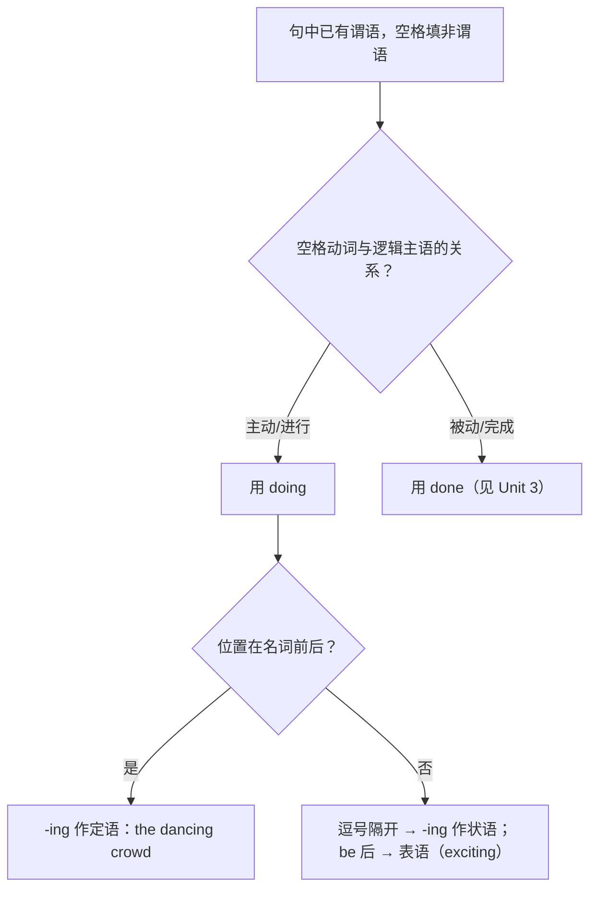

# 语法与语言运用（Using language）

**Unit 2 Let's celebrate**（外研版必修第二册）｜标签：#Unit2 #非谓语动词 #动词ing #定语状语表语

## 单元导览

本单元语法核心：**动词-ing 形式作定语、状语和表语**，与 Unit 1 的"-ing 作主语/宾语"共同构成 -ing 形式完整体系。目标：能判断 -ing 与被修饰词/主语的**主动关系**，并在写作中用 -ing 状语为句子增色。

## 核心内容

### 三种功能对比表

| 功能 | 位置与结构 | 例句 | 判断要点 |
| --- | --- | --- | --- |
| 作定语 | 单个 -ing 前置；短语后置 | the rising sun 初升的太阳 / the girl standing there 站在那里的女孩 | 与被修饰词是**主动/进行**关系 |
| 作状语 | 句首/句尾，逗号隔开 | Seeing the fireworks, we cheered. 看到烟花，我们欢呼起来。 | 逻辑主语 = 句子主语，主动关系 |
| 作表语 | be + -ing（说明性质） | The match was exciting. 比赛激动人心。 | 主语多为**物**，表"令人……的" |

### -ing 状语细分

| 类型 | 例句 |
| --- | --- |
| 时间 | Walking into the hall, I heard music. 走进大厅时，我听到了音乐。 |
| 原因 | Being tired, she went to bed early. 因为累了，她早早睡了。 |
| 伴随 | He watched the race, cheering loudly. 他看比赛，大声欢呼着。 |
| 结果 | The team won, making the fans excited. 球队获胜，令球迷兴奋。 |

## 典型例题

**例1**（语法填空）：______ (watch) the dragon dance, the children clapped their hands with joy.
**解析**：children 与 watch 为主动关系，-ing 短语作时间状语。答案 Watching。

**例2**（单选）：The news about the coming festival is really ______, and we are all ______ about it.
A. exciting; excited  B. excited; exciting  C. exciting; exciting  D. excited; excited
**解析**：news（物）"令人兴奋"用 exciting 作表语；人"感到兴奋"用 excited。答案 A。

## 易错点

1. -ing 状语的逻辑主语必须与句子主语一致："Walking down the street, the museum appeared." ❌（博物馆不会走路）。
2. -ing/-ed 形容词分工：exciting 修饰物/事，excited 修饰人（的感受）。
3. 单个 -ing 作定语放名词前，短语必须后置：a sleeping baby / a baby sleeping in the cradle。
4. 伴随状语与并列谓语混淆：He sat there, reading（伴随）≠ He sat there and read（并列）。

## 背记要点

- 高考视角：北京卷语法填空非谓语题中，-ing 与 -ed 二选一是最高频考法，判断口诀"主动进行 doing，被动完成 done"。
- 必背表语形容词对：exciting/excited, amazing/amazed, interesting/interested, surprising/surprised。
- 写作升格：把两个简单句合并成"主句 + -ing 伴随状语"，如 People gathered in the square, singing and dancing. 人们聚在广场上，载歌载舞。

## 自测题

1. 语法填空：Look at the ______ (rise) lanterns in the night sky!
2. 语法填空：______ (not know) the local custom, he asked the guide for help.
3. 单选：The ceremony was so ______ that everyone stood up. A. moved  B. moving  C. move  D. to move
4. 句子升格：People walked along the street. They waved flags.（合并为含 -ing 状语的一句）

**答案**：1. rising  2. Not knowing（否定式 not 置于 -ing 前）  3. B  4. People walked along the street, waving flags.

## 相关知识点

[[Unit 2 · 词汇与课文精读]] ｜ [[Unit 2 · 读写与表达]] ｜ 对比 [[Unit 3 · 语法与语言运用]]（-ed 形式作定语/状语）
