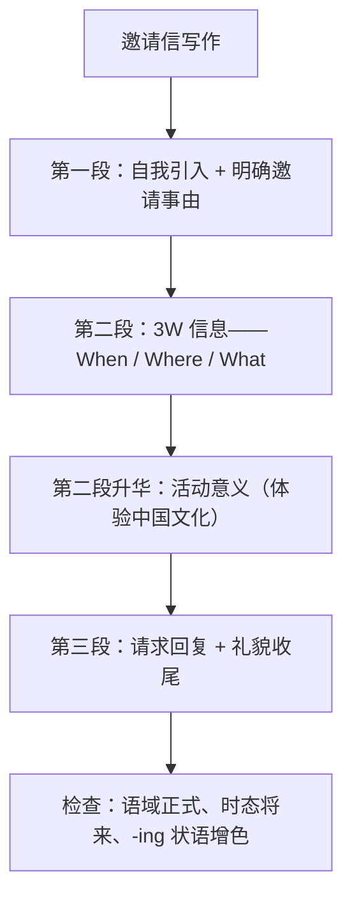

# 读写与表达（Developing ideas）

**Unit 2 Let's celebrate**（外研版必修第二册）｜标签：#Unit2 #阅读策略 #邀请信 #节日介绍

## 单元导览

本板块围绕课文 *When and Why Did It Begin?*（节日起源）展开：学习"因果关系词定位"的阅读策略，并完成写作任务——**写一封邀请外国朋友参加中国节日活动的邀请信**（北京高考应用文核心体裁）。

## 核心内容

### 阅读策略：因果线索词

1. 表原因：because, due to, thanks to, originate from（起源于）。
2. 表结果：therefore, as a result, thus。
3. 节日起源类文章常按"传说/历史原因 → 演变 → 现代庆祝方式"组织，抓因果词即可理清脉络。

### 写作模板：节日活动邀请信（三段式）

| 段落 | 功能 | 参考句型 |
| --- | --- | --- |
| 开头 | 寒暄+发出邀请 | I'm writing to invite you to... 我写信邀请你参加…… |
| 主体 | 活动安排（时间/地点/内容）+意义 | The activity will be held on... / You will get a chance to... 活动将于……举行／你将有机会…… |
| 结尾 | 期待回复 | I would appreciate it if you could come. Looking forward to your early reply. 若你能来我将不胜感激，期待早日回复。 |

### 高分句型

1. Held on the 15th day of the first lunar month, the Lantern Festival marks the end of Spring Festival celebrations. 元宵节在正月十五举行，标志着春节庆祝的尾声。
2. Walking among the lanterns, you will feel the charm of Chinese culture. 漫步于花灯之间，你会感受到中华文化的魅力。（-ing 状语，呼应本单元语法）
3. It would be a great pleasure if you could join us. 如果你能加入我们，将是莫大的荣幸。（虚拟客气语气）

## 典型例题

**例1**（细节题）：文中 "The festival originated from an ancient legend" 后最可能接什么内容？
**解析**：originate from 提示下文将展开讲述传说细节（叙述过去，注意时态转为过去时）。

**例2**（写作点评）：学生句 "I invite you come to my home celebrate Mid-Autumn Festival."
**升格**：I'd like to invite you **to come** to my home **to celebrate** the Mid-Autumn Festival.（invite sb. to do；目的状语 to do；节日名前加 the）。

## 易错点

1. 邀请信语域要正式：用 I would like to 而非 I wanna；结尾用 Yours, Li Hua。
2. 活动安排用将来时 will be held，介绍节日固定习俗用一般现在时。
3. appreciate 后接 it：I would appreciate **it** if you could reply soon。
4. 漏写 3W 要点（时间/地点/内容）是应用文最常见扣分原因。

## 背记要点

- 高考视角：邀请信是北京卷应用文最高频体裁之一，模板+3W+文化意义三层结构可保基础分，-ing 状语与虚拟客气句提升档次。
- 必背句式：I'm writing to invite you to... / Looking forward to your reply。
- 节日常用语块：set off fireworks / admire the full moon / enjoy reunion dinner。

## 自测题

1. 写出邀请信三段的核心功能。
2. 单选：I would appreciate ______ if you could join us. A. that  B. it  C. this  D. you
3. 用 -ing 状语翻译：品尝着月饼，我们一起赏月。
4. 列出介绍节日起源时应使用的两个因果/起源类词汇。

**答案**：1. 发出邀请 / 3W+意义 / 期待回复。 2. B。 3. Tasting mooncakes, we admired the full moon together. 4. originate from, because/due to 等。

## 相关知识点

[[Unit 2 · 词汇与课文精读]] ｜ [[Unit 2 · 语法与语言运用]]
