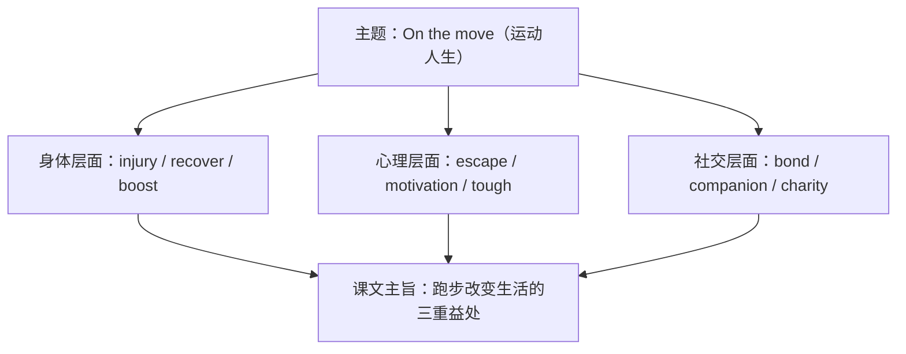

# 词汇与课文精读（Understanding ideas）

**Unit 3 On the move**（外研版必修第二册）｜标签：#Unit3 #运动 #词汇 #课文精读

## 单元导览

本单元主题为"运动与健身"，课文 *Running into a Better Life* 讲述"跑步"如何改变人们的生活方式与心态。目标：掌握运动主题词汇约 15 个；理解议论+叙述混合文体；剖析含 -ed 形式的长难句。

## 核心内容

### 主题词汇表

| 词汇 | 词性/含义 | 常考搭配 | 例句 |
| --- | --- | --- | --- |
| athlete | n. 运动员 | a professional athlete | She trains like a professional athlete. 她像职业运动员一样训练。 |
| bond | n./v. 纽带；联结 | build a bond | Running builds a bond between us. 跑步在我们之间建立了纽带。 |
| boost | v. 增强 | boost confidence | Exercise boosts my confidence. 锻炼增强了我的自信。 |
| escape | v./n. 逃离；解脱 | escape from pressure | Running is an escape from stress. 跑步是压力的解药。 |
| tough | adj. 艰难的 | a tough race | The last mile was really tough. 最后一英里非常艰难。 |
| injury | n. 受伤 | avoid injury | Warm up to avoid injury. 热身以避免受伤。 |
| recover | v. 恢复 | recover from | He recovered from the knee injury. 他的膝伤痊愈了。 |
| sweat | n./v. 汗水；出汗 | be covered in sweat | I was covered in sweat after the run. 跑完后我满身是汗。 |
| pace | n. 速度；步伐 | at one's own pace | Run at your own pace. 按自己的节奏跑。 |
| companion | n. 同伴 | a running companion | My dog is my running companion. 我的狗是我的跑步伙伴。 |
| motivation | n. 动力 | lack motivation | Music gives me motivation. 音乐给我动力。 |
| charity | n. 慈善 | a charity run | She joined a charity run. 她参加了慈善跑。 |
| equipment | n. 装备（不可数） | sports equipment | The gym has new equipment. 健身房有新装备。 |
| regularly | adv. 定期地 | exercise regularly | Exercise regularly to stay fit. 定期锻炼保持健康。 |
| benefit | n./v. 益处；受益 | benefit from | We all benefit from sports. 我们都从运动中受益。 |

### 课文主旨与结构

课文以多位跑者的故事为例：跑步带来的不只是健康（physical），还有减压（mental）与友谊（social），结尾号召读者"迈开第一步"。

### 长难句剖析

**原句**：Encouraged by her companions, she finished the tough race, exhausted but satisfied.
**剖析**：Encouraged by... 为过去分词短语作原因状语（she 与 encourage 是被动关系，衔接本单元语法）；exhausted but satisfied 为形容词短语作伴随状语。译：在同伴鼓励下，她跑完了艰难的比赛，精疲力竭却心满意足。

## 典型例题

**例1**（单选）：It took him two months to ______ from the leg injury.
A. escape  B. recover  C. boost  D. benefit
**解析**：recover from 表"从（伤病）中恢复"。答案 B。

**例2**（语法填空）：Running with friends ______ (benefit) both our health and our friendship.
**解析**：动名词短语作主语，谓语用单数。答案 benefits。

## 易错点

1. equipment 不可数：many equipments ❌，应说 much equipment / a piece of equipment。
2. benefit from（从……受益）与 be beneficial to（对……有益）方向相反，勿混。
3. injury（伤）/ injure（伤害 v.）/ injured（受伤的）词性区分是语法填空考点。
4. pace 与 speed：at one's own pace 指自己的节奏，是固定搭配。

## 背记要点

- 高考视角：体育锻炼、健康生活是北京卷阅读与写作常青话题；boost、benefit、motivation 是高级替换词。
- 必背搭配：recover from / at one's own pace / build a bond with / take up running。
- 主旨句型：Sport is not just about winning; it is about becoming a better self. 运动不只关乎输赢，更关乎成为更好的自己。

## 自测题

1. 语法填空：All the ______ (equip) in the gym is brand new.
2. 单选：______ by the coach's words, the team played harder. A. Encouraging  B. Encouraged  C. To encourage  D. Encourage
3. 翻译：定期锻炼能增强我们的信心。（boost）
4. 写出 escape 在课文语境中的含义并造一句。

**答案**：1. equipment（不可数）  2. B（被动关系用过去分词）  3. Exercising regularly can boost our confidence.  4. （精神上的）解脱、逃离压力（造句合理即可）

## 相关知识点

[[Unit 3 · 语法与语言运用]] ｜ [[Unit 3 · 读写与表达]]
