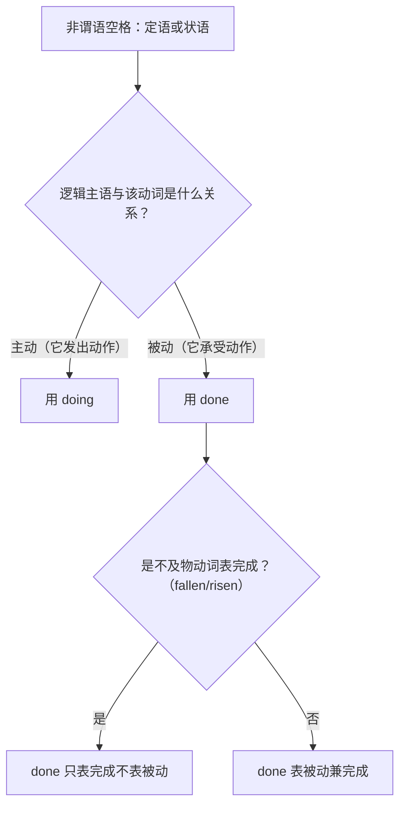

# 语法与语言运用（Using language）

**Unit 3 On the move**（外研版必修第二册）｜标签：#Unit3 #非谓语动词 #动词ed #定语状语

## 单元导览

本单元语法核心：**动词-ed 形式（过去分词）作定语和状语**，与 Unit 2 的 -ing 形式互为镜像。判断口诀：**主动进行用 doing，被动完成用 done**。目标：能在非谓语二选一中准确判断语态关系。

## 核心内容

### -ed 作定语

| 位置 | 结构 | 例句 |
| --- | --- | --- |
| 前置（单个分词） | done + n. | a broken leg 骨折的腿 / boiled water 开水 |
| 后置（分词短语） | n. + done... | the record set by the athlete 运动员创造的纪录 |

判断要点：被修饰名词与动词是**被动**关系（leg 被 break），或表**已完成**（fallen leaves 落叶）。

### -ed 作状语

| 类型 | 例句 |
| --- | --- |
| 时间 | Seen from the hill, the stadium looks like a nest. 从山上看，体育场像鸟巢。 |
| 原因 | Tired after the race, he sat down at once. 赛后疲惫，他立刻坐下。 |
| 条件 | Given more time, she would run faster. 如果给更多时间，她会跑得更快。 |
| 伴随/方式 | He stood there, surrounded by fans. 他站在那里，被粉丝围着。 |

### doing 与 done 对比

| 判断 | -ing（主动/进行） | -ed（被动/完成） |
| --- | --- | --- |
| 定语 | the man running on the track 跑道上跑步的人 | the medal won last year 去年赢得的奖牌 |
| 状语 | Hearing the gun, he started. 听到枪声他就出发。 | Injured in the match, he left the field. 比赛中受伤，他离场了。 |

## 典型例题

**例1**（语法填空）：______ (compare) with last year, our team has made great progress.
**解析**：our team 与 compare 是被动关系（被拿来比较），固定结构 compared with。答案 Compared。

**例2**（单选）：The player ______ in the final will receive extra training.
A. beating  B. beaten  C. to beat  D. beat
**解析**："在决赛中**被击败**的选手"，被动关系用过去分词后置定语。答案 B。

## 易错点

1. 逻辑主语不一致的悬垂分词："Seen from the plane, we saw the city." ❌（we 不能"被看"）。
2. interested/interesting 类：the excited fans（人感到激动）vs. the exciting match（比赛令人激动）。
3. 不及物动词的 -ed 只表完成：fallen leaves（已落的叶），无被动含义。
4. having done（先发生）与 done 区分：Having finished the warm-up, he began to run。

## 背记要点

- 高考视角：北京卷语法填空非谓语题几乎必考 doing/done 之辨；先找逻辑主语，再判主被动。
- 必背固定分词结构：compared with / given（考虑到）/ generally speaking / located in。
- 写作升格：用 -ed 状语开头，如 Founded in 2008, our running club now has 200 members. 我们的跑步俱乐部成立于 2008 年，现有 200 名成员。

## 自测题

1. 语法填空：The stadium ______ (build) for the Olympics is still in use.
2. 语法填空：______ (give) another chance, I would train even harder.
3. 单选：______ the news, they jumped with joy. A. Hearing  B. Heard  C. To hear  D. Being heard
4. 改错：Losing in the semi-final, the team was praised for its spirit.（team 与 lose 需重新判断——此处指"输掉比赛后"）

**答案**：1. built  2. Given  3. A（they 主动听到）  4. Losing → Having lost（先输掉比赛，完成在先且主动）

## 相关知识点

[[Unit 3 · 词汇与课文精读]] ｜ [[Unit 3 · 读写与表达]] ｜ 对比 [[Unit 2 · 语法与语言运用]]（-ing 形式）
