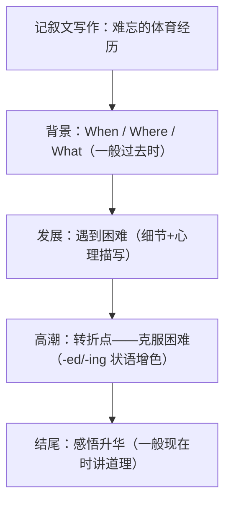

# 读写与表达（Developing ideas）

**Unit 3 On the move**（外研版必修第二册）｜标签：#Unit3 #阅读策略 #记叙文 #人物报道

## 单元导览

本板块围绕课文 *The Road to Success*（体育人物故事）展开：学习"抓时间线与转折点"的记叙文阅读策略，并完成写作任务——**记叙一次难忘的体育经历/介绍一位敬佩的运动员**（记叙文体裁）。

## 核心内容

### 阅读策略：时间线 + 转折点

1. 人物故事按时间顺序展开，圈出年份与 at first / later / eventually 等时间词。
2. 转折点（turning point）常伴随 however / but / until one day，是主旨题与推断题的命题点。
3. 结尾段往往揭示人物精神品质——态度题答案多在此。

### 写作模板：难忘的体育经历（记叙文四步）

| 步骤 | 功能 | 参考句型 |
| --- | --- | --- |
| 背景 | 时间地点事件 | Last autumn, our school held its annual sports meeting. 去年秋天，学校举办了一年一度的运动会。 |
| 发展 | 遇到困难 | Halfway through the race, my legs felt as heavy as lead. 跑到一半，我的双腿重如灌铅。 |
| 高潮 | 克服困难 | Encouraged by my classmates' cheers, I gritted my teeth and sped up. 在同学们的加油声鼓舞下，我咬牙加速。 |
| 感悟 | 点题升华 | This experience taught me that persistence pays off. 这次经历教会我坚持终有回报。 |

### 高分句型

1. Exhausted but determined, I refused to give up. 我筋疲力尽却意志坚定，拒绝放弃。（-ed 形容词作状语，呼应本单元语法）
2. It was at that moment that I understood the true meaning of sportsmanship. 正是在那一刻，我懂得了体育精神的真谛。（强调句）
3. Never had I felt so proud of myself. 我从未如此为自己骄傲。（倒装）

## 典型例题

**例1**（推断题）：文末 "He still runs every morning, rain or shine." 表现人物什么品质？
**解析**：rain or shine（风雨无阻）暗示 perseverance / self-discipline（坚持不懈、自律）。

**例2**（写作点评）：学生句 "I was very tired, but I keep running and finally I win."
**升格**：Tired as I was, I **kept** running and finally **won** the race.（记叙文全程过去时；as 倒装让步增色）。

## 易错点

1. 记叙文时态"漂移"：叙事用过去时，结尾感悟才转一般现在时。
2. 心理描写缺失导致内容单薄：加入 my heart raced / I told myself... 等细节。
3. 直接翻译"坚持就是胜利"生硬，可用 persistence pays off / never give up。
4. -ed 状语逻辑主语错误：Encouraged by the cheers, **I**...（是"我"被鼓舞）。

## 背记要点

- 高考视角：北京卷情景作文常考"活动过程叙述"，四步结构（背景—困难—克服—感悟）适配大多数题目。
- 必背语块：grit one's teeth / speed up / cross the finish line / pay off。
- 万能感悟句：What matters is not the result but the courage to keep going. 重要的不是结果，而是坚持下去的勇气。

## 自测题

1. 写出记叙文四步结构的名称。
2. 单选：______ by the audience's applause, she performed even better. A. Inspiring  B. Inspired  C. To inspire  D. Inspire
3. 用强调句翻译：正是那次失败让我学会了坚持。
4. 记叙一次比赛时，全文主体应使用什么时态？

**答案**：1. 背景—发展（困难）—高潮（克服）—感悟。 2. B。 3. It was that failure that taught me to persevere. 4. 一般过去时（感悟句可用一般现在时）。

## 相关知识点

[[Unit 3 · 词汇与课文精读]] ｜ [[Unit 3 · 语法与语言运用]]
