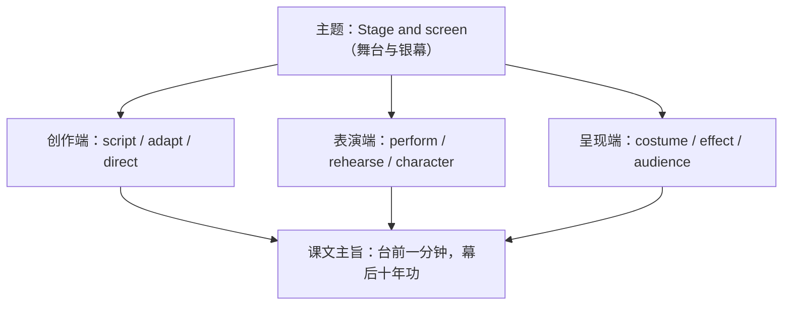

# 词汇与课文精读（Understanding ideas）

**Unit 4 Stage and screen**（外研版必修第二册）｜标签：#Unit4 #戏剧影视 #词汇 #课文精读

## 单元导览

本单元主题为"舞台与银幕"，课文 *Behind the Scenes*（幕后故事）介绍戏剧/电影制作背后的工作与匠心。目标：掌握表演艺术主题词汇约 15 个；理解说明文的分类结构；剖析含定语从句的长难句。

## 核心内容

### 主题词汇表

| 词汇 | 词性/含义 | 常考搭配 | 例句 |
| --- | --- | --- | --- |
| audience | n. 观众 | a large audience | The play attracted a large audience. 这部剧吸引了大量观众。 |
| character | n. 角色；人物 | the main character | Who plays the main character? 谁扮演主角？ |
| plot | n. 情节 | a gripping plot | The film has a gripping plot. 这部电影情节扣人心弦。 |
| scene | n. 场景；一场 | the opening scene | The opening scene is set in Beijing. 开场戏以北京为背景。 |
| perform | v. 表演 | perform on stage | They performed on stage last night. 他们昨晚登台表演。 |
| rehearse | v. 排练 | rehearse a play | We rehearsed the play for weeks. 我们排练了这部剧数周。 |
| direct | v. 导演；指导 | direct a film | The film was directed by a young talent. 影片由一位年轻才俊执导。 |
| script | n. 剧本 | write a script | She is writing a film script. 她在写电影剧本。 |
| applause | n. 掌声（不可数） | a burst of applause | The ending won warm applause. 结尾赢得热烈掌声。 |
| costume | n. 戏服 | design costumes | The costumes were beautifully designed. 戏服设计精美。 |
| effect | n. 效果 | special effects | The special effects amazed us. 特效令我们惊叹。 |
| adapt | v. 改编 | be adapted from | The film is adapted from a novel. 影片改编自小说。 |
| release | v./n. 上映；发行 | be released | The movie will be released in May. 电影将于五月上映。 |
| review | n./v. 评论 | a film review | I wrote a review of the play. 我写了一篇剧评。 |
| talent | n. 天赋；人才 | have a talent for | She has a talent for acting. 她有表演天赋。 |

### 课文主旨与结构

课文按"幕后分工"分类展开：编剧（script）→ 导演（director）→ 演员排练（rehearse）→ 服装与特效（costume, effects），结尾点题：舞台上的一分钟，凝聚幕后无数人的心血。

### 长难句剖析

**原句**：The actors, who had rehearsed for months, finally won the applause that they truly deserved.
**剖析**：who had rehearsed for months 为非限制性定语从句修饰 actors；that they truly deserved 为限制性定语从句修饰 applause（衔接本单元语法）。译：排练了数月的演员们，终于赢得了他们真正应得的掌声。

## 典型例题

**例1**（单选）：The film, ______ from a true story, moved everyone to tears.
A. adapting  B. adapted  C. to adapt  D. adapts
**解析**：film 与 adapt 为被动关系，过去分词短语作非限制性定语。答案 B。

**例2**（语法填空）：The audience ______ (be) clapping warmly when the curtain fell.
**解析**：audience 作整体谓语可用单数，此处过去进行时。答案 was。

## 易错点

1. audience 指整体时谓语用单数，强调成员时可用复数；不说 many audiences（场次义除外）。
2. applause 不可数：a burst of applause ✅，many applauses ❌。
3. adapt（改编/适应）与 adopt（收养/采纳）形近易混。
4. scene（一场戏/场景）与 scenery（自然风景，不可数）不同。

## 背记要点

- 高考视角：影视戏剧是北京卷阅读常见素材；be adapted from、win applause、have a talent for 是写作实用语块。
- 必背搭配：play the role of / be released / a gripping plot / behind the scenes（在幕后）。
- 主旨句型：Every minute on the stage takes years of work behind the scenes. 台上一分钟，台下十年功。

## 自测题

1. 语法填空：The play, ______ (base) on a Beijing legend, was a great success.
2. 单选：She has a talent ______ singing and dancing. A. in  B. of  C. for  D. at
3. 翻译：这部电影改编自一部著名小说。（be adapted from）
4. 写出 adapt 与 adopt 的含义区别。

**答案**：1. based  2. C  3. The film is adapted from a famous novel.  4. adapt 改编/适应；adopt 收养/采纳。

## 相关知识点

[[Unit 4 · 语法与语言运用]] ｜ [[Unit 4 · 读写与表达]]
