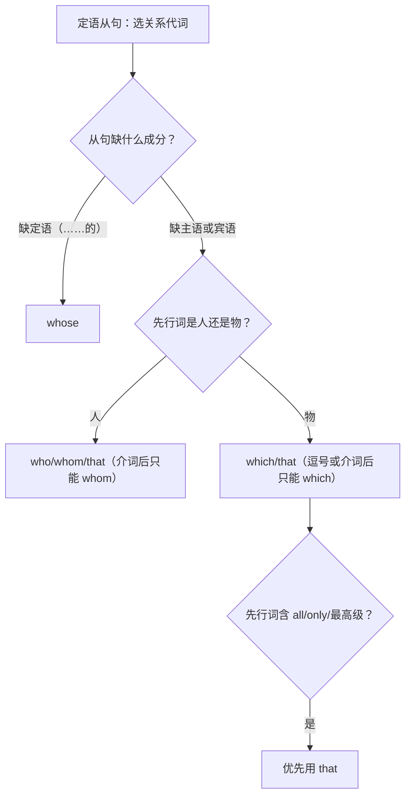

# 语法与语言运用（Using language）

**Unit 4 Stage and screen**（外研版必修第二册）｜标签：#Unit4 #定语从句 #关系代词 #语法专项

## 单元导览

本单元语法核心：**关系代词 that / which / who / whom / whose 引导的定语从句**。这是高中语法的重中之重，北京高考语法填空与写作年年考查。目标：能判断先行词与从句成分，正确选择关系代词。

## 核心内容

### 关系代词选择表

| 关系代词 | 先行词 | 从句中作成分 | 例句 |
| --- | --- | --- | --- |
| who | 人 | 主语/宾语 | The actor who plays Hamlet is famous. 扮演哈姆雷特的演员很有名。 |
| whom | 人 | 宾语（正式） | The director whom we admire is here. 我们敬佩的导演在这里。 |
| which | 物 | 主语/宾语 | The film which won the award is on. 获奖影片正在上映。 |
| that | 人/物 | 主语/宾语 | The play that we saw was moving. 我们看的那部剧很感人。 |
| whose | 人/物 | 定语（……的） | The writer whose novel was adapted came. 小说被改编的那位作家来了。 |

### 关键规则

1. 关系代词作**宾语**时可省略：The film (that) I saw yesterday。
2. **只用 that** 的情形：先行词被 the only / all / everything / 序数词 / 最高级修饰。
3. **只用 which** 的情形：非限制性从句（逗号后）、介词后（in which）。
4. 判断步骤：先行词是人还是物 → 从句缺主语、宾语还是定语。

## 典型例题

**例1**（语法填空）：The actress ______ costume was designed by hand impressed the audience.
**解析**：先行词 actress 与 costume 是所属关系（"她的"戏服），从句缺定语。答案 whose。

**例2**（单选）：This is the most moving film ______ I have ever seen.
A. which  B. that  C. who  D. whose
**解析**：先行词被最高级 the most moving 修饰，关系代词只能用 that。答案 B。

## 易错点

1. 非限制性定语从句（逗号后）不能用 that：The film, **which** was released in May, ... ❌ that。
2. 关系代词在从句中作主语时，从句谓语与**先行词**保持一致：the actors who **are**...
3. whose 可指物：a play whose ending surprised us（= the ending of which）。
4. 定语从句与强调句区分：It was the play that moved us（强调句，去掉 It was...that 句子仍完整）。

## 背记要点

- 高考视角：北京卷语法填空定语从句题，纯空格（无提示词）常填 which/that/whose/who；先判断从句缺什么成分再选词。
- 口诀：**人 who 物 which，通用 that，"的"用 whose；逗号介词不用 that**。
- 写作升格：用定语从句合并句子——I watched a play. It was adapted from a novel. → I watched a play **that was adapted from a novel**. 我看了一部改编自小说的戏。

## 自测题

1. 语法填空：The director ______ we interviewed yesterday will release a new film.
2. 语法填空：The theatre, ______ was built in 1950, is a landmark of the city.
3. 单选：All ______ we can do now is rehearse harder. A. which  B. what  C. that  D. who
4. 合并句子：I admire the actress. Her performance won applause.（用 whose）

**答案**：1. whom/who/that（作宾语，可省略）  2. which（非限制性）  3. C（先行词为 all）  4. I admire the actress whose performance won applause.

## 相关知识点

[[Unit 4 · 词汇与课文精读]] ｜ [[Unit 4 · 读写与表达]] ｜ 衔接 [[Unit 5 · 语法与语言运用]]（关系副词）
