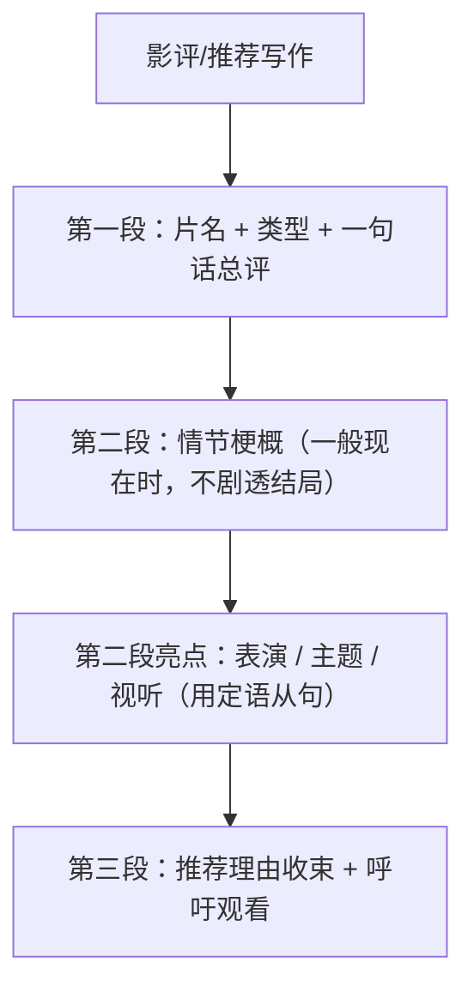

# 读写与表达（Developing ideas）

**Unit 4 Stage and screen**（外研版必修第二册）｜标签：#Unit4 #阅读策略 #影评 #推荐类写作

## 单元导览

本板块围绕课文 *A Review Worth Reading*（剧评/影评）展开：学习"区分事实与观点"的阅读策略，并完成写作任务——**写一篇电影/戏剧推荐（影评）**，兼顾北京高考"推荐信"应用文体裁。

## 核心内容

### 阅读策略：事实 vs. 观点

1. 事实（fact）：可验证的信息，如上映时间、导演、票房。
2. 观点（opinion）：含评价性形容词（brilliant, disappointing）或 I think / in my view。
3. 影评类文章结构：基本信息 → 情节简介（不剧透）→ 评价 → 推荐；观点题多考评价段。

### 写作模板：影视推荐/影评（三段式）

| 段落 | 功能 | 参考句型 |
| --- | --- | --- |
| 开头 | 推荐对象+总评 | I'd like to recommend a film called..., which impressed me deeply. 我想推荐一部让我印象深刻的电影…… |
| 主体 | 情节梗概+亮点（表演/主题/特效） | It tells the story of... / What impresses me most is... 它讲述了……最打动我的是…… |
| 结尾 | 强化推荐 | It is definitely a film that you shouldn't miss. 这绝对是一部你不容错过的电影。 |

### 高分句型

1. It is a film that combines humour with deep thoughts about life. 这是一部幽默与人生思考兼具的电影。（定语从句，呼应本单元语法）
2. The character whose courage touched me most is the young dancer. 最触动我的是那位年轻舞者的勇气。（whose 从句）
3. Anyone who loves Chinese culture will find it worth watching. 热爱中国文化的人都会觉得它值得一看。

## 典型例题

**例1**（观点题）：句子 "The film was released in 2023 and it is undoubtedly the best of the year." 中哪部分是观点？
**解析**：released in 2023 是事实；undoubtedly the best 含评价词，是观点。

**例2**（写作点评）：学生句 "The film is very good. The actor is very good. The music is very good."
**升格**：The film is brilliant: the actor **who plays the lead** delivers a moving performance, and the music **that runs through it** stays in your heart.（定语从句连接+高级词替换 very good）。

## 易错点

1. 情节梗概用**一般现在时**（It tells the story of...），误用过去时是常见失误。
2. 剧透结局会让"推荐"失去意义，用 I won't spoil the ending 收住。
3. 评价词单一（good/nice）：替换为 impressive, touching, thought-provoking。
4. 推荐信别忘对象意识：向外国朋友推荐中国电影时补充文化背景一句。

## 背记要点

- 高考视角：推荐类应用文（推荐电影/书籍/活动）是北京卷高频题型；"总评—亮点—推荐"三段结构+定语从句是提分组合。
- 必背语块：be based on / play the lead / a must-see / be worth watching。
- 万能推荐句：I'm confident that it will leave a lasting impression on you. 我相信它会给你留下深刻印象。

## 自测题

1. 判断事实/观点：a) The play lasts two hours. b) The plot is gripping.
2. 单选：It is a story ______ every teenager can relate to. A. what  B. that  C. who  D. whose
3. 用定语从句翻译：我推荐的这部电影改编自真实故事。
4. 影评中情节梗概应使用什么时态？

**答案**：1. a 事实，b 观点。 2. B。 3. The film that I recommend is adapted from a true story. 4. 一般现在时。

## 相关知识点

[[词汇与课文精读（Understanding ideas）]] ｜ [[语法与语言运用（Using language）]]
