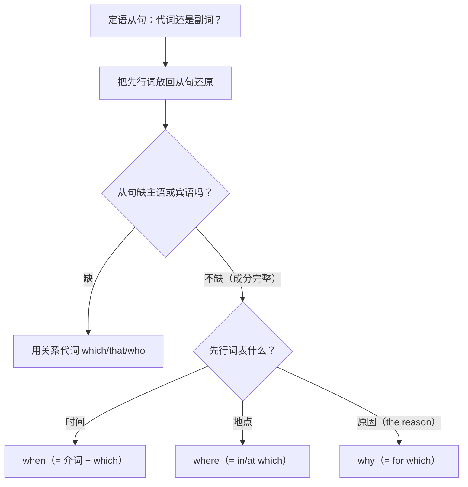

# 语法与语言运用（Using language）

**Unit 5 On the road**（外研版必修第二册）｜标签：#Unit5 #定语从句 #关系副词 #语法专项

## 单元导览

本单元语法核心：**关系副词 when / where / why 引导的定语从句**，与 Unit 4 的关系代词形成完整体系。关键区别：关系副词在从句中作**状语**，关系代词作主语/宾语。目标：掌握"还原法"判断技巧。

## 核心内容

### 关系副词选择表

| 关系副词 | 先行词 | 从句中作成分 | 例句 |
| --- | --- | --- | --- |
| when | 时间（day, year, moment） | 时间状语 | I'll never forget the day when we set off. 我永远忘不了我们出发的那天。 |
| where | 地点（place, town, house） | 地点状语 | This is the village where I was born. 这是我出生的村庄。 |
| why | 原因（仅 the reason） | 原因状语 | That's the reason why I love travelling. 那就是我爱旅行的原因。 |

### 关系副词 vs. 关系代词（还原法）

| 判断方法 | 用关系代词 | 用关系副词 |
| --- | --- | --- |
| 把先行词放回从句 | 从句缺主语/宾语 → which/that | 从句成分完整，缺状语 → when/where/why |
| 例：the city ______ I visited | visited 缺宾语 → which/that | — |
| 例：the city ______ I grew up | — | grew up 不及物，句子完整 → where |

等价转换：when = on/in which；where = in/at which；why = for which。

## 典型例题

**例1**（语法填空）：We came to a small town ______ time seemed to slow down.
**解析**：还原：time seemed to slow down **in the town**，从句完整，先行词表地点。答案 where。

**例2**（单选）：I still remember the trip ______ we took together last summer.
A. when  B. where  C. that  D. why
**解析**：还原：we took **the trip**，took 缺宾语，用关系代词。答案 C。⚠️ 先行词是时间/地点词≠一定用关系副词！

## 易错点

1. 见"时间/地点先行词"就填 when/where 是最大陷阱，必须先**还原判断**从句是否缺宾语。
2. the reason why... is that...（表语从句用 that，不用 because）。
3. where 的先行词可以是抽象地点：a situation where（在……的情形下）, a point where。
4. when 前有介词时改用 which：the day **on which** we left = the day when we left。

## 背记要点

- 高考视角：北京卷定语从句考查中"that/which 与 when/where 之辨"是命题热点，还原法是万能解题钥匙。
- 口诀：**还原先行词，缺宾用代词；句子完整时，时 when 地 where 因 why**。
- 写作升格：There are moments when words fail us. 有些时刻，语言无法表达我们的感受。／I long to visit the town where my grandparents grew up. 我渴望探访祖父母长大的小镇。

## 自测题

1. 语法填空：Autumn is the season ______ the mountain looks most beautiful.
2. 语法填空：The hotel ______ we stayed offered a splendid view.
3. 单选：This is the museum ______ we visited last week. A. where  B. when  C. which  D. why
4. 转换：the reason why he was late = the reason ______ ______ he was late

**答案**：1. when  2. where（stayed 不及物，句子完整）  3. C（visited 缺宾语）  4. for which

## 相关知识点

[[Unit 5 · 词汇与课文精读]] ｜ [[Unit 5 · 读写与表达]] ｜ 对比 [[Unit 4 · 语法与语言运用]]（关系代词）｜ 衔接 [[Unit 6 · 语法与语言运用]]（介词+关系代词）
