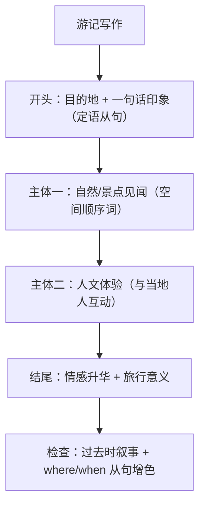

# 读写与表达（Developing ideas）

**Unit 5 On the road**（外研版必修第二册）｜标签：#Unit5 #阅读策略 #游记 #旅行计划

## 单元导览

本板块围绕课文 *Postcards from Abroad*（旅行见闻）展开：学习"空间顺序与情感线索并行"的游记阅读策略，并完成写作任务——**写一篇游记/向朋友介绍旅行计划的邮件**。

## 核心内容

### 阅读策略：双线阅读法

1. 明线（空间/时间）：圈出地点转换词 first stop / heading north / on arriving。
2. 暗线（情感变化）：捕捉 amazed → tired → touched 等情绪词，主旨常落在情感终点。
3. 游记结尾的感悟句是主旨题与标题题的答案来源。

### 写作模板：游记（四段式）

| 段落 | 功能 | 参考句型 |
| --- | --- | --- |
| 开头 | 交代行程背景 | Last month, I paid a visit to Xi'an, a city where history comes alive. 上月我游览了西安——一座历史鲜活的城市。 |
| 见闻一 | 景点+描写 | What first caught my eye was... 最先映入眼帘的是…… |
| 见闻二 | 人文体验 | I also chatted with the locals, from whom I learned... 我还与当地人交谈，从他们那里了解到…… |
| 结尾 | 感悟 | The journey taught me that beauty lies in the unknown. 这次旅程让我懂得，美藏于未知之中。 |

### 高分句型

1. Xi'an is a city where every brick tells a story. 西安是一座每块砖都在讲故事的城市。（where 从句，呼应本单元语法）
2. It was the moment when I stood on the ancient wall that I felt connected to history. 正是站上古城墙的那一刻，我感到与历史相连。
3. Only when you slow down can you truly appreciate the beauty around you. 只有慢下来，才能真正欣赏身边的美。（倒装）

## 典型例题

**例1**（标题题）：一篇游记以 "I left the village with a full heart" 结尾，最佳标题方向？
**解析**：a full heart 指情感收获，标题应突出"心灵之旅"，如 A Journey That Warmed My Heart，而非单纯景点罗列。

**例2**（写作点评）：学生句 "I went to Guilin. The scenery there is very beautiful. I was very happy."
**升格**：I travelled to Guilin, **where** the breathtaking scenery took my breath away, filling me with pure joy.（where 从句合并；高级词替换 very beautiful/happy）。

## 易错点

1. 游记全程流水账，缺少"情感线"；每个见闻后补一句感受。
2. 时态混乱：叙述用过去时，描述客观景色特征可用一般现在时（The mountain stands 800 metres high）。
3. 地点转换缺连接：加 on arriving at / heading south / our next stop was。
4. where 从句误用：the city where I visited ❌（visited 及物缺宾语，应用 which/that）。

## 背记要点

- 高考视角：游记与旅行计划邮件是北京卷情景作文常见载体；"景—人—情"三要素齐全才能上高档。
- 必背语块：pay a visit to / catch one's eye / be deeply impressed by / a feast for the eyes（大饱眼福）。
- 万能结尾：Every road leads to a new understanding of the world. 每条路都通向对世界的新认识。

## 自测题

1. 写出游记"双线阅读法"的两条线索。
2. 单选：Hangzhou is the city ______ I spent my childhood. A. which  B. where  C. when  D. that
3. 用 where 从句翻译：我们参观了一个村庄，那里的人们仍保持着传统的生活方式。
4. 游记的结尾段应包含什么内容？

**答案**：1. 空间/时间明线 + 情感暗线。 2. B。 3. We visited a village where people still keep a traditional way of life. 4. 情感升华与旅行感悟。

## 相关知识点

[[Unit 5 · 词汇与课文精读]] ｜ [[Unit 5 · 语法与语言运用]]
