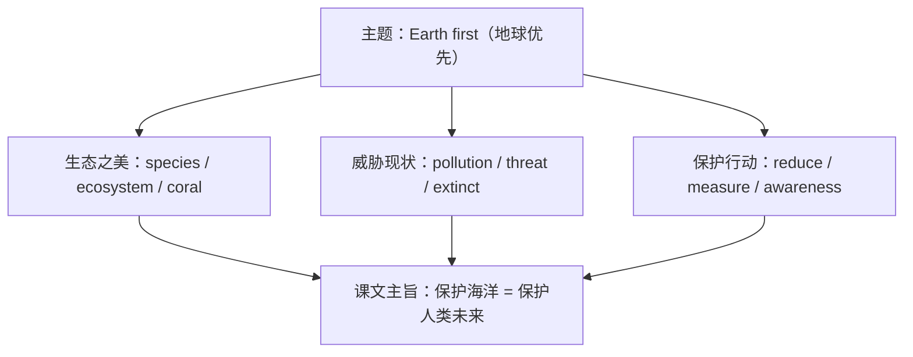

# 词汇与课文精读（Understanding ideas）

**Unit 6 Earth first**（外研版必修第二册）｜标签：#Unit6 #环境保护 #词汇 #课文精读

## 单元导览

本单元主题为"地球优先——环境保护"，课文 *Under the Sea*（海洋生态）呈现海洋之美与人类活动带来的威胁。目标：掌握环保主题词汇约 15 个；理解"现象—原因—对策"说明文结构；剖析含"介词+关系代词"的长难句。

## 核心内容

### 主题词汇表

| 词汇 | 词性/含义 | 常考搭配 | 例句 |
| --- | --- | --- | --- |
| environment | n. 环境 | protect the environment | We must protect the environment. 我们必须保护环境。 |
| pollution | n. 污染 | plastic pollution | Plastic pollution harms sea life. 塑料污染危害海洋生物。 |
| species | n. 物种（单复同形） | endangered species | Many species are endangered. 许多物种濒临灭绝。 |
| extinct | adj. 灭绝的 | become extinct | Some fish may become extinct. 一些鱼类可能灭绝。 |
| ecosystem | n. 生态系统 | a fragile ecosystem | Coral reefs form a fragile ecosystem. 珊瑚礁构成脆弱的生态系统。 |
| threat | n. 威胁 | pose a threat to | Overfishing poses a threat to the ocean. 过度捕捞威胁海洋。 |
| resource | n. 资源 | natural resources | Save natural resources. 节约自然资源。 |
| reduce | v. 减少 | reduce waste | Reduce, reuse, recycle. 减量、重复利用、回收。 |
| absorb | v. 吸收 | absorb carbon dioxide | Oceans absorb carbon dioxide. 海洋吸收二氧化碳。 |
| release | v. 释放 | release harmful gases | Factories release harmful gases. 工厂排放有害气体。 |
| climate | n. 气候 | climate change | Climate change affects us all. 气候变化影响每个人。 |
| awareness | n. 意识 | raise awareness | Raise awareness of ocean protection. 提高海洋保护意识。 |
| measure | n. 措施 | take measures | Take measures to cut pollution. 采取措施减少污染。 |
| coral | n. 珊瑚 | coral reefs | Coral reefs are dying. 珊瑚礁正在死亡。 |
| sustainable | adj. 可持续的 | sustainable development | Pursue sustainable development. 追求可持续发展。 |

### 课文主旨与结构

课文按"海底世界的奇观 → 人类活动的威胁（污染/过度捕捞/气候变暖）→ 保护行动"推进，结尾呼吁：保护海洋就是保护人类自己。

### 长难句剖析

**原句**：The ocean, on which all life depends, is facing threats from which it may never recover.
**剖析**：on which all life depends = which all life depends **on**，介词+关系代词的非限制性定语从句（本单元语法）；from which it may never recover 修饰 threats。译：万物赖以生存的海洋，正面临着可能永远无法恢复的威胁。

## 典型例题

**例1**（单选）：Global warming poses a serious ______ to polar bears.
A. measure  B. threat  C. resource  D. awareness
**解析**：pose a threat to 对……构成威胁，固定搭配。答案 B。

**例2**（语法填空）：Several rare ______ (species) of fish were found in the bay.
**解析**：species 单复数同形，several 修饰用复数概念但拼写不变。答案 species。

## 易错点

1. species 单复数同形：a species / many species，speices 拼写错误高发。
2. extinct（已灭绝的）与 endangered（濒危的）程度不同，勿混用。
3. raise awareness（及物 raise）≠ rise（不及物）。
4. environment 前搭配 protect/preserve，不说 save the environment 之外滥用 save。

## 背记要点

- 高考视角：环保是北京卷阅读与写作永恒热点；sustainable、raise awareness、take measures 是议论文高频语块。
- 必背搭配：pose a threat to / become extinct / take measures to do / play a vital role in。
- 主旨句型：The earth does not belong to us; we belong to the earth. 地球不属于我们，我们属于地球。

## 自测题

1. 语法填空：Immediate measures must ______ (take) to reduce plastic waste.
2. 单选：Pandas were once in danger of becoming ______. A. endangered  B. extinct  C. sustainable  D. absorbed
3. 翻译：我们应该提高人们的环保意识。（raise awareness）
4. 写出 reduce, reuse, recycle 的中文含义。

**答案**：1. be taken  2. B  3. We should raise people's awareness of environmental protection.  4. 减少使用、重复利用、回收利用。

## 相关知识点

[[语法与语言运用（Using language）]] ｜ [[读写与表达（Developing ideas）]]
