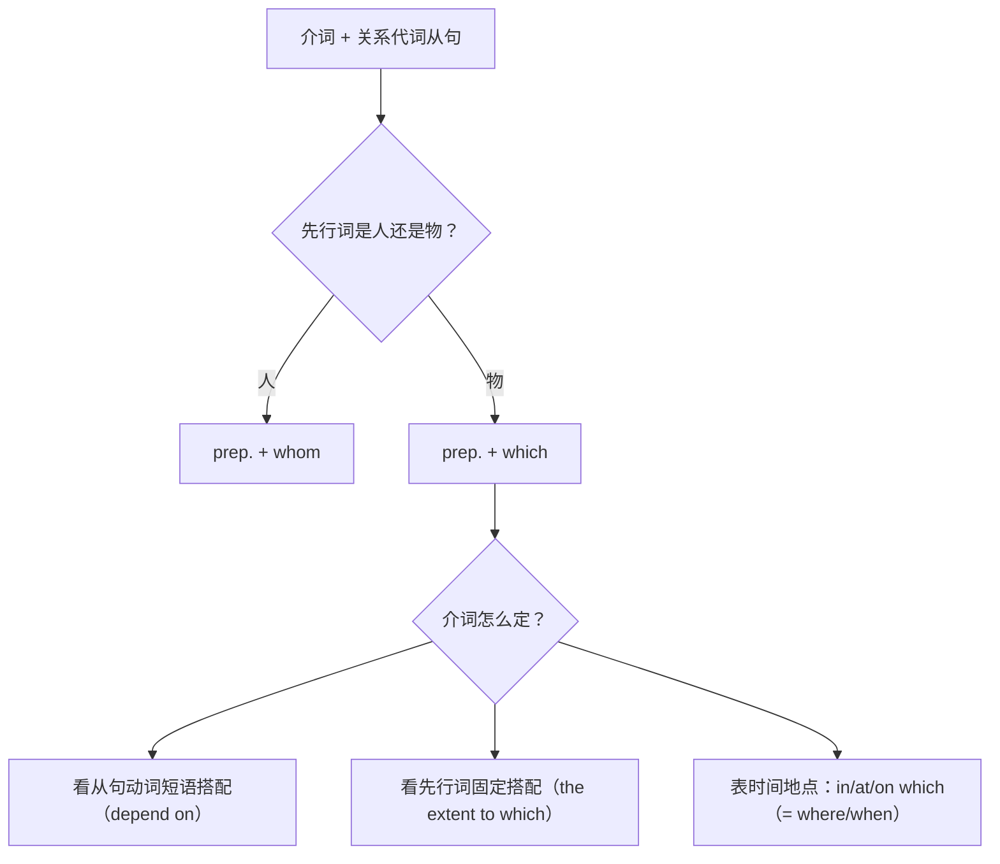

# 语法与语言运用（Using language）

**Unit 6 Earth first**（外研版必修第二册）｜标签：#Unit6 #定语从句 #介词加关系代词 #语法专项

## 单元导览

本单元语法核心：**介词 + 关系代词（prep. + which/whom）引导的定语从句**，是定语从句体系的收官内容，也是正式文体与书面表达的标志性结构。目标：掌握介词的确定方法与 which/whom 的选择规则。

## 核心内容

### 基本规则

| 规则 | 说明 | 例句 |
| --- | --- | --- |
| 介词后只用 which/whom | 不用 that/who | the world in which we live 我们生活的世界 |
| 先行词为人 → prep. + whom | — | the scientist with whom I worked 与我共事的科学家 |
| 先行词为物 → prep. + which | — | the sea on which we depend 我们赖以生存的大海 |
| 介词后关系代词不可省略 | — | the way in which（in 保留时不可省 which） |

### 介词如何确定（三看）

| 方法 | 示例 |
| --- | --- |
| 一看从句动词搭配 | depend **on** → on which; listen **to** → to which |
| 二看先行词习惯搭配 | the speed **at** which / the extent **to** which / the age **at** which |
| 三看句意（时间地点） | in which = where; on/in which = when |

### 特殊结构

1. 数量词 + of which/whom：Fifty species, **most of which** are rare, live here. 这里有 50 个物种，其中大多数很珍稀。
2. whose + n. = the + n. + of which：a river whose water = a river **the water of which** is clean。

## 典型例题

**例1**（语法填空）：The environment is something ______ which everyone's life depends.
**解析**：depend on 搭配，介词 on 提前。答案 on。

**例2**（单选）：The team studied 100 rivers, ______ were seriously polluted.
A. most of them  B. most of which  C. most of that  D. which most
**解析**：两个分句间无连词，需关系代词连接；"数量词 + of which"结构。答案 B（选 A 则缺连词 ❌）。

## 易错点

1. 介词后误用 that/who：in **that** we live ❌ → in which。
2. "数量词 + of which/whom"与"数量词 + of them"区分：前者是从句（无连词时用），后者是独立句（有 and 时用）。
3. 介词悬空时 which 可换 that 且可省略：the world (which/that) we live **in**；介词提前后均不可。
4. the way 后接 in which / that / 省略均可：the way (in which/that) we treat nature。

## 背记要点

- 高考视角：北京卷语法填空中"纯空格 + 从句动词带固定搭配介词"是介词+which 的典型考法；读写任务中该结构可显著提升语言档次。
- 必背语块：the extent to which（……的程度）/ the speed at which / the ease with which。
- 写作升格：We should protect the planet **on which** future generations will live. 我们应保护子孙后代将要生活的星球。

## 自测题

1. 语法填空：This is the ocean ______ which thousands of species make their home.
2. 语法填空：He wrote a report, the results of ______ surprised us all.
3. 单选：The scientists, some of ______ are from Beijing, study climate change. A. which  B. them  C. whom  D. that
4. 转换：The house whose roof is green is a lab. = The house ______ ______ ______ ______ is green is a lab.

**答案**：1. in  2. which  3. C（先行词为人且在介词后）  4. the roof of which

## 相关知识点

[[Unit 6 · 词汇与课文精读]] ｜ [[Unit 6 · 读写与表达]] ｜ 前置基础 [[Unit 4 · 语法与语言运用]]（关系代词）与 [[Unit 5 · 语法与语言运用]]（关系副词）
