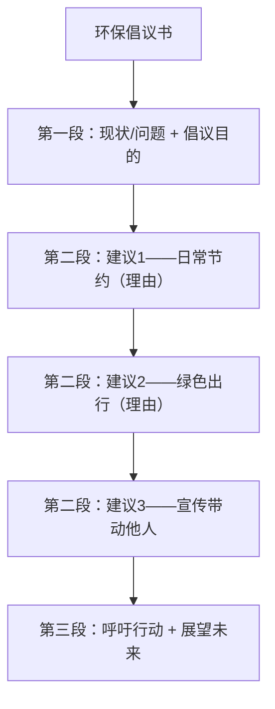

# 读写与表达（Developing ideas）

**Unit 6 Earth first**（外研版必修第二册）｜标签：#Unit6 #阅读策略 #倡议书 #议论文

## 单元导览

本板块围绕课文 *A Greener Future*（绿色未来）展开：学习"识别作者态度与写作目的"的阅读策略，并完成写作任务——**写一封环保倡议书/建议信**（北京高考应用文高频体裁）。

## 核心内容

### 阅读策略：态度与目的

1. 态度词定位：positive（supportive, optimistic）/ negative（critical, worried）/ neutral（objective）。
2. 写作目的题：科普文多为 to inform；倡议文多为 to call on readers to act。
3. 环保类文章常以"问题严峻性"开头、"行动呼吁"结尾——首尾段决定态度与目的。

### 写作模板：环保倡议书（三段式）

| 段落 | 功能 | 参考句型 |
| --- | --- | --- |
| 开头 | 点出问题+发出倡议 | As we all know, our planet is facing serious environmental problems. 众所周知，地球正面临严峻的环境问题。 |
| 主体 | 具体建议（2-3条，each+理由） | Firstly, we should reduce the use of plastic bags, which cause serious pollution. 首先，我们应减少使用塑料袋，它们造成严重污染。 |
| 结尾 | 呼吁行动 | Let's join hands to build a greener future. It is high time that we took action. 让我们携手共建绿色未来，是时候行动起来了。 |

### 高分句型

1. The earth, on which all of us depend, deserves our best care. 我们所有人赖以生存的地球值得我们悉心呵护。（介词+which，呼应本单元语法）
2. Only by working together can we make a real difference. 只有齐心协力，我们才能带来真正的改变。（倒装）
3. It is high time that we took action to protect our home. 是我们采取行动保护家园的时候了。（虚拟语气）

## 典型例题

**例1**（目的题）：文章结尾 "So next time you shop, say no to plastic bags." 表明写作目的是？
**解析**：祈使句直接呼吁读者行动，目的为 to call on / encourage readers to act（倡议型）。

**例2**（写作点评）：学生句 "We should protect environment. Everyone must do something."
**升格**：We should protect **the** environment, **on which** our survival depends; only if everyone pitches in **can we** succeed.（加冠词；介词+which 从句；倒装）。

## 易错点

1. environment 前漏掉定冠词 the：protect **the** environment。
2. 倡议书人称：以 we 拉近距离，避免通篇 you should（说教感）。
3. It is high time that 后用**过去式**（took）或 should do。
4. 建议缺乏理由支撑：每条建议后用 which/because 补一句原因更有说服力。

## 背记要点

- 高考视角：环保倡议/建议信是北京卷应用文核心题型；"问题—建议—呼吁"结构 + 高级句式（倒装/虚拟/介词+which）是高分配置。
- 必背语块：raise awareness of / green travel / turn off lights when leaving / from small things around us。
- 万能呼吁句：Small actions, when multiplied by millions, can change the world. 微小的行动乘以百万人，足以改变世界。

## 自测题

1. 写出倡议书三段的功能。
2. 单选：It is high time that we ______ measures to cut waste. A. take  B. took  C. will take  D. taking
3. 用"介词+which"翻译：我们应该保护我们赖以生存的自然资源。
4. 判断写作目的：一篇以数据说明冰川消融、结尾呼吁减排的文章目的为何？

**答案**：1. 问题+倡议 / 具体建议+理由 / 呼吁行动。 2. B。 3. We should protect the natural resources on which we depend. 4. 呼吁读者行动（to call on readers to reduce emissions）。

## 相关知识点

[[词汇与课文精读（Understanding ideas）]] ｜ [[语法与语言运用（Using language）]]
