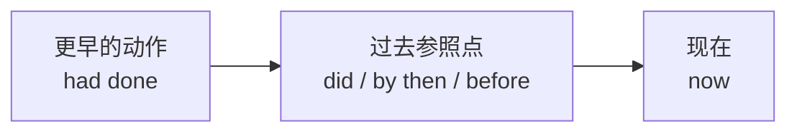

# 语法与语言运用（Using language）

**Unit 1 Laugh out loud!**（外研版选择性必修第一册）｜语法专题：**过去完成时的用法复习与深化**

## 语法讲解

### 过去完成时（had done）的核心：过去的过去

表示在**过去某一时间或动作之前**已经发生或完成的动作，即"过去的过去"。

| 用法 | 例句 |
| --- | --- |
| 过去动作之前的动作 | By the time the comedian appeared, the audience **had filled** the hall. 喜剧演员登场时观众已坐满大厅。 |
| 与 by / before / when 连用 | She **had never heard** such a funny joke before that night. 那晚之前她从没听过这么好笑的笑话。 |
| 表未实现的愿望 | I **had hoped** to catch the early show, but I missed it. 我本希望赶上早场却错过了。 |
| 在宾语从句中表更早动作 | He said he **had told** the joke twice. 他说那笑话他已讲过两遍。 |

### 三个高频句式

1. **By the time + 过去时, ... had done**：By the time we got there, the show had begun.
2. **Hardly/Scarcely had + 主语 + done ... when...**（倒装）：Hardly had he finished the punchline when everyone burst out laughing.
3. **No sooner had + 主语 + done ... than...**：No sooner had she sat down than the comedy started.

### 使用限制

- 有明确参照点才用过去完成时；单独叙述过去事件用一般过去时。
- before/after 本身已表先后，从句中过去完成时可换用一般过去时：After he (had) told the joke, we laughed.

## 典型例题

**例1**（单选）：By the end of last year's comedy festival, over 300 performances ______.
A. had been given  B. were given  C. have been given  D. would be given
**解析**：by the end of last year 是过去参照点，动作在其前完成，且 performances 与 give 是被动关系。答案 A。

**例2**（语法填空）：Hardly ______ (he/step) onto the stage when the audience started cheering.
**解析**：hardly...when... 句型，hardly 置句首用部分倒装，从句一般过去时，主句过去完成时。答案 had he stepped。

**例3**（改错）：I had watched the sitcom last night, and it was hilarious.
**解析**：单独叙述昨晚的动作，无"过去的过去"参照，去掉 had，用 watched。

## 易错点

1. 过去完成时**不能独立使用**，必须有过去参照点（语境或时间状语）。
2. Hardly...when... / No sooner...than... 连词搭配固定，不可混用（hardly~than ❌）。
3. 倒装只发生在 hardly/no sooner 置于**句首**时。
4. had hoped/expected/intended + to do 表"本打算而未实现"。

## 背记要点

- 公式：过去参照点（did）+ 更早动作（had done）。
- 三句式：By the time... / Hardly...when... / No sooner...than...。
- 高考视角：语法填空常考"by + 过去时间"触发 had done；短文改错常考多余的 had。

## 自测题

1. 语法填空：She told me she ______ (see) the stand-up show twice.
2. 单选：No sooner ______ the joke than the room went silent. A. he had told  B. had he told  C. he told  D. did he tell
3. 翻译：等我们到达剧院时，演出已经开始了。（by the time）
4. 改错：Hardly had she opened her mouth than everyone laughed.

**答案**：1. had seen  2. B  3. By the time we arrived at the theatre, the show had begun.  4. than 改为 when。

## 相关知识点

[[词汇与课文精读（Understanding ideas）]] ｜ [[读写与表达（Developing ideas）]]
