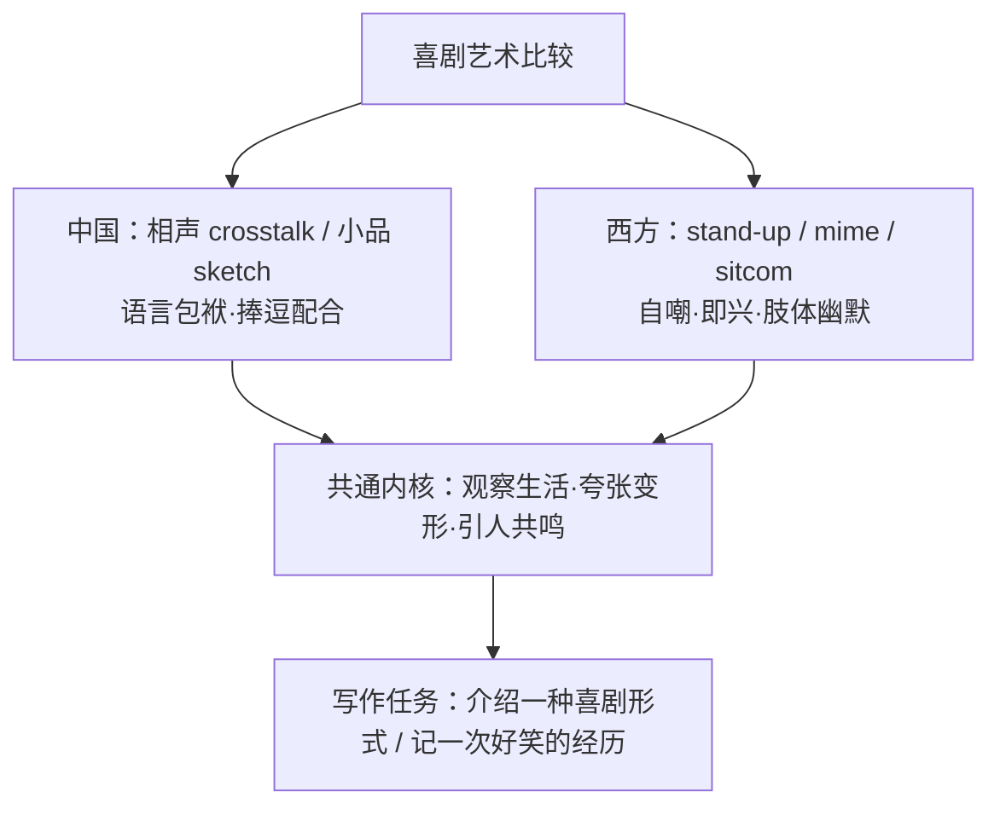

# 读写与表达（Developing ideas）

**Unit 1 Laugh out loud!**（外研版选择性必修第一册）｜读写主题：中外喜剧艺术与幽默写作

## 拓展阅读要点

Developing ideas 部分聚焦**喜剧表演艺术**：从中国的相声、小品到西方的 stand-up comedy、哑剧（mime），比较不同文化的幽默传统。卓别林（Charlie Chaplin）的默片喜剧以**肢体幽默**跨越语言障碍；中国相声以**说学逗唱**和语言包袱见长。

## 读写衔接词汇

| 表达 | 含义 | 写作应用 |
| --- | --- | --- |
| have the audience in stitches | 让观众笑破肚皮 | The performer had us in stitches. |
| a play on words | 文字游戏；双关 | The joke relies on a play on words. |
| slapstick | n. 闹剧式滑稽 | Chaplin was a master of slapstick. |
| improvise | v. 即兴表演 | Stand-up comedians often improvise. |
| appeal to | 吸引 | Crosstalk appeals to all ages. |
| date back to | 追溯到 | Crosstalk dates back to the Qing Dynasty. |

## 写作指导：介绍一种喜剧艺术（说明文）

**结构模板**：
1. **引入**：Crosstalk, a traditional Chinese comic art, has entertained audiences for over a century.
2. **主体**：起源与发展（date back to...）；表演特点（speaking, imitating, teasing and singing）；代表人物与现状。
3. **结尾**：With its unique charm, crosstalk continues to bring laughter to millions.

**加分句式**：
- Not only does crosstalk amuse people, but it also reflects social life.（倒装）
- It is the witty dialogue that makes crosstalk so appealing.（强调句）
- Watching a live performance, you will find yourself laughing from beginning to end.（非谓语）

## 典型例题

**例1**（阅读理解）：Why could Chaplin's films cross language barriers?
**解析**：细节题。默片依靠**肢体动作与面部表情**（physical/body humour）而非语言制造笑料，故全世界观众都能理解。

**例2**（应用文写作）：你校英语社团将举办"中外幽默文化"分享会，请你写一封邮件邀请外教 Mr Smith 参加，包括：活动内容、时间地点、期待其分享的话题。
**要点**：①邀请目的与活动简介；②时间地点具体信息；③礼貌请求分享 western humour；④期待回复。注意邮件格式与礼貌用语（I would be grateful if... / We would be honoured to...）。

## 易错点

1. crosstalk（相声）不可写成 cross talk 表演艺术义。
2. audience 是集合名词，a large audience（不用 many audiences 表"很多观众"）。
3. 幽默描写慎用 laugh at sb（嘲笑），善意的逗笑用 make sb laugh。
4. 说明文时态以一般现在时为主，历史沿革部分用过去时。

## 背记要点

- 高考视角：介绍中国传统艺术是北京卷书面表达高频话题（相声、京剧、剪纸同一套路）。
- 必背表达：date back to / appeal to / have a history of / It is ... that ...（强调句）。
- 文化立场：比较中外幽默时突出"各有特色、彼此欣赏"。

## 自测题

1. 用 date back to 写一句介绍相声起源的句子。
2. 翻译：正是幽默让这部电影如此受欢迎。（强调句）
3. 列出说明文"介绍一种艺术形式"的三段式要点。
4. 写出 slapstick、improvise 的含义并造句。

**答案**：1. Crosstalk dates back to the Qing Dynasty.（合理即可）  2. It is humour that makes the film so popular.  3. 引入定位—起源特点代表—意义展望。  4. 闹剧式滑稽；即兴表演（造句合理即可）。

## 相关知识点

[[Unit 1 · 词汇与课文精读]] ｜ [[Unit 1 · 语法与语言运用]]
