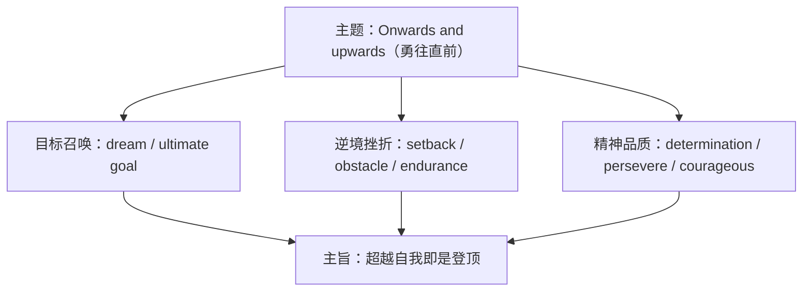

# 词汇与课文精读（Understanding ideas）

**Unit 2 Onwards and upwards**（外研版选择性必修第一册）｜标签：#Unit2 #坚持与奋斗 #词汇 #课文精读

## 单元导览

本单元主题为"不断进取、超越自我"，课文讲述人们在逆境中坚持不懈、追求目标的故事（如探险家、登山者的经历）。学习目标：掌握"奋斗与毅力"主题词汇约 15 个；理解"坚持成就非凡"的主旨；剖析含状语从句与非谓语的长难句。

## 核心内容

### 主题词汇表

| 词汇 | 词性/含义 | 常考搭配 | 例句 |
| --- | --- | --- | --- |
| persevere | v. 坚持不懈 | persevere in/with | She persevered with her training. 她坚持训练。 |
| endurance | n. 耐力 | physical endurance | The climb tests endurance. 攀登考验耐力。 |
| attempt | n./v. 尝试 | make an attempt to do | He made several attempts to reach the summit. 他多次尝试登顶。 |
| conquer | v. 征服 | conquer difficulties | She conquered her fear of heights. 她克服了恐高。 |
| setback | n. 挫折 | suffer a setback | The team suffered a major setback. 团队遭遇重大挫折。 |
| determination | n. 决心 | with determination | He fought on with determination. 他坚定地奋战下去。 |
| abandon | v. 放弃 | abandon the plan | They never abandoned hope. 他们从未放弃希望。 |
| inspire | v. 激励 | inspire sb to do | Her story inspires us to keep going. 她的故事激励我们前行。 |
| extraordinary | adj. 非凡的 | an extraordinary feat | It was an extraordinary achievement. 这是非凡的成就。 |
| summit | n. 顶峰 | reach the summit | They reached the summit at dawn. 他们黎明登顶。 |
| obstacle | n. 障碍 | overcome obstacles | Obstacles make us stronger. 障碍使我们更强大。 |
| commit | v. 投入；承诺 | be committed to doing | She is committed to her dream. 她执着于梦想。 |
| striving | n./strive v. 力争 | strive for | Strive for excellence. 力争卓越。 |
| ultimate | adj. 最终的 | the ultimate goal | Their ultimate goal was the peak. 他们的终极目标是山顶。 |
| courageous | adj. 勇敢的 | a courageous decision | It was a courageous choice. 那是勇敢的选择。 |

### 课文主旨与结构

课文以攀登者/探险者的经历为线：先写目标的召唤与准备，再写途中的挫折（恶劣天气、体力极限、同伴伤病），最后写凭借毅力与团队协作达成目标——真正的高峰不在山顶，而在**超越自我**。

### 长难句剖析

**原句**：Exhausted but determined, the climbers pushed on, knowing that giving up would mean losing everything they had worked for.
**剖析**：Exhausted but determined 为形容词短语作状语表伴随状态；knowing that... 现在分词作状语；they had worked for 为省略 that 的定语从句。译：攀登者们精疲力竭却意志坚定，继续前行，因为他们深知放弃就意味着失去为之奋斗的一切。

## 典型例题

**例1**（单选）：______ many setbacks, she never thought of giving up.
A. In spite  B. Despite  C. Although  D. However
**解析**：空后为名词短语，用介词 Despite（= In spite of）。答案 B。

**例2**（语法填空）：He is committed ______ (achieve) his goal of climbing Qomolangma.
**解析**：be committed to 中 to 为介词。答案 to achieving。

## 易错点

1. be committed/devoted/dedicated to doing，to 均为介词。
2. attempt to do = make an attempt to do；attempt doing 少用。
3. persevere in/with + n./doing，不接 to do。
4. despite/in spite of + 名词；although + 从句。

## 背记要点

- 高考视角：奋斗与毅力是北京卷书面表达核心主题，determination、overcome obstacles 为高频加分词。
- 必背搭配：strive for / suffer a setback / overcome obstacles / with determination。
- 主旨句型：It is not the mountain we conquer but ourselves. 我们征服的不是高山，而是自己。

## 自测题

1. 语法填空：Her ______ (determine) to succeed impressed everyone.
2. 单选：They made a final ______ to reach the top. A. attend  B. attempt  C. attention  D. attitude
3. 翻译：尽管遭遇多次挫折，他仍坚持追求梦想。（despite; persevere）
4. 写出 endurance、setback 的含义并各造一句。

**答案**：1. determination  2. B  3. Despite repeated setbacks, he persevered in pursuing his dream.  4. 耐力；挫折（造句合理即可）

## 相关知识点

[[Unit 2 · 语法与语言运用]] ｜ [[Unit 2 · 读写与表达]]
