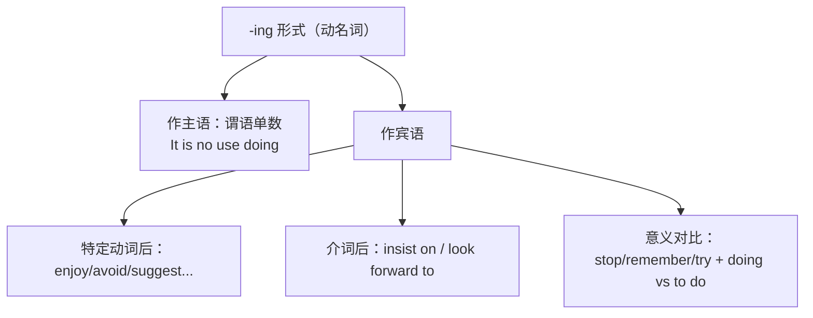

# 语法与语言运用（Using language）

**Unit 2 Onwards and upwards**（外研版选择性必修第一册）｜语法专题：**动词-ing 形式作主语和宾语**

## 语法讲解

### -ing 形式作主语

| 用法 | 例句 |
| --- | --- |
| 直接置于句首作主语 | **Climbing** high mountains requires great endurance. 攀登高山需要极大耐力。 |
| It 作形式主语（It is no use/good doing） | It is no use **complaining** about the weather. 抱怨天气没有用。 |
| There is no point (in) doing | There is no point **giving up** halfway. 半途而废毫无意义。 |

注意：-ing 短语作主语，谓语用**单数**。

### -ing 形式作宾语

| 类型 | 常见动词/结构 | 例句 |
| --- | --- | --- |
| 只接 -ing 的动词 | enjoy, avoid, suggest, consider, imagine, practise, mind, keep, finish, admit, delay | He avoided **taking** unnecessary risks. |
| 接 -ing 的短语 | give up, put off, insist on, feel like, look forward to, be used to, devote ... to | She never gave up **trying**. |
| 意义有别 | remember/forget/regret/try/stop + doing vs to do | He stopped **resting**（停止休息）/ stopped **to rest**（停下来去休息）. |

### 高频辨析

- remember doing 记得做过；remember to do 记得去做。
- regret doing 后悔做过；regret to do（to say/tell）遗憾地要做。
- try doing 试着做（尝试办法）；try to do 努力做。

## 典型例题

**例1**（单选）：______ to the top of the mountain in winter takes both skill and courage.
A. Get  B. Getting  C. Got  D. Being got
**解析**：句首作主语用动名词。答案 B。

**例2**（语法填空）：We look forward to ______ (hear) about your adventure.
**解析**：look forward to 中 to 为介词。答案 hearing。

**例3**（单选）：On the way up, they stopped ______ their water bottles at a stream.
A. to fill  B. filling  C. filled  D. fill
**解析**：停下来去灌水，表目的用 stop to do。答案 A。

## 易错点

1. 动名词作主语谓语用单数：Reading books **is** fun。
2. look forward to / be used to / devote...to / object to 中 to 是介词，接 doing。
3. suggest/consider/avoid 后**只能**接 doing，不接 to do。
4. It is no use/good + doing（不是 to do）。

## 背记要点

- 只接 doing 动词口诀：考虑建议盼完成（consider, suggest, look forward to, finish），喜欢介意避免练（enjoy, mind, avoid, practise），保持推迟与承认（keep, put off, admit）。
- 高考视角：语法填空高频考介词后 doing 与主语 doing 的谓语一致。
- 写作应用：Doing sth is a good way to... / There is no point (in) doing...

## 自测题

1. 语法填空：______ (train) hard every day is the secret of her success.
2. 单选：I regret ______ you that the expedition has been cancelled. A. telling  B. to tell  C. told  D. tell
3. 翻译：坚持锻炼需要毅力，但放弃毫无意义。（doing 作主语；There is no point）
4. 用 remember doing 和 remember to do 各造一句并注明区别。

**答案**：1. Training  2. B（遗憾地通知）  3. Keeping exercising requires determination, but there is no point (in) giving up.  4. 造句合理即可。

## 相关知识点

[[词汇与课文精读（Understanding ideas）]] ｜ [[读写与表达（Developing ideas）]]
