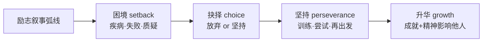

# 读写与表达（Developing ideas）

**Unit 2 Onwards and upwards**（外研版选择性必修第一册）｜读写主题：逆境中的成长与励志人物写作

## 拓展阅读要点

Developing ideas 部分聚焦**在逆境中成就自我的人物**：如身残志坚的运动员、白手起家的科学家。阅读要点在于把握"困境—抉择—坚持—升华"的叙事弧线，以及人物**内心变化**的描写。

## 读写衔接词汇

| 表达 | 含义 | 写作应用 |
| --- | --- | --- |
| against all odds | 冲破重重困难 | Against all odds, she succeeded. |
| rise to the challenge | 迎接挑战 | He rose to the challenge bravely. |
| pay off | 得到回报 | Years of hard work finally paid off. |
| in the face of | 面对 | She stayed calm in the face of failure. |
| live up to | 不辜负 | He lived up to his parents' expectations. |
| push one's limits | 挑战极限 | Athletes keep pushing their limits. |

## 写作指导：记叙一段克服困难的经历（记叙文）

**结构模板**：
1. **背景与困境**：Last term, I signed up for the 3,000-metre race, though I had never been good at running.
2. **过程与转折**：At first I fell far behind... With my teacher's encouragement, I trained every morning...（细节+心理描写）
3. **结果与感悟**：Crossing the finish line, I realised that what matters is not winning but never giving up.

**加分句式**：
- Only when we face difficulties bravely can we grow.（only 倒装）
- Had it not been for her encouragement, I would have quit.（虚拟倒装）
- Tired as I was, I kept running.（as 倒装让步）

## 典型例题

**例1**（阅读理解）：What can be inferred about the author's attitude towards setbacks?
**解析**：推断题。从"Every failure taught me something new"等句可知作者视挫折为**成长的养分**，态度积极（positive/optimistic）。

**例2**（书面表达）：以 "A Challenge I Overcame" 为题写一篇短文，记述你克服困难的一次经历及感悟。
**要点**：①交代挑战是什么；②描写克服过程（行动+心理）；③点明收获与感悟。时态以过去时为主，感悟句可用一般现在时。

## 易错点

1. pay off（回报）不及物；reward sb with sth 及物，勿混用。
2. in the face of + n.；face up to + n./doing。
3. 记叙文人称时态要一致，感悟升华部分才转一般现在时。
4. live up to 后接 expectations/one's name 等名词。

## 背记要点

- 高考视角："克服困难"是北京卷书面表达（记叙类）最常见母题，叙事弧线四步法直接套用。
- 必背表达：against all odds / pay off / rise to the challenge / push one's limits。
- 主旨句型：What defines us is not how many times we fall, but how many times we get back up.

## 自测题

1. 用 against all odds 造一个励志主题的句子。
2. 翻译：只有直面挑战，我们才能超越自我。（Only 倒装）
3. 列出记叙文"克服困难"的四步叙事弧线。
4. 写出 live up to、pay off 的含义并各造一句。

**答案**：1. Against all odds, he finished the marathon.（合理即可）  2. Only by facing challenges bravely can we surpass ourselves.  3. 困境—抉择—坚持—升华。  4. 不辜负；得到回报（造句合理即可）。

## 相关知识点

[[词汇与课文精读（Understanding ideas）]] ｜ [[语法与语言运用（Using language）]]
