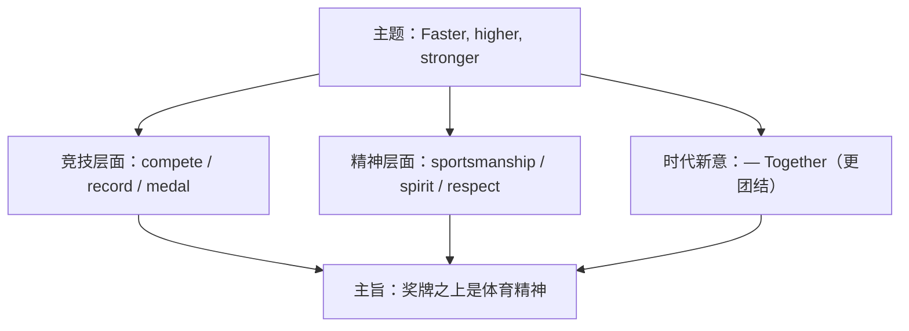

# 词汇与课文精读（Understanding ideas）

**Unit 3 Faster, higher, stronger**（外研版选择性必修第一册）｜标签：#Unit3 #体育精神 #词汇 #课文精读

## 单元导览

本单元主题为"体育与奥林匹克精神"，课文讲述运动员超越胜负、彰显体育精神的动人故事。学习目标：掌握体育主题词汇约 15 个；理解"更快更高更强——更团结"的奥林匹克格言内涵；剖析含定语从句与强调结构的长难句。

## 核心内容

### 主题词汇表

| 词汇 | 词性/含义 | 常考搭配 | 例句 |
| --- | --- | --- | --- |
| athlete | n. 运动员 | a professional athlete | The athlete broke the record. 这名运动员打破了纪录。 |
| compete | v. 竞争 | compete against/with | She competed against the best. 她与最强者同场竞技。 |
| championship | n. 锦标赛 | win the championship | They won the national championship. 他们赢得全国冠军。 |
| motto | n. 格言 | the Olympic motto | "Faster, Higher, Stronger — Together" is the motto. |
| sportsmanship | n. 体育精神 | show sportsmanship | He showed true sportsmanship. 他展现了真正的体育精神。 |
| opponent | n. 对手 | defeat an opponent | Respect your opponents. 尊重你的对手。 |
| stadium | n. 体育场 | a packed stadium | The stadium was packed. 体育场座无虚席。 |
| medal | n. 奖牌 | win a gold medal | She won a gold medal. 她获得金牌。 |
| record | n./v. 纪录 | set/break a record | He set a new world record. 他创造了新的世界纪录。 |
| injury | n. 受伤 | suffer an injury | He played on despite the injury. 他带伤上场。 |
| retire | v. 退役 | retire from | She retired from competition. 她退役了。 |
| spirit | n. 精神 | team spirit | Team spirit matters most. 团队精神最重要。 |
| amateur | adj./n. 业余的 | an amateur player | He began as an amateur. 他起初是业余选手。 |
| qualify | v. 取得资格 | qualify for | They qualified for the final. 他们晋级决赛。 |
| glory | n. 荣耀 | win glory for | She won glory for her country. 她为国争光。 |

### 课文主旨与结构

课文通过赛场故事（如对手相扶、虽败犹荣的瞬间）阐述：竞技体育的价值不止于奖牌，更在于**拼搏、尊重与团结**——这正是奥林匹克格言加入 "Together" 的时代意义。

### 长难句剖析

**原句**：It was not the medal itself but the courage she showed in the final lap that won the hearts of the audience.
**剖析**：强调句 It was ... that ...；not...but... 并列强调对象；she showed in the final lap 为定语从句修饰 courage。译：赢得观众之心的不是奖牌本身，而是她在最后一圈展现的勇气。

## 典型例题

**例1**（单选）：The young swimmer ______ for the Olympic final with a personal best time.
A. qualified  B. required  C. acquired  D. inquired
**解析**：qualify for 晋级、取得资格。答案 A。

**例2**（语法填空）：It was his perseverance ______ made him a champion.
**解析**：强调句结构 It was ... that ...。答案 that。

## 易错点

1. compete with/against（与……竞争）、compete for（为……而争）、compete in（参加……比赛）介词各异。
2. record 作名词重音在前（REcord），作动词重音在后（reCORD）。
3. sportsmanship 是抽象名词不可数。
4. beat + 对手，win + 比赛/奖项：beat the team / win the match。

## 背记要点

- 高考视角：体育与奥运是北京卷阅读高频语境，2021 年奥林匹克格言更新为 "Faster, Higher, Stronger — Together"。
- 必背搭配：break a record / qualify for / win glory for / show sportsmanship。
- 主旨句型：The most important thing is not winning but taking part. 重要的不是取胜而是参与。

## 自测题

1. 语法填空：She suffered a serious ______ (injure) but refused to give up.
2. 单选：Our team ______ theirs by three points. A. won  B. beat  C. gained  D. earned
3. 翻译：他打破了世界纪录，为祖国赢得荣耀。（break; glory）
4. 写出 opponent、amateur 的含义并各造一句。

**答案**：1. injury  2. B  3. He broke the world record and won glory for his motherland.  4. 对手；业余的/业余爱好者（造句合理即可）

## 相关知识点

[[语法与语言运用（Using language）]] ｜ [[读写与表达（Developing ideas）]]
