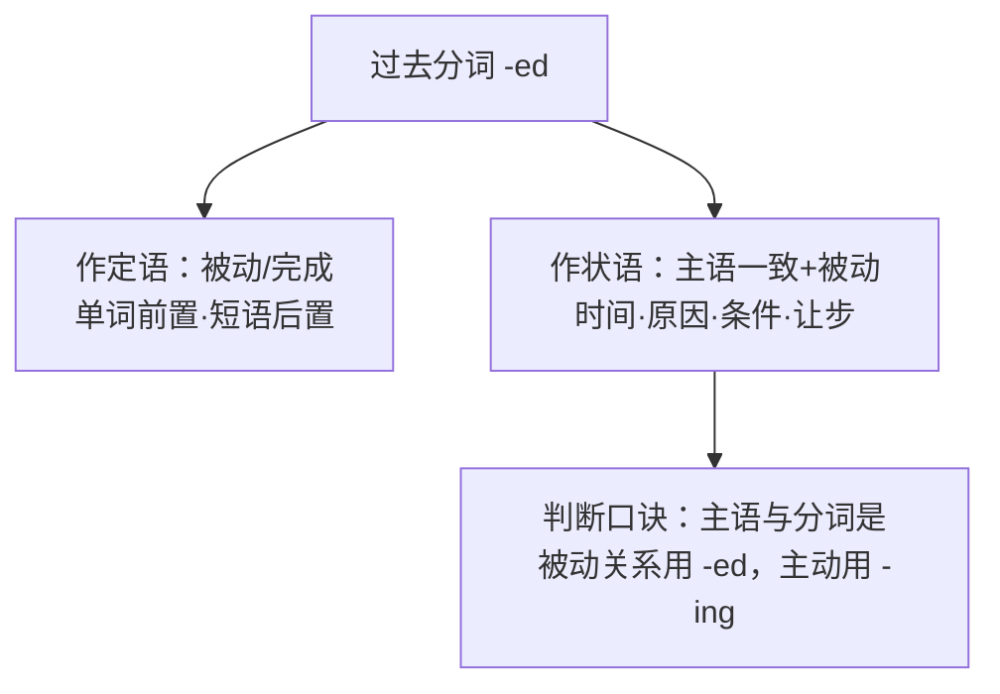

# 语法与语言运用（Using language）

**Unit 3 Faster, higher, stronger**（外研版选择性必修第一册）｜语法专题：**过去分词（-ed）作定语和状语**

## 语法讲解

### 过去分词作定语

表示**被动**或**完成**意义，修饰名词。

| 位置 | 例句 |
| --- | --- |
| 单个分词前置 | a **broken** record 被打破的纪录；an **injured** athlete 受伤的运动员 |
| 分词短语后置 | The stadium **built for the Olympics** holds 80,000 people. 为奥运会修建的体育场可容纳八万人。 |
| 相当于定语从句 | the medal **won by the team** = the medal **which was won** by the team |

### 过去分词作状语

分词的逻辑主语须与**句子主语**一致，表被动。

| 意义 | 例句 |
| --- | --- |
| 时间 | **Asked** about his plan, the coach smiled.（= When he was asked...）被问及计划时，教练笑了。 |
| 原因 | **Exhausted** by the race, she fell to the ground.（= Because she was exhausted...）因比赛而精疲力竭，她倒在地上。 |
| 条件 | **Given** more time, the team could do better.（= If it was given...）若有更多时间，队伍能表现更好。 |
| 让步/伴随 | **Defeated**, they never lost heart. 虽败却不气馁。 |

### -ed 与 -ing 分词对比

- The news was **exciting**; the fans were **excited**.（事物令人激动 / 人感到激动）
- **Seeing** the score, he cheered.（主动：他看见）/ **Seen** from the stands, the pitch looks tiny.（被动：球场被看）

## 典型例题

**例1**（单选）：______ by the cheering crowd, the runner sped up in the last 100 metres.
A. Encouraging  B. Encouraged  C. To encourage  D. Encourage
**解析**：runner 与 encourage 是被动关系（被鼓舞）。答案 B。

**例2**（语法填空）：The techniques ______ (use) in training have improved the team's performance.
**解析**：techniques 与 use 为被动关系，作后置定语。答案 used。

**例3**（改错）：Comparing with last year, our team has made great progress.
**解析**：our team 与 compare 是被动关系，Comparing 改为 Compared。

## 易错点

1. 分词作状语必须与**句子主语**保持逻辑一致，否则为"垂悬分词"错误。
2. 固定被动分词短语：compared with / given（考虑到）/ located in / dressed in。
3. 情绪类动词：-ed 修饰**人**的感受，-ing 修饰**事物**的性质。
4. 不及物动词的过去分词作定语表**完成**而非被动：fallen leaves 落叶、retired athletes 退役运动员。

## 背记要点

- 判断三步：找逻辑主语→判断主/被动→选 -ing/-ed。
- 高频套语：Compared with... / Given that... / Located in... / Seen from...。
- 高考视角：语法填空与短文改错每年必考分词，先看主语关系再下笔。

## 自测题

1. 语法填空：______ (locate) in the north of the city, the stadium is easy to reach.
2. 单选：The coach watched the match with a ______ look, for his team was losing. A. worrying  B. worried  C. worry  D. to worry
3. 翻译：与对手相比，我们队更有经验。（compared with）
4. 改错：Given more chances, and he will surely succeed.

**答案**：1. Located  2. B  3. Compared with our opponents, our team is more experienced.  4. 去掉 and（分词短语直接作条件状语）。

## 相关知识点

[[Unit 3 · 词汇与课文精读]] ｜ [[Unit 3 · 读写与表达]]
