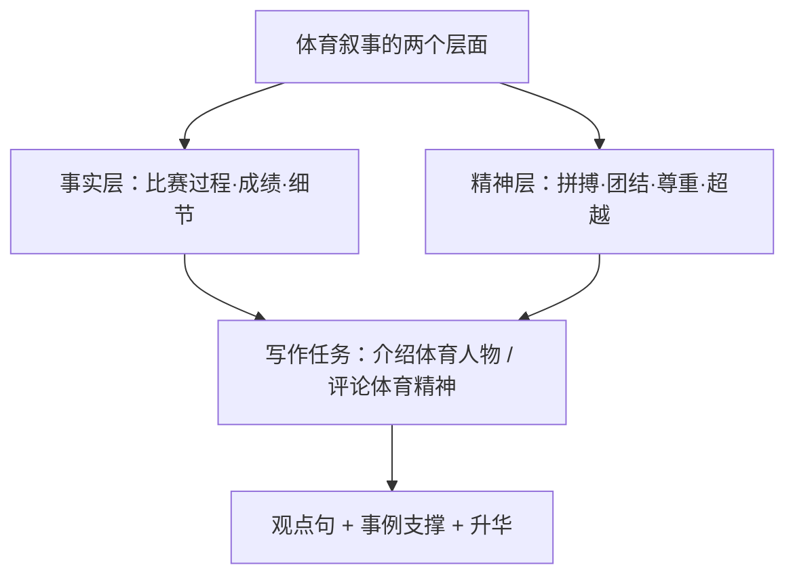

# 读写与表达（Developing ideas）

**Unit 3 Faster, higher, stronger**（外研版选择性必修第一册）｜读写主题：体育人物故事与观点表达

## 拓展阅读要点

Developing ideas 部分聚焦**中外体育人物与奥运故事**：中国女排的团队精神、残奥运动员的顽强意志、马拉松赛场上互相搀扶的对手。阅读要点：把握**事实叙述与精神提炼**的关系——故事是载体，体育精神是内核。

## 读写衔接词汇

| 表达 | 含义 | 写作应用 |
| --- | --- | --- |
| bring out the best in | 激发出最佳状态 | Competition brings out the best in us. |
| a role model | 榜样 | She is a role model for young athletes. |
| team up with | 与……合作 | He teamed up with his rival in training. |
| at one's peak | 处于巅峰 | She retired at her peak. |
| never-say-die spirit | 永不言弃的精神 | The team's never-say-die spirit moved us. |
| carry the torch | 传承（火炬） | Young players carry the torch of the team. |

## 写作指导：介绍一位体育人物（人物介绍文）

**结构模板**：
1. **总起定位**：Su Bingtian, the fastest sprinter in Asia, has rewritten what people believe possible.
2. **经历事例**：起步与挫折（injuries, doubts）→ 关键突破（9.83 seconds in Tokyo）→ 细节支撑（technique adjustments, strict training）。
3. **精神升华**：His story proves that with science and perseverance, limits are meant to be broken.

**加分句式**：
- Such is his dedication that he trains six hours a day.（such 倒装）
- What impresses me most is not his speed but his persistence.（主语从句）
- He has set an example for all who dare to dream.（定语从句收尾）

## 典型例题

**例1**（阅读理解）：Why does the author mention the two runners helping each other?
**解析**：写作意图题。以具体事例**例证**体育精神超越输赢（to illustrate that sportsmanship matters more than victory）。

**例2**（书面表达）：你校英文报开设 "Sports Stars" 专栏，请写一篇短文介绍你敬佩的一位运动员，包括其成就、经历及你敬佩的原因。
**要点**：①人物身份与成就（一般现在时/现在完成时）；②关键经历（过去时）；③敬佩原因与感悟（观点句+升华）。

## 易错点

1. "榜样"用 role model，勿直译为 example person。
2. set an example for sb（为……树立榜样）、follow one's example（学习榜样）。
3. 人物介绍避免流水账：选 2–3 个典型事例并与精神品质对应。
4. 数字表达：run 100m in 9.83 seconds；介词用 in。

## 背记要点

- 高考视角：体育人物介绍兼考记叙与议论，观点句 + 事例 + 升华三段式最稳妥。
- 必背表达：a role model / never-say-die spirit / bring out the best in / set an example for。
- 主旨句型：True champions are defined not by gold medals but by the spirit they embody.

## 自测题

1. 用 set an example for 造句介绍一位运动员。
2. 翻译：令我印象最深的不是他的成绩，而是他永不言弃的精神。（What...；not...but...）
3. 列出人物介绍文的三段式结构要点。
4. 写出 at one's peak、team up with 的含义并各造一句。

**答案**：1. Her perseverance sets an example for all of us.（合理即可）  2. What impresses me most is not his results but his never-say-die spirit.  3. 总起定位—经历事例—精神升华。  4. 处于巅峰；与……合作（造句合理即可）。

## 相关知识点

[[词汇与课文精读（Understanding ideas）]] ｜ [[语法与语言运用（Using language）]]
