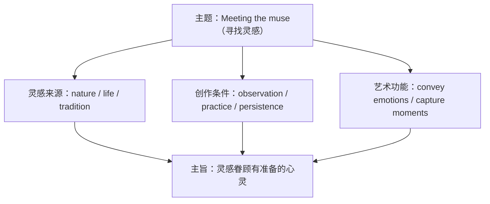

# 词汇与课文精读（Understanding ideas）

**Unit 4 Meeting the muse**（外研版选择性必修第一册）｜标签：#Unit4 #艺术与灵感 #词汇 #课文精读

## 单元导览

本单元主题为"艺术与灵感（muse 缪斯）"，课文探讨艺术创作的源泉——诗歌、绘画、音乐如何从生活与自然中获得灵感。学习目标：掌握艺术主题词汇约 15 个；理解"艺术源于生活"的主旨；剖析含同位语从句与分词结构的长难句。

## 核心内容

### 主题词汇表

| 词汇 | 词性/含义 | 常考搭配 | 例句 |
| --- | --- | --- | --- |
| inspiration | n. 灵感 | draw inspiration from | Poets draw inspiration from nature. 诗人从自然中汲取灵感。 |
| composition | n. 作品；创作 | a musical composition | This composition took years. 这部作品耗时数年。 |
| masterpiece | n. 杰作 | create a masterpiece | The painting is a masterpiece. 这幅画是杰作。 |
| creativity | n. 创造力 | spark creativity | Reading sparks creativity. 阅读激发创造力。 |
| appreciate | v. 欣赏 | appreciate art | Learn to appreciate poetry. 学会欣赏诗歌。 |
| convey | v. 传达 | convey emotions | Colours convey emotions. 色彩传达情感。 |
| rhythm | n. 节奏 | a strong rhythm | The poem has a gentle rhythm. 这首诗节奏柔和。 |
| imagery | n. 意象 | vivid imagery | The poem is rich in imagery. 这首诗意象丰富。 |
| exhibition | n. 展览 | hold an exhibition | The gallery holds an exhibition. 画廊举办展览。 |
| interpret | v. 诠释 | interpret a work | Each reader interprets it differently. 每位读者诠释不同。 |
| abstract | adj. 抽象的 | abstract art | Abstract art puzzles some viewers. 抽象艺术令一些观众困惑。 |
| capture | v. 捕捉 | capture the moment | The artist captured the light. 画家捕捉住了光线。 |
| stimulate | v. 激发 | stimulate the imagination | Music stimulates the imagination. 音乐激发想象。 |
| genre | n. 体裁 | a literary genre | Poetry is an ancient genre. 诗歌是古老的体裁。 |
| aesthetic | adj. 审美的 | aesthetic value | The design has aesthetic value. 这个设计具有审美价值。 |

### 课文主旨与结构

课文以"缪斯何在"为问题线索：艺术家的灵感并非凭空而来——自然之景、人生经历、文化传统皆为源泉；灵感更眷顾**有准备的心灵**：观察、积累与坚持练习是创作的根基。

### 长难句剖析

**原句**：The idea that inspiration strikes only a chosen few is misleading, for most great works come from artists who observe life closely and practise their craft daily.
**剖析**：that inspiration strikes only a chosen few 为同位语从句说明 idea；for 引导原因分句；who... daily 为定语从句。译："灵感只青睐少数天选之人"的观念是误导性的，因为多数伟大作品出自细察生活、日日磨练技艺的艺术家。

## 典型例题

**例1**（单选）：The poet ______ inspiration from her childhood by the sea.
A. drew  B. pulled  C. dragged  D. brought
**解析**：draw inspiration from 固定搭配。答案 A。

**例2**（语法填空）：The belief ______ art belongs only to galleries is being challenged.
**解析**：同位语从句说明 belief，从句成分完整用 that。答案 that。

## 易错点

1. appreciate 后接名词/动名词，"感激某人做某事"用 appreciate one's doing。
2. imagery（意象，总称不可数）与 image（图像，可数）。
3. 同位语从句 that 不可省略且不作成分；定语从句 that 作成分。
4. abstract（抽象的）反义词是 concrete（具体的）。

## 背记要点

- 高考视角：艺术与审美教育是北京卷阅读新兴话题，draw inspiration from、convey emotions 为写作亮点表达。
- 必背搭配：draw inspiration from / hold an exhibition / be rich in imagery / capture the moment。
- 主旨句型：Art does not reproduce what we see; it makes us see. 艺术不复制所见，而让我们看见。

## 自测题

1. 语法填空：Her paintings are famous for their ______ (aesthetic) appeal.
2. 单选：The fact ______ he had no formal training makes his success more amazing. A. what  B. that  C. which  D. how
3. 翻译：这首诗通过生动的意象传达了乡愁。（convey; imagery）
4. 写出 masterpiece、genre 的含义并各造一句。

**答案**：1. aesthetic  2. B（同位语从句）  3. The poem conveys homesickness through vivid imagery.  4. 杰作；体裁（造句合理即可）

## 相关知识点

[[Unit 4 · 语法与语言运用]] ｜ [[Unit 4 · 读写与表达]]
