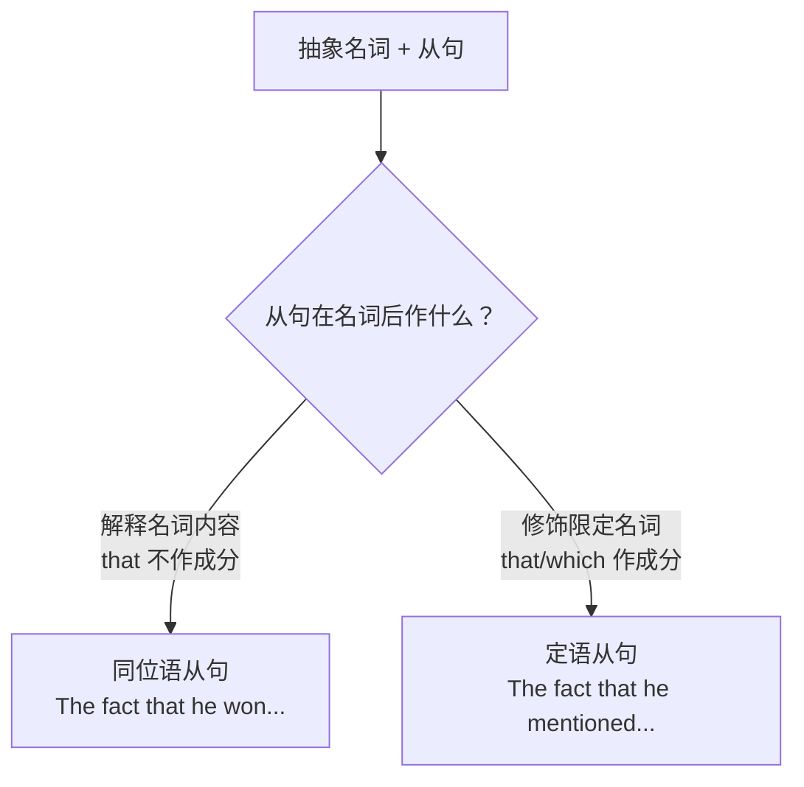

# 语法与语言运用（Using language）

**Unit 4 Meeting the muse**（外研版选择性必修第一册）｜语法专题：**同位语从句**

## 语法讲解

### 同位语从句的本质

对前面的**抽象名词**作补充说明，回答"这个 idea/fact/news 的**内容**是什么"。

常见先行名词：fact, news, idea, belief, thought, hope, promise, suggestion, possibility, doubt, question, truth。

| 引导词 | 用法 | 例句 |
| --- | --- | --- |
| that | 从句成分完整，that 不作成分不可省 | The news **that the exhibition would open early** excited us. 展览提前开幕的消息令我们兴奋。 |
| whether | 表"是否"（不用 if） | The question **whether art can be taught** remains open. 艺术能否被教授仍无定论。 |
| when/where/how/why | 从句缺状语性说明 | I have no idea **when the concert will begin**. 我不知道音乐会何时开始。 |

### 同位语从句 vs 定语从句（高频考点）

- The idea **that he proposed** was creative.（定语从句：that 作 proposed 的宾语，可换 which）
- The idea **that art heals the mind** is popular.（同位语从句：从句完整，that 不可换 which）

判断法：①从句缺不缺成分；②能否把从句理解为名词的"内容"；③that 能否换成 which。

### 分隔式同位语从句

Word came **that the painter would visit our school**.（从句与 word 被谓语隔开）类似：News spread that... / The question arose whether...

## 典型例题

**例1**（单选）：The suggestion ______ students visit the art museum every term has been accepted.
A. which  B. what  C. that  D. whose
**解析**：从句完整，解释 suggestion 的内容，同位语从句用 that。答案 C。

**例2**（单选）：There is some doubt ______ the concert will be held as planned.
A. that  B. whether  C. if  D. which
**解析**：doubt 后表"是否"，同位语从句用 whether（不用 if）。答案 B。

**例3**（语法填空）：He expressed the hope ______ more young people would fall in love with poetry.
**解析**：同位语从句内容完整。答案 that。

## 易错点

1. 同位语从句中的 **that 不可省略**（宾语从句 that 可省）。
2. 表"是否"用 whether，**不用 if**（同位语从句/介词后/不定式前）。
3. suggestion, advice 等名词的同位语从句谓语用 **(should+) 动词原形**：The suggestion that he (should) study abroad...
4. 与定语从句混淆：先检查从句是否缺成分。

## 背记要点

- 口诀：内容完整 that 引导，缺啥成分定语挑；是否 whether 不用 if，建议名词 should 到。
- 高频名词：fact/news/idea/hope/promise/doubt/question/possibility。
- 高考视角：语法填空常在抽象名词后设空考 that/whether 辨析。

## 自测题

1. 语法填空：The fact ______ she painted it in one night amazed everyone.
2. 判断从句类型：The promise that he made was kept. / The promise that he would come was kept.
3. 翻译：他能否成为艺术家这个问题取决于他的坚持。（whether 同位语从句）
4. 改错：The idea if we should hold an art festival was discussed.

**答案**：1. that  2. 前者定语从句（that 作宾语），后者同位语从句。  3. The question whether he can become an artist depends on his persistence.  4. if 改为 whether。

## 相关知识点

[[词汇与课文精读（Understanding ideas）]] ｜ [[读写与表达（Developing ideas）]]
