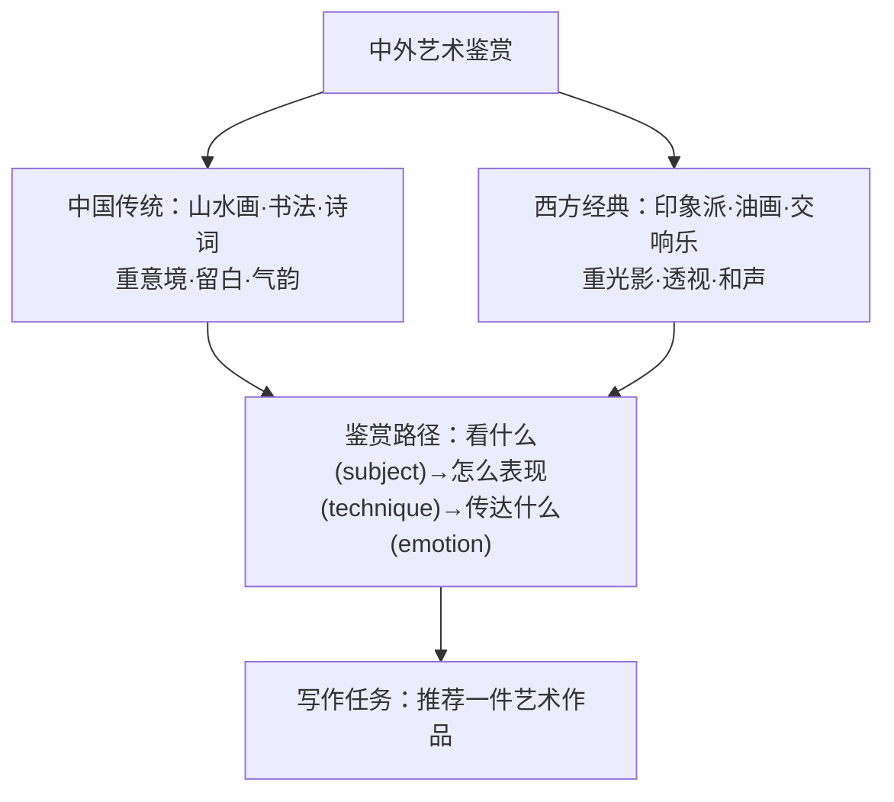

# 读写与表达（Developing ideas）

**Unit 4 Meeting the muse**（外研版选择性必修第一册）｜读写主题：中外艺术鉴赏与推荐文写作

## 拓展阅读要点

Developing ideas 部分聚焦**中外艺术作品鉴赏**：中国的山水画、书法与唐诗，西方的印象派绘画与古典音乐。阅读要点：理解**艺术语言的文化差异**——中国艺术重"意境"（artistic conception）与留白，西方艺术重光影与写实/变形。

## 读写衔接词汇

| 表达 | 含义 | 写作应用 |
| --- | --- | --- |
| artistic conception | 意境 | Chinese painting values artistic conception. |
| leave blank space | 留白 | Masters often leave blank space deliberately. |
| a feast for the eyes | 视觉盛宴 | The exhibition is a feast for the eyes. |
| be reflected in | 体现于 | Chinese philosophy is reflected in landscape painting. |
| strike a chord with | 引起共鸣 | The melody strikes a chord with listeners. |
| stand the test of time | 经受时间考验 | True masterpieces stand the test of time. |

## 写作指导：推荐一件艺术作品（推荐文）

**结构模板**：
1. **推荐引入**：Among all the works I have seen, *Along the River During the Qingming Festival* impresses me most.
2. **作品介绍**：基本信息（作者、年代、体裁）→ 突出特点（technique + detail）→ 价值意义。
3. **推荐理由与呼吁**：It offers not only beauty but also a window into Song Dynasty life. Do go and see it if you have the chance.

**加分句式**：
- So vivid is the painting that every figure seems alive.（so 倒装）
- It is in the blank space that Chinese art hides its deepest meaning.（强调句）
- Anyone who appreciates beauty will find it rewarding.（定语从句）

## 典型例题

**例1**（阅读理解）：What does the underlined phrase "strike a chord" probably mean?
**解析**：词义猜测题。由上下文"listeners were moved to tears"可知为**引起共鸣**（arouse sympathy/resonate with）。

**例2**（书面表达）：外教 Ms Brown 想了解中国传统艺术，请写一封邮件向她推荐一件中国艺术作品（绘画/书法/音乐皆可），说明其特点及推荐理由。
**要点**：①推荐对象与基本信息；②艺术特点（用 artistic conception、blank space 等术语）；③推荐理由与观展建议；④邮件格式完整。

## 易错点

1. "意境"译作 artistic conception，勿逐字直译。
2. painting（绘画作品）可数；calligraphy（书法）不可数。
3. 推荐文要有**明确的推荐语气**（strongly recommend / do not miss），不是纯说明文。
4. 作品名用斜体或引号：*Along the River During the Qingming Festival*。

## 背记要点

- 高考视角：推荐中国传统艺术是北京卷应用文高频命题方向（邮件体+推荐理由两点以上）。
- 必背表达：a feast for the eyes / stand the test of time / strike a chord with / be reflected in。
- 主旨句型：Art speaks where words fail. 言语不及之处，艺术开口说话。

## 自测题

1. 用 stand the test of time 造句评价一件经典作品。
2. 翻译：正是留白赋予中国画无穷的想象空间。（强调句）
3. 列出推荐文的三段式结构要点。
4. 写出 artistic conception、a feast for the eyes 的含义并各造一句。

**答案**：1. Beethoven's symphonies have stood the test of time.（合理即可）  2. It is the blank space that gives Chinese painting boundless room for imagination.  3. 推荐引入—作品介绍—理由呼吁。  4. 意境；视觉盛宴（造句合理即可）。

## 相关知识点

[[词汇与课文精读（Understanding ideas）]] ｜ [[语法与语言运用（Using language）]]
