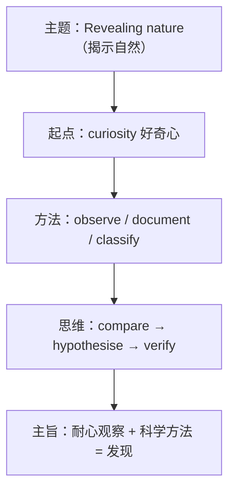

# 词汇与课文精读（Understanding ideas）

**Unit 5 Revealing nature**（外研版选择性必修第一册）｜标签：#Unit5 #探索自然 #词汇 #课文精读

## 单元导览

本单元主题为"揭示自然的奥秘"，课文讲述博物学家与科学家观察、记录、研究自然的故事（如达尔文的环球考察、法布尔的昆虫观察）。学习目标：掌握自然科考主题词汇约 15 个；理解"细致观察成就科学发现"的主旨；剖析含非限制性定语从句的长难句。

## 核心内容

### 主题词汇表

| 词汇 | 词性/含义 | 常考搭配 | 例句 |
| --- | --- | --- | --- |
| species | n. 物种（单复同形） | an endangered species | The island hosts rare species. 岛上栖息着珍稀物种。 |
| organism | n. 生物体 | living organisms | Soil is full of organisms. 土壤中充满生物。 |
| evolve | v. 进化 | evolve from/into | Birds evolved from dinosaurs. 鸟类由恐龙进化而来。 |
| observation | n. 观察 | make observations | He recorded his observations daily. 他每天记录观察结果。 |
| specimen | n. 标本 | collect specimens | Darwin collected thousands of specimens. 达尔文收集了数千件标本。 |
| habitat | n. 栖息地 | natural habitat | Protect the panda's habitat. 保护熊猫栖息地。 |
| adapt | v. 适应 | adapt to | Cacti adapt to dry climates. 仙人掌适应干旱气候。 |
| classify | v. 分类 | classify ... into | He classified the plants into groups. 他将植物分类。 |
| phenomenon | n. 现象（复数 phenomena） | a natural phenomenon | Migration is a fascinating phenomenon. 迁徙是迷人的现象。 |
| curiosity | n. 好奇心 | out of curiosity | Science begins with curiosity. 科学始于好奇。 |
| examine | v. 检查；研究 | examine closely | She examined the insect closely. 她仔细研究这只昆虫。 |
| remarkable | adj. 非凡的 | a remarkable discovery | It was a remarkable finding. 这是非凡的发现。 |
| document | v. 记录 | document the process | He documented every change. 他记录每一个变化。 |
| instinct | n. 本能 | by instinct | Birds migrate by instinct. 鸟类凭本能迁徙。 |
| diversity | n. 多样性 | biological diversity | The forest is rich in diversity. 森林物种多样。 |

### 课文主旨与结构

课文以科学家的自然探索为线索：好奇心驱动观察→耐心记录与比较→提出解释并验证。自然的奥秘不会主动显现，唯有**长期细致的观察**与**科学的思维方法**才能揭示。

### 长难句剖析

**原句**：Darwin, whose voyage on the Beagle lasted five years, noticed that finches on different islands had differently shaped beaks, which led him to question why.
**剖析**：whose... years 为非限制性定语从句修饰 Darwin；that... beaks 为宾语从句；which 引导非限制性定语从句指代前面整件事。译：达尔文乘"小猎犬号"航行五年，注意到不同岛屿上的雀鸟喙形不同，这使他开始追问原因。

## 典型例题

**例1**（单选）：Over millions of years, these birds ______ into dozens of different species.
A. evolved  B. involved  C. revolved  D. dissolved
**解析**：evolve into 进化成。答案 A。

**例2**（语法填空）：The scientist spent years ______ (observe) the behaviour of ants.
**解析**：spend time (in) doing。答案 observing。

## 易错点

1. species 单复数同形：a species / many species。
2. phenomenon 复数为 phenomena（希腊词源）。
3. adapt to（适应）与 adopt（收养/采纳）拼写混淆。
4. evolve 不及物为主；"由……进化而来"用 evolve from。

## 背记要点

- 高考视角：自然科学与生物多样性是北京卷阅读 C/D 篇高频题材，species、habitat、adapt to 必须过关。
- 必背搭配：out of curiosity / adapt to / evolve from / make observations。
- 主旨句型：Nature reveals her secrets only to those who observe patiently. 自然只向耐心观察者展露秘密。

## 自测题

1. 语法填空：The reserve protects dozens of endangered ______ (species).
2. 单选：Out of ______, the boy opened the box of insects. A. curiosity  B. curious  C. curiously  D. cure
3. 翻译：这种植物已经适应了沙漠环境。（adapt to）
4. 写出 specimen、instinct 的含义并各造一句。

**答案**：1. species（单复同形）  2. A  3. This plant has adapted to the desert environment.  4. 标本；本能（造句合理即可）

## 相关知识点

[[Unit 5 · 语法与语言运用]] ｜ [[Unit 5 · 读写与表达]]
