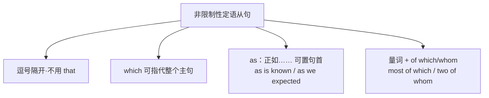

# 语法与语言运用（Using language）

**Unit 5 Revealing nature**（外研版选择性必修第一册）｜语法专题：**非限制性定语从句**

## 语法讲解

### 限制性 vs 非限制性

| 项目 | 限制性定语从句 | 非限制性定语从句 |
| --- | --- | --- |
| 作用 | 限定先行词，不可删 | 补充说明，删去不影响主句 |
| 标点 | 无逗号 | 用**逗号**隔开 |
| that | 可用 | **不可用** |
| 先行词 | 名词 | 名词或**整个句子**（用 which） |

例：My brother **who lives in Beijing** is a biologist.（限制性：区别于其他兄弟）
My brother, **who lives in Beijing**, is a biologist.（非限制性：只有一个兄弟，补充信息）

### 非限制性定语从句的常见形式

| 形式 | 例句 |
| --- | --- |
| , which 指代整句 | The glacier is melting fast, **which worries scientists**. 冰川消融加快，这令科学家担忧。 |
| , who/whom 指人 | Darwin, **who sailed around the world**, changed biology. |
| , whose 表所属 | The bird, **whose wings measure two metres**, can fly for days. |
| , as 引导（正如） | **As is known to all**, species evolve. 众所周知，物种在进化。 |
| 介词 + which/whom | The forest, **in which countless species live**, must be protected. |
| 数词/代词 + of which/whom | He collected 500 specimens, **most of which** were insects. |

### as 与 which 辨析

- as 可置于句首、句中、句末，意为"正如"，常用于 as is known/as we expected/as has been said；
- which 只能位于**主句之后**；表"这一点/这件事"时用 which：He failed the test, **which** surprised us.

## 典型例题

**例1**（单选）：The team discovered a new plant species, ______ made headlines worldwide.
A. that  B. which  C. as  D. what
**解析**：非限制性从句指代整件事，且 that 不可用于非限制性从句。答案 B。

**例2**（单选）：______ is often the case, major discoveries begin with small observations.
A. Which  B. It  C. As  D. That
**解析**：as is often the case 正如通常情况，as 可置句首。答案 C。

**例3**（语法填空）：He tagged 60 birds, half of ______ returned the next spring.
**解析**：数量词 + of which 指物。答案 which。

## 易错点

1. 非限制性定语从句**绝不能用 that** 引导。
2. which 指代整句时谓语用**单数**：..., which **is**/was...
3. "as+句首"只能用 as，不能用 which。
4. 先行词是 all/everything 等不定代词时用限制性 that，勿用逗号。

## 背记要点

- 口诀：逗号从句 that 逃，整句指代 which 挑；句首正如 as 来引，量词搭配 of which/whom 好。
- 高频套语：as is known to all / as is often the case / most of which / , which means...
- 高考视角：语法填空/改错高频考"逗号 + that"错误与 as/which 辨析。

## 自测题

1. 语法填空：The reserve is home to 300 species, some of ______ are found nowhere else.
2. 单选：______ we all know, water is vital to all organisms. A. Which  B. As  C. That  D. What
3. 翻译：气温持续上升，这威胁着北极熊的栖息地。（, which）
4. 改错：The whale, that scientists tracked for a year, swam 20,000 km.

**答案**：1. which  2. B  3. Temperatures keep rising, which threatens polar bears' habitats.  4. that 改为 which。

## 相关知识点

[[Unit 5 · 词汇与课文精读]] ｜ [[Unit 5 · 读写与表达]]
