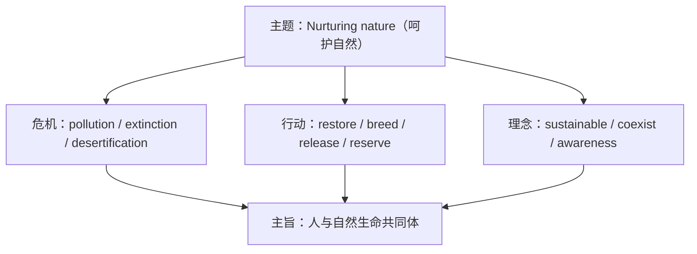

# 词汇与课文精读（Understanding ideas）

**Unit 6 Nurturing nature**（外研版选择性必修第一册）｜标签：#Unit6 #生态保护 #词汇 #课文精读

## 单元导览

本单元主题为"呵护自然、生态保护"，课文讲述人类保护与修复生态环境的努力（如植树治沙、国家公园建设、濒危物种保育）。学习目标：掌握生态保护主题词汇约 15 个；理解"人与自然生命共同体"的主旨；剖析含被动语态与状语从句的长难句。

## 核心内容

### 主题词汇表

| 词汇 | 词性/含义 | 常考搭配 | 例句 |
| --- | --- | --- | --- |
| conservation | n. 保护 | wildlife conservation | She works in wildlife conservation. 她从事野生动物保护。 |
| ecosystem | n. 生态系统 | a fragile ecosystem | Wetlands are fragile ecosystems. 湿地是脆弱的生态系统。 |
| restore | v. 恢复 | restore the forest | Volunteers helped restore the wetland. 志愿者帮助恢复湿地。 |
| sustainable | adj. 可持续的 | sustainable development | We pursue sustainable development. 我们追求可持续发展。 |
| extinct | adj. 灭绝的 | become/go extinct | The dodo went extinct long ago. 渡渡鸟早已灭绝。 |
| reserve | n. 保护区 | a nature reserve | The reserve protects tigers. 保护区保护老虎。 |
| pollution | n. 污染 | reduce pollution | Reduce plastic pollution. 减少塑料污染。 |
| release | v. 放归；释放 | release ... into the wild | The pandas were released into the wild. 大熊猫被放归野外。 |
| breed | v. 繁殖 | breed in captivity | Cranes are bred in captivity. 鹤在人工环境下繁殖。 |
| threaten | v. 威胁 | be threatened with | Many species are threatened with extinction. 许多物种濒临灭绝。 |
| initiative | n. 倡议 | launch an initiative | The city launched a green initiative. 该市发起绿色倡议。 |
| awareness | n. 意识 | raise awareness | Raise public awareness of ecology. 提升公众生态意识。 |
| combat | v. 对抗 | combat desertification | China combats desertification. 中国治理荒漠化。 |
| vegetation | n. 植被 | dense vegetation | Vegetation holds the soil. 植被固定土壤。 |
| coexist | v. 共存 | coexist with | Humans can coexist with wildlife. 人类可与野生动物共存。 |

### 课文主旨与结构

课文以生态修复故事为线索：从生态危机（荒漠化、物种减少）到行动（植树、建立保护区、人工繁育放归），再到理念升华——**绿水青山就是金山银山**，人与自然是生命共同体。

### 长难句剖析

**原句**：Thanks to decades of effort, the desert, which once swallowed villages, has been turned into a green barrier that protects millions of people from sandstorms.
**剖析**：Thanks to 介词短语作状语；which... villages 非限制性定语从句；has been turned 现在完成时被动；that... sandstorms 定语从句。译：得益于数十年的努力，曾经吞噬村庄的沙漠已变成保护数百万人免受沙尘暴侵袭的绿色屏障。

## 典型例题

**例1**（单选）：Giant pandas bred in captivity will eventually be ______ into the wild.
A. released  B. relieved  C. removed  D. reminded
**解析**：release ... into the wild 放归野外。答案 A。

**例2**（语法填空）：The campaign aims to raise ______ (aware) of marine protection.
**解析**：raise awareness of 固定搭配。答案 awareness。

## 易错点

1. extinct 是形容词：become/go extinct；名词 extinction（on the verge of extinction）。
2. reserve（保护区）与 preserve（保存/果酱）区分；nature reserve 为固定说法。
3. breed 过去式/过去分词为 bred。
4. sustainable（可持续的）与 substantial（大量的）拼写形近。

## 背记要点

- 高考视角：生态文明是北京卷各题型的主旋律话题，sustainable development、raise awareness 为必备表达。
- 必背搭配：be threatened with extinction / release into the wild / combat desertification / coexist with。
- 主旨句型：Lucid waters and lush mountains are invaluable assets. 绿水青山就是金山银山。

## 自测题

1. 语法填空：Without protection, the species would have gone ______ (extinction).
2. 单选：The wetland park was built to ______ the damaged ecosystem. A. restore  B. store  C. explore  D. ignore
3. 翻译：我们应当提高公众的环保意识，实现人与自然和谐共存。（awareness; coexist）
4. 写出 initiative、vegetation 的含义并各造一句。

**答案**：1. extinct  2. A  3. We should raise public awareness of environmental protection and coexist in harmony with nature.  4. 倡议；植被（造句合理即可）

## 相关知识点

[[Unit 6 · 语法与语言运用]] ｜ [[Unit 6 · 读写与表达]]
